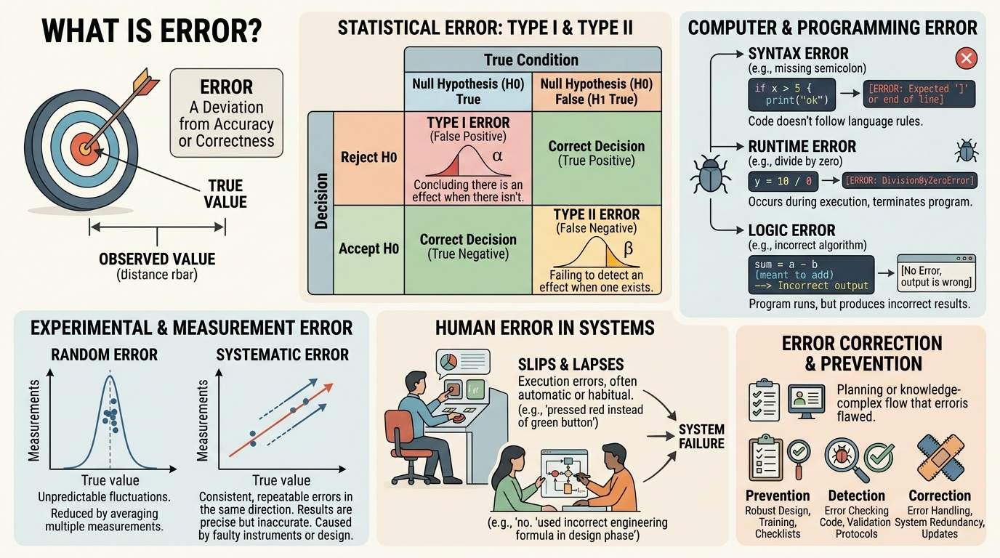
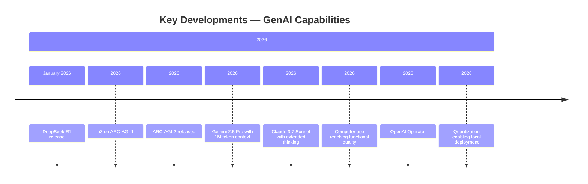
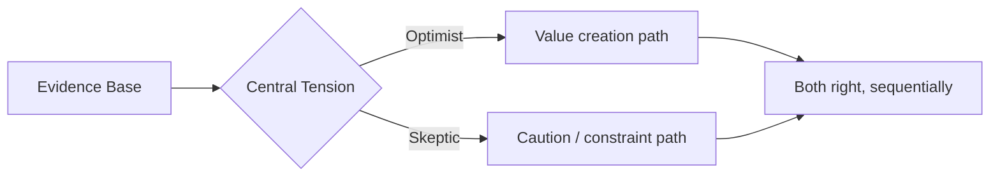
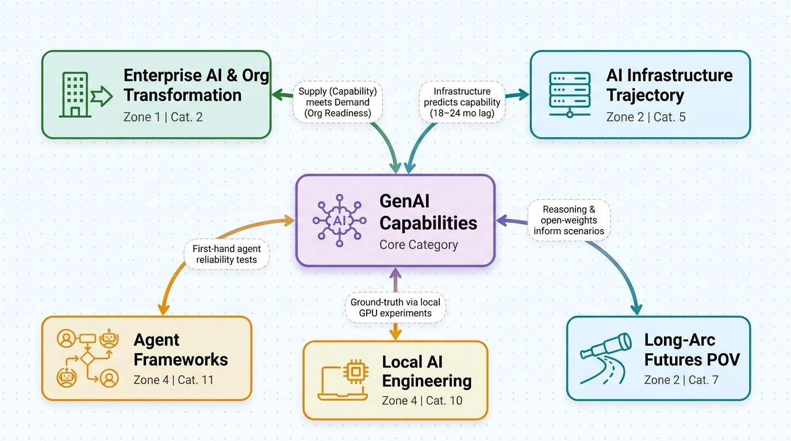

# GenAI Capabilities
**Zone:** 1 — Present Intelligence  
**Last updated:** April 2026  
**Baseline status:** COMPLETE

  <button type="button" class="audio-brief__play" aria-label="Play audio brief" data-audio-play>
    ▶
  </button>
  

    Audio brief
    
    Sanjay (cloned)
  

  

    

  

  <audio class="audio-brief__audio" src="/elite-research-pipeline/audio/categories/01.mp3" preload="metadata" data-audio-element></audio>

---

*Conceptual overview — generated via PaperBanana (color infographic)*

---

---

## State of the Field (as of April 2026)

GenAI has crossed a meaningful threshold: it is no longer primarily a text prediction system that impresses people in demos but frustrates them in production. Frontier models (GPT-4o, Claude 3.5/3.7, Gemini 2.0/2.5 Pro) reliably handle long-form drafting, summarization, translation across 100+ languages, structured data extraction, and code generation at junior-to-mid developer level. These are deployed at scale — Microsoft Copilot is embedded across M365 with 70%+ of Fortune 500 reportedly using it as of early 2026; GitHub Copilot reports 55,000+ enterprise customers with a 55% code completion acceptance rate.

The most significant architectural shift of 2025–2026 is the emergence of **reasoning models**: a distinct model class (OpenAI o1/o3, Claude 3.7 extended thinking, Gemini 2.0 Flash Thinking) that spends additional inference-time compute on internal reasoning chains before producing output. This is not just better autocomplete — benchmark evidence on novel problems (see Key Developments) suggests a qualitative change in what these systems can do, particularly on math, logic, and coding. The [ARC-AGI-1 benchmark result for o3](https://arcprize.org/arc-agi/1) (87.5%, close to human average of 84%) was surprising even to [François Chollet](https://arcprize.org/), who designed the benchmark specifically to resist pattern-matching.

Multimodal capability has matured substantially. Image understanding is production-ready across all frontier models — enterprise document parsing, chart analysis, and medical imaging (FDA-cleared screening for diabetic retinopathy) are live. Real-time voice interaction (GPT-4o Voice Mode, Gemini Live) is in production. Short-form video generation (Sora, Veo 2) is commercially deployed for social and advertising content. Video understanding at long duration is functional but not fully hardened for enterprise use.

Open-weight models have democratized access in a way that fundamentally changes the "who can do this" question. The DeepSeek R1 release (January 2026) was the most disruptive single event of the period — an open-weight model reportedly trained for ~$6M achieving reasoning performance competitive with OpenAI o1, triggering an industry-wide reassessment of whether massive compute investment is structurally required. Llama 3.3 70B at 4-bit quantization runs on a 24GB consumer GPU (RTX 4090-class hardware), as do Mistral 24B and DeepSeek-R1 distilled models up to 32B — meaning serious reasoning capability is accessible to anyone with a high-end personal machine.

Agents — multi-step AI systems that use tools, take actions, and complete tasks over multiple turns — are real and deployed for scoped workflows: coding assistance, document processing pipelines, constrained automation. However, long-horizon autonomous operation (>30 steps, multi-session) remains unreliable. Error accumulation and context degradation are well-documented. The best agent coding performance (Claude 3.7 on [SWE-bench Verified: ~55%](https://www.swebench.com/verified.html)) means roughly 1 in 2 complex real-world coding tasks fails. This is useful with human oversight; it is not "set and forget" automation.

---

## Key Developments (Past 12 Months)

- **DeepSeek R1 release (January 2026)** — Open-weight reasoning model, ~o1-level performance, reportedly trained for ~$6M. MIT license. 32B distilled variant runs on consumer 24GB GPU. Triggered major market repricing of AI hardware (Nvidia –17% in one session) and serious industry debate about compute efficiency. Most disruptive capability democratization event since Llama's public release.

- **o3 on ARC-AGI-1[^arc-agi-1] (87.5%)** — OpenAI's o3 model scored 87.5% on a benchmark specifically designed to resist memorization and force novel generalization, vs. human average ~84%. Surprised Chollet (benchmark creator)[^chollet]. On [FrontierMath (novel PhD-level math problems)](https://epoch.ai/frontiermath): o3 scored 25.2% vs. prior models at ~2%. This is the strongest empirical evidence that reasoning models represent a qualitative capability shift.

- **[ARC-AGI-2 released (early 2026)](https://arcprize.org/arc-agi/2)** — Chollet's follow-up benchmark[^chollet], harder, designed specifically to probe whether models can form genuinely novel conceptual combinations. Results at time of writing: frontier models are struggling. This is the active frontier of the generalization debate.

- **Gemini 2.5 Pro with 1M token context** — Functional processing of entire codebases, full legal documents, multi-hour video — in a single context window. Long-context use cases that required complex RAG architectures 18 months ago are now accessible via direct context.

- **Claude 3.7 Sonnet with extended thinking** — Hybrid mode: answer immediately or spend reasoning tokens. Leading performance on SWE-bench Verified[^swe-bench-verified] (~55%) and strong on complex multi-step tasks. Most widely cited as the best model for enterprise coding use cases.

- **Computer use reaching functional quality** — Anthropic's computer use (October 2024, matured through 2025): models can operate desktop applications via screenshots + actions. ~39% on [OSWorld benchmark (humans ~72%)](https://os-world.github.io/). Functional for constrained enterprise workflows — not general-purpose automation.

- **OpenAI Operator** — Browser-based agent for web tasks. Similar reliability profile to computer use: useful for scoped tasks, unreliable for anything requiring sustained multi-step judgment.

- **Quantization enabling local deployment** — GGUF/llama.cpp, EXL2/ExLlamaV2, AWQ formats mean a 70B model with 10-20% quality degradation over full precision runs on consumer hardware. The quality gap to hosted frontier models has narrowed substantially for most practical tasks.

- **Enterprise AI productivity evidence hardening** — [Peng et al. (GitHub, 2023, now widely replicated)](https://arxiv.org/abs/2302.06590) showed ~26% productivity improvement for GitHub Copilot on isolated coding tasks. [Mollick's Wharton consulting simulation studies](https://papers.ssrn.com/sol3/papers.cfm?abstract_id=4573321) showed 25–40% task completion speedup. Caveat: these are individual task studies, not firm-level transformation evidence.

---

## The Debate

**Core tension:** The technology is significantly more capable than most organizational processes have adapted to, and significantly less capable than the most optimistic public claims suggest. The debate is not "is it useful?" (settled: yes) but "what is it, fundamentally, and where does it go?"

**Optimist case** ([Demis Hassabis](https://deepmind.google/), [Sam Altman](https://blog.samaltman.com/), [Dario Amodei](https://www.darioamodei.com/), [Andrej Karpathy](https://karpathy.ai/)):
Scaling laws continue to hold. Reasoning models demonstrate qualitatively new capabilities — o3's ARC-AGI performance[^arc-agi-1] is evidence of generalization, not memorization. The trajectory from 2020 to 2026 (GPT-2 → o3) is historically unprecedented. [Amodei (February 2025)](https://www.darioamodei.com/essay/machines-of-loving-grace): AI could compress 50–100 years of biomedical progress into 5–10 years if deployed at scale. Karpathy's framing[^karpathy]: LLMs are useful "lossy simulators" of human cognition — Copilot is the fastest-adopted developer tool in history by any measure.

**Skeptic/critic case** ([Yann LeCun](https://ai.meta.com/people/396469589677838/yann-lecun/), [Gary Marcus](http://www.garymarcus.com/index.html), [Melanie Mitchell](https://melaniemitchell.me/), [Subbarao Kambhampati](https://rakaposhi.eas.asu.edu/)):
- LeCun (Meta):[^lecun] LLMs are auto-regressive next-token predictors with no persistent world model, no physics grounding, no causal reasoning. His proposed alternative: Joint Embedding Predictive Architectures. He calls current LLMs a "dead end" for general intelligence. Has held this position consistently since 2022 despite capability gains.
- Marcus (NYU)[^marcus]: Benchmark improvements are real but benchmarks are contaminated — models are tested on data too similar to training data. Models fail on trivially modified versions of benchmark problems.
- [Kambhampati (Arizona State): Formally published work (Nature, 2024)](https://arxiv.org/abs/2402.01817) showing frontier models conflate "plan generation" with "plan validation" — they produce plausible-looking plans that fail systematic validity testing.
- Mitchell (Santa Fe Institute)[^mitchell]: LLMs manipulate symbols without conceptual grounding; compositionality failures are evidence of this.

**What the evidence supports:**
- LLMs are exceptional at synthesis, summarization, pattern completion, code for standard patterns
- They fail structurally on counting/arithmetic without tools, spatial reasoning, novel factual claims, and long-horizon planning
- Reasoning models show measurable improvement on formal reasoning tasks — this is real, not just better training data
- Whether these architectures can reach general-purpose reliability or require fundamental redesign is genuinely unresolved

---

## Sanjay's Current Position

*[DRAFT — refine with your own view after reading above]*

Reasoning models represent a real inflection point, not just incremental improvement — the ARC-AGI evidence[^arc-agi-1] is too specific and too surprising to dismiss. The democratization via open weights (DeepSeek R1, Llama 3.3) is arguably more consequential for organizations than frontier model advances, because it removes the API dependency and cost structure that made enterprise adoption complex.

For the organizational transformation lens: the interesting question is not whether AI is capable enough, but whether organizations have the structural, cultural, and process conditions to absorb capability that is already better than what most workflows are designed to use. The mismatch between available capability and organizational readiness is where the real transformation challenge lives — and it is fundamentally an OD and change management problem, not a technology problem.

The skeptics (LeCun, Marcus) are right that these systems don't reason causally in a principled way. But that matters less to organizational impact than to theoretical AI progress. For most knowledge work, the relevant question is "does it produce reliable, useful output most of the time?" — and the honest answer for scoped tasks is increasingly yes.

---

## Key Figures / Sources to Track

**For technical ground truth:**
- **François Chollet** — [ARC Prize Substack, X/Twitter](https://fchollet.substack.com/). Builds the hardest benchmarks; updates views based on evidence. Essential for capability assessment.
- **Andrej Karpathy** — YouTube (karpathy), X/Twitter. Best translator of technical reality into accessible framing. His "Zero to Hero" course is the foundation for understanding what these systems actually are.
- **[Percy Liang / Stanford CRFM](https://cs.stanford.edu/~pliang/)** — [HELM benchmark initiative (crfm.stanford.edu/helm)](https://crfm.stanford.edu/helm/). Rigorous, systematic model evaluation — not vendor claims.
- **[Ethan Mollick](https://mgmt.wharton.upenn.edu/profile/emollick/)** — [One Useful Thing (Substack)](https://www.oneusefulthing.org/). Best enterprise-grounded practitioner researcher. Runs structured experiments. High signal, high cadence.

**For calibrated skepticism:**
- **Yann LeCun** — X/Twitter. Prolific, principled; forces precision in capability claims even when overcorrecting.
- **[Arvind Narayanan & Sayash Kapoor](https://www.aisnakeoil.com/)** — ["AI Snake Oil" (Princeton, book 2024)](https://press.princeton.edu/books/hardcover/9780691249131/ai-snake-oil). Best systematic debunking of overblown enterprise AI claims with specific criteria.
- **Gary Marcus** — [Road to AI We Can Trust (Substack)](https://garymarcus.substack.com/). Tracks LLM failures systematically.

**For enterprise deployment evidence:**
- [**a16z AI research** (Martin Casado)](https://a16z.com/author/martin-casado/) — rigorous on enterprise ROI and deployment patterns
- **[Thomas Davenport** (Babson College)](https://www.babson.edu/about/our-leaders-and-scholars/faculty-and-academic-divisions/faculty-profiles/thomas-davenport.php) — ["All-in on AI"](https://store.hbr.org/product/all-in-on-ai-how-smart-companies-win-big-with-artificial-intelligence/10599) — grounded in case studies of actual deployments, not aspirational

**Essential publications:**
- [**Import AI** (Jack Clark, weekly newsletter)](https://importai.substack.com/) — technical, low hype, essential
- [**The Batch** (Andrew Ng / deeplearning.ai, weekly)](https://www.deeplearning.ai/the-batch/) — practitioner-oriented, good signal/noise
- [**Papers With Code** (paperswithcode.com)](https://paperswithcode.com/) — benchmark leaderboards with implementations
- **HELM** (crfm.stanford.edu/helm)[^helm] — systematic benchmark comparisons
- [**arXiv cs.LG, cs.CL**](https://arxiv.org/list/cs.LG/recent) — preprints, 6–12 months ahead of published findings

---

## Open Questions

1. **Does inference-time scaling have a ceiling?** o3's "think longer = do better" has held so far. Whether continued scaling produces meaningful gains beyond current o3-class performance or hits diminishing returns fast is genuinely unknown. This determines whether the reasoning model trajectory continues or plateaus.

2. **What is the actual enterprise adoption absorption rate?** We have individual task productivity studies (Copilot, consulting simulations). We do not have rigorous firm-level evidence of what AI capability adoption translates to in organizational performance at scale — or how long it takes.

3. **Is the hallucination floor structural?** Hallucination rates have dropped substantially but not to zero. Whether they approach zero through more training or have a fundamental floor set by training data ambiguity is unresolved. Critical for enterprise deployments in high-stakes domains.

4. **ARC-AGI-2 results?[^arc-agi-2]** Chollet's new, harder benchmark[^chollet] will be the next major data point on whether o3-class reasoning generalizes or is still sophisticated pattern matching. Results emerging through 2026.

5. **Copyright/training data litigation outcome.** Multiple major cases (NYT v. OpenAI, Getty v. Stability AI, class actions against Anthropic and Google) in various stages. The legal framework for training data permissibility, fair use, and output licensing is unresolved. Real enterprise risk implications, particularly for organizations generating content at scale.

---

## Sources

### Papers & Reports

[^dellacqua-jagged-frontier-2023]: Dell'Acqua, McFowland, Mollick, Lifshitz-Assaf, Kellogg, Rajendran, Krayer, Candelon, Lakhani. *Navigating the Jagged Technological Frontier — Field Experimental Evidence of the Effects of AI on Knowledge Worker Productivity and Quality*. Harvard Business School Working Paper 24-013 / SSRN 4573321. 2023. <https://papers.ssrn.com/sol3/papers.cfm?abstract_id=4573321>
[^kambhampati-2024]: Kambhampati et al. *Position — LLMs Can't Plan, But Can Help Planning in LLM-Modulo Frameworks*. arXiv:2402.01817 (ICML 2024); see also Annals NYAS 2024. 2024. <https://arxiv.org/abs/2402.01817>
[^peng-2023]: Peng, Kalliamvakou, Cihon, Demirer. *The Impact of AI on Developer Productivity — Evidence from GitHub Copilot*. arXiv:2302.06590. 2023. <https://arxiv.org/abs/2302.06590>

### Benchmarks

[^arc-agi-1]: François Chollet. *ARC-AGI-1*. arcprize.org. 2019. <https://arcprize.org/arc-agi/1>
[^arc-agi-2]: François Chollet. *ARC-AGI-2*. arcprize.org. 2025. <https://arcprize.org/arc-agi/2>
[^frontiermath]: Epoch AI. *FrontierMath*. epoch.ai. 2024. <https://epoch.ai/frontiermath>
[^helm]: Stanford CRFM. *HELM — Holistic Evaluation of Language Models*. crfm.stanford.edu/helm. 2022. <https://crfm.stanford.edu/helm/>
[^osworld]: Xie, Zhang, Chen, et al. (XLang Lab). *OSWorld — Benchmarking Multimodal Agents for Open-Ended Tasks in Real Computer Environments*. NeurIPS 2024 / os-world.github.io. 2024. <https://os-world.github.io/>
[^swe-bench-verified]: Princeton / OpenAI. *SWE-bench Verified*. swebench.com. 2024. <https://www.swebench.com/verified.html>

### Articles & Newsletters

[^ai-snake-oil]: Arvind Narayanan, Sayash Kapoor. *AI Snake Oil — What Artificial Intelligence Can Do, What It Can't, and How to Tell the Difference*. Princeton University Press. 2024. <https://press.princeton.edu/books/hardcover/9780691249131/ai-snake-oil>
[^all-in-on-ai]: Thomas H. Davenport, Nitin Mittal. *All-in On AI — How Smart Companies Win Big with Artificial Intelligence*. Harvard Business Review Press. 2023. <https://store.hbr.org/product/all-in-on-ai-how-smart-companies-win-big-with-artificial-intelligence/10599>
[^amodei-machines-loving-grace]: Dario Amodei. *Machines of Loving Grace*. darioamodei.com. 2024. <https://www.darioamodei.com/essay/machines-of-loving-grace>
[^arc-prize-substack]: François Chollet. *Sparks in the Wind (ARC Prize-related writing)*. fchollet.substack.com. <https://fchollet.substack.com/>
[^import-ai]: Jack Clark. *Import AI*. importai.substack.com. <https://importai.substack.com/>
[^one-useful-thing]: Ethan Mollick. *One Useful Thing*. oneusefulthing.org. <https://www.oneusefulthing.org/>
[^road-to-ai-we-can-trust]: Gary Marcus. *Marcus on AI (formerly "The Road to AI We Can Trust")*. garymarcus.substack.com. <https://garymarcus.substack.com/>
[^the-batch]: Andrew Ng / DeepLearning.AI. *The Batch*. deeplearning.ai/the-batch. <https://www.deeplearning.ai/the-batch/>

### People (Sources to Track)

[^altman]: Sam Altman. *CEO, OpenAI*. blog.samaltman.com. <https://blog.samaltman.com/>
[^amodei]: Dario Amodei. *CEO, Anthropic*. darioamodei.com. <https://www.darioamodei.com/>
[^casado]: Martin Casado. *General Partner, Andreessen Horowitz (a16z)*. a16z.com. <https://a16z.com/author/martin-casado/>
[^chollet]: François Chollet. *Founder, ARC Prize; creator of Keras*. arcprize.org. <https://arcprize.org/>
[^davenport]: Thomas Davenport. *President's Distinguished Professor, Babson College*. babson.edu. <https://www.babson.edu/about/our-leaders-and-scholars/faculty-and-academic-divisions/faculty-profiles/thomas-davenport.php>
[^hassabis]: Demis Hassabis. *CEO and co-founder, Google DeepMind*. deepmind.google. <https://deepmind.google/>
[^kambhampati]: Subbarao Kambhampati. *Professor, Arizona State University; ex-President, AAAI*. rakaposhi.eas.asu.edu. <https://rakaposhi.eas.asu.edu/>
[^karpathy]: Andrej Karpathy. *AI researcher and educator (Eureka Labs; ex-OpenAI, ex-Tesla)*. karpathy.ai. <https://karpathy.ai/>
[^lecun]: Yann LeCun. *Turing Award laureate; ex-Chief AI Scientist, Meta*. ai.meta.com. <https://ai.meta.com/people/396469589677838/yann-lecun/>
[^marcus]: Gary Marcus. *Professor Emeritus, NYU; author of Rebooting AI*. garymarcus.com. <http://www.garymarcus.com/index.html>
[^mitchell]: Melanie Mitchell. *Professor, Santa Fe Institute*. melaniemitchell.me. <https://melaniemitchell.me/>
[^mollick]: Ethan Mollick. *Associate Professor, Wharton*. mgmt.wharton.upenn.edu/profile/emollick. <https://mgmt.wharton.upenn.edu/profile/emollick/>
[^narayanan-kapoor]: Arvind Narayanan, Sayash Kapoor. *Authors of AI Snake Oil; Princeton CITP*. aisnakeoil.com. <https://www.aisnakeoil.com/>
[^percy-liang]: Percy Liang. *Associate Professor, Stanford; Director, CRFM*. cs.stanford.edu/~pliang. <https://cs.stanford.edu/~pliang/>

### Organizations & Publications

[^arxiv-cs-lg]: *arXiv cs.LG / cs.CL preprint server*. arxiv.org. <https://arxiv.org/list/cs.LG/recent>
[^papers-with-code]: *Papers With Code*. paperswithcode.com. <https://paperswithcode.com/>

---
## Connections to Other Categories

*Category connections map — generated via PaperBanana*

- **Zone 2 / AI Infrastructure Trajectory (Cat. 5):** Today's capabilities are downstream of infrastructure decisions made 18–24 months ago. Understanding the infrastructure trajectory predicts capability evolution.
- **Zone 2 / Long-Arc Futures POV (Cat. 7):** Reasoning model trajectory and open-weight democratization are the two inputs most directly relevant to futures scenarios.
- **Zone 4 / Local AI Engineering (Cat. 10):** Personal experimentation with Llama 3.3, DeepSeek-R1 distilled models on local GPU provides ground-truth on what capability claims hold up outside vendor-controlled conditions.
- **Zone 4 / Agent Frameworks (Cat. 11):** Agentic capability is the most active frontier; personal experiments with LangGraph and Claude SDK provide first-hand evidence on agent reliability claims.
- **Zone 1 / Enterprise AI & Org Transformation (Cat. 2):** Capability is the supply side; organizational readiness is the demand side. The mismatch between them is where the transformation challenge actually lives.
