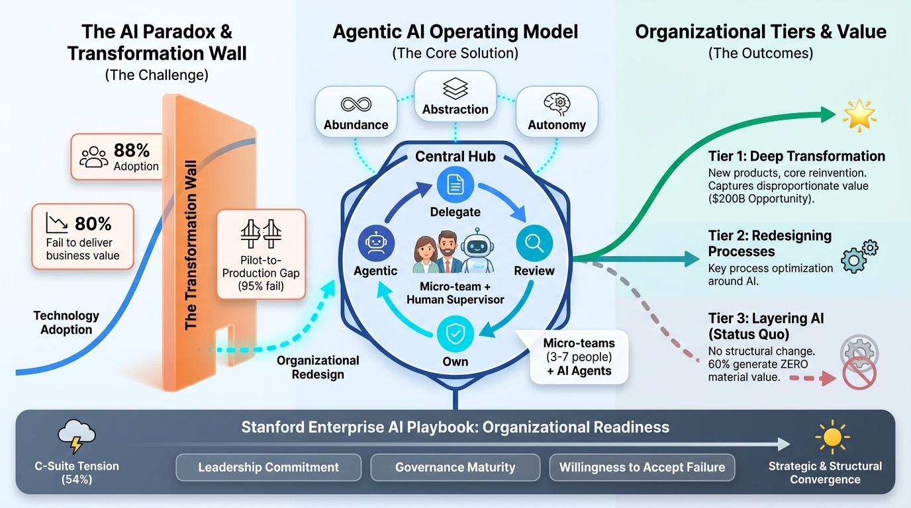
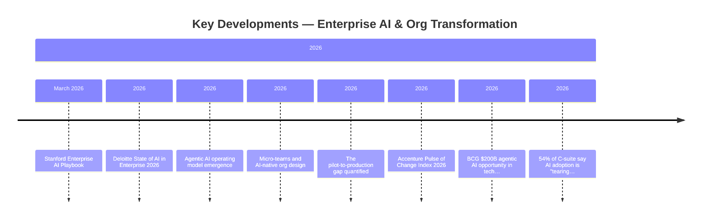
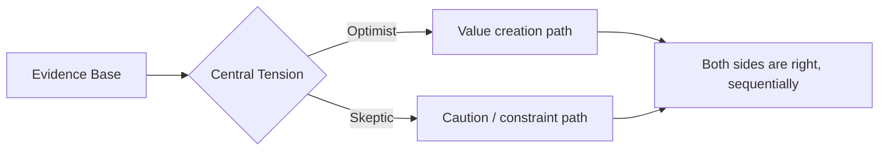
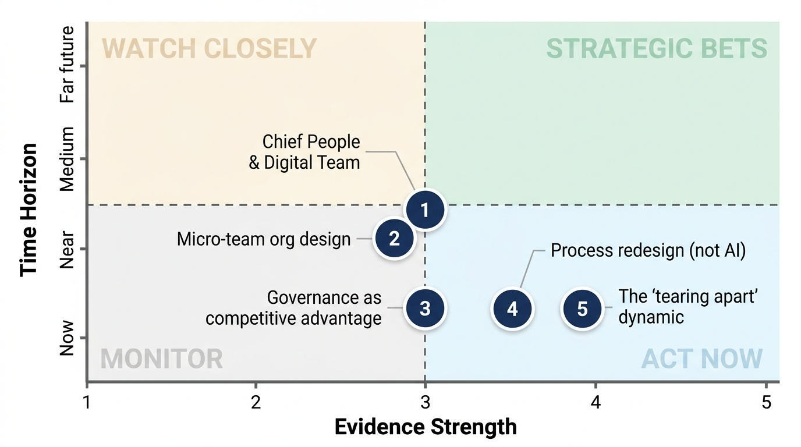
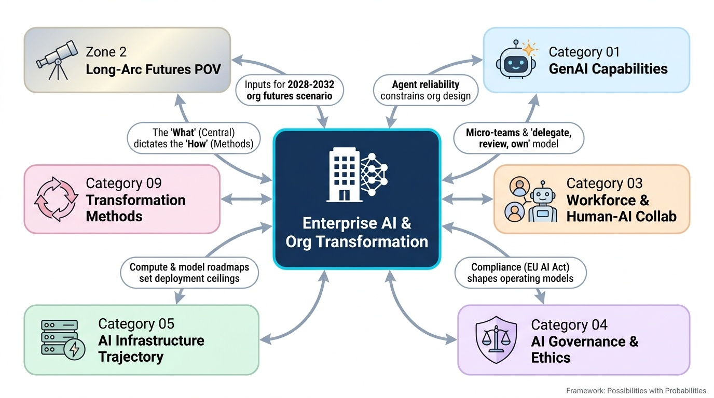

# Enterprise AI & Org Transformation
**Zone:** 1 — Present Intelligence  
**Last updated:** April 2026  
**Baseline status:** COMPLETE

  
  <button type="button" class="audio-brief__play" aria-label="Play audio brief" data-audio-play>
    ▶
  </button>
  

    
    Sanjay's Summary
  

  

    

  

  <audio class="audio-brief__audio" src="/audio/categories/02.mp3" preload="metadata" data-audio-element></audio>

---

*Conceptual overview — generated via PaperBanana (color infographic)*

---

---

## State of the Field (as of April 2026)

Enterprise AI has crossed the adoption threshold but crashed into the transformation wall. The numbers tell a paradox: 88% of companies use AI in at least one function ([McKinsey State of AI 2025](https://www.mckinsey.com/capabilities/quantumblack/our-insights/the-state-of-ai)), yet 80% of AI projects fail to deliver intended business value ([Pertama Partners 2026](https://www.pertamapartners.com/insights/ai-project-failure-statistics-2026)), and only 29% report significant ROI from generative AI despite individual productivity gains averaging 5x ([BCG Closing the AI Impact Gap 2025](https://www.bcg.com/publications/2025/closing-the-ai-impact-gap)). The gap is not technological — it is organizational.

The central insight emerging from every major report in 2025–2026 is a sentence from the [Stanford Enterprise AI Playbook (Brynjolfsson et al., March 2026)](https://digitaleconomy.stanford.edu/publication/enterprise-ai-playbook/): *"Same technology, same use cases, vastly different outcomes. The difference was never the AI model. It was always the organization."* This finding, based on 51 enterprise deployments studied over 5 months, confirms what transformation practitioners have long suspected: AI success is a redesign problem, not an adoption problem.

The most significant shift of the past 12 months is the emergence of **agentic AI as an enterprise architecture question**. The [Deloitte State of AI in the Enterprise 2026 survey](https://www.deloitte.com/us/en/what-we-do/capabilities/applied-artificial-intelligence/content/state-of-ai-in-the-enterprise.html) (3,235 leaders) shows 38% piloting agentic AI solutions, but only 11% have agents in production. The scaling gap is severe — 78% of executives say realizing the full benefit of agentic AI will require a new operating model, yet 42% are still developing a strategy roadmap and 35% have no formal strategy at all. [Gartner projects 15% of day-to-day work decisions will be made autonomously by 2028](https://www.gartner.com/en/newsroom/press-releases/2025-06-25-gartner-predicts-over-40-percent-of-agentic-ai-projects-will-be-canceled-by-end-of-2027) (up from effectively zero in 2024), while simultaneously warning that 40%+ of agentic AI projects will be cancelled by end of 2027.

Organizations are splitting into three tiers. One-third are using AI for **deep transformation** — creating new products/services or reinventing core processes. Another third are **redesigning key processes** around AI. The remaining third are layering AI onto existing processes with little structural change. The first tier is capturing disproportionate value; BCG reports that 60% of organizations generate no material value from AI investments despite spending.

The [Accenture Technology Vision 2025](https://www.accenture.com/us-en/insights/technology/technology-trends-2025) framed this era through three pillars: **Abundance** (reduced cost and time for digital creation), **Abstraction** (democratized access beyond technical specialists), and **Autonomy** (intent-based systems minimizing friction). 77% of surveyed executives believe AI agents will reinvent how organizations build digital systems, and 78% agree digital ecosystems must be built for AI agents as much as for humans within 3-5 years.

---

## Key Developments (Past 12 Months)

- **Stanford Enterprise AI Playbook[^stanford-enterprise-ai-playbook-2026] (March 2026)[^stanford-enterprise-ai-playbook-2026]:** 51 enterprise case studies showing organizational readiness — not technology selection — as the determinant of success. Key insight: leadership commitment, willingness to accept failure, and process redesign matter more than model choice.

- **Deloitte State of AI in Enterprise 2026:** Worker access to AI rose 50% in 2025. Number of companies with ≥40% projects in production expected to double in six months. But governance maturity lags: only 1 in 5 companies has a mature governance model for autonomous AI agents.

- **Agentic AI operating model emergence:** Leading teams converging on "delegate, review, own" model ([Deloitte Tech Trends 2026](https://www.deloitte.com/us/en/insights/topics/technology-management/tech-trends/2026/agentic-ai-strategy.html)). Humans as "agent supervisors" positioned at critical decision points rather than checking every output. [Moderna combined HR and IT under a single Chief People and Digital Technology Officer](https://www.flexos.work/learn/moderna-merges-hr-it-new-chief-manages-3000-ai-and-5800-humans) — an early signal of structural convergence.

- **Micro-teams and AI-native org design:** Emerging pattern of 3-7 person cross-functional teams with AI agent support, shipping production AI in weeks rather than quarters. Traditional team structures lack the speed, integration, and feedback loops needed to scale AI. Early adopters report order-of-magnitude cycle time improvements.

- **The pilot-to-production gap quantified:** 95% of GenAI pilots fail to reach production ([MIT Sloan 2025](https://nanda.media.mit.edu/ai_report_2025.pdf)). 78% of enterprises have AI agent pilots but under 15% reach production. Five gaps account for 89% of failures: legacy integration complexity, inconsistent output quality at volume, absent monitoring tooling, unclear organizational ownership, and insufficient domain training data.

- **[Accenture Pulse of Change Index 2026](https://www.accenture.com/us-en/insights/pulse-of-change):** Rate of enterprise change has increased 183% since 2019. Biggest barrier to AI value is no longer technology — it is workforce alignment. Employees are eager to learn; organizations aren't restructuring fast enough to channel that energy.

- **[BCG $200B agentic AI opportunity in tech services (2026)](https://www.bcg.com/publications/2026/the-200-billion-dollar-ai-opportunity-in-tech-services):** Tech service providers face existential transformation as agentic AI reshapes delivery models. The firms that adapt their operating models fastest capture disproportionate market share.

- **54% of C-suite say AI adoption is "tearing their company apart" ([Writer, 2026](https://writer.com/blog/enterprise-ai-adoption-2026/)):** Organizational tension between AI enthusiasts and skeptics, between centralized control and distributed experimentation, between speed-of-deployment pressure and governance requirements.

---

## The Debate

**Optimist case (Accenture Tech Vision[^accenture-tech-vision-2025], Deloitte, BCG strategic leaders):**
AI-native operating models will create 10x value by fundamentally redesigning how work gets done. The organizations that move fastest through the transformation wall — redesigning processes, upskilling workforces, deploying agentic AI at scale — will establish insurmountable competitive advantages. The $200B opportunity[^bcg-200b-agentic-ai-2026] is real; the winners-take-most dynamic is already visible. AI agents will not just assist humans but operate as "digital workers" requiring onboarding, performance management, and lifecycle governance — a new organizational capability that creates value at scale.

**Skeptic/pragmatist case ([Stanford Digital Economy Lab](https://digitaleconomy.stanford.edu/), MIT Sloan[^mit-nanda-genai-divide-2025], BCG impact gap research[^bcg-ai-impact-gap-2025]):**
The 80% failure rate is not a technology problem — it is a systemic organizational deficit that cannot be solved by moving faster. Most enterprises lack the data governance, process maturity, and change management capability to absorb the transformation. The pilot-to-production gap (95% failure for GenAI pilots) suggests structural barriers, not just execution gaps. Layering agentic AI onto unreformed organizations will amplify existing dysfunction. The "digital worker" metaphor risks obscuring the fragility and error-proneness of current agent systems. The honest assessment: most organizations need 18-36 months of foundational work (data architecture, governance, skills) before agentic AI can deliver at scale.

**What the evidence supports:**
Both sides are right, sequentially. The optimist vision is directionally correct — organizations that redesign around AI will capture disproportionate value. But the pragmatist timing is more accurate — the Stanford finding that "the difference was always the organization" means most enterprises need to do hard organizational work before the technology delivers. The dangerous middle ground is cosmetic AI adoption: deploying tools without redesigning work, claiming transformation while preserving existing structures. This is where 60% of organizations currently sit, and where value destruction occurs — spending on AI without the organizational change required to capture returns.

---

## Sanjay's Current Position

Enterprise AI transformation is fundamentally an **organization development (OD) problem**, not a technology deployment problem. After 30 years of transformation consulting, I recognize the pattern: every major technology wave (ERP in the 90s, digital transformation in the 2010s, AI now) follows the same arc — technology arrives, organizations try to bolt it onto existing structures, most fail, and the winners are those who redesign the organization around the technology's capabilities rather than constraining the technology within legacy organizational boundaries.

What makes AI different from previous waves is the **speed and depth of organizational redesign required**. ERP demanded process standardization; digital demanded omnichannel integration; AI demands a fundamental rethinking of **who does what** — not just process, but the human-machine division of labor at every level. The emergence of agentic AI accelerates this: if AI agents can autonomously complete multi-step workflows, the role of middle management shifts from task delegation to agent supervision and exception handling. This is not a staffing adjustment — it is a structural redesign of how organizations coordinate work.

My working hypothesis: **the organizations that succeed will be those that treat AI agents as a new class of organizational participant** — requiring governance, oversight, and integration into the operating model — rather than as tools to be deployed within existing structures. The "delegate, review, own" model is a starting point, but the real transformation is in redesigning decision rights, information flows, and accountability structures around a hybrid human-agent workforce.

The micro-team pattern (3-7 people with AI agent support) is the early signal of what AI-native org design looks like: small, cross-functional, empowered teams that leverage AI for speed, with human judgment concentrated at decision points where stakes and ambiguity are highest. This pattern will propagate from engineering teams to the broader enterprise.

The biggest risk I see: **transformation theater** — organizations claiming AI transformation while preserving existing power structures and processes. The 60% that generate no material value from AI are overwhelmingly in this category. Genuine transformation requires executives willing to redesign their own roles.

---

## Key Figures / Sources to Track

- [**Erik Brynjolfsson**](https://www.brynjolfsson.com/) (Stanford Digital Economy Lab) — Co-author of Enterprise AI Playbook[^stanford-enterprise-ai-playbook-2026]. Foundational researcher on AI-and-organizations. ["The Turing Trap"](https://arxiv.org/abs/2201.04200) framing on augmentation vs. automation. Track: papers, Stanford HAI talks.
- [**Thomas Davenport**](https://www.babson.edu/about/our-leaders-and-scholars/faculty-and-academic-divisions/faculty-profiles/thomas-davenport.php) (Babson College) — Two decades of enterprise AI research. Bridges academic rigor and practitioner language. Track: HBR articles, books.
- **Accenture Research / Technology Vision team** — Annual Technology Vision, Pulse of Change Index. Largest enterprise survey datasets. Track: annual reports (internal access advantage for Sanjay).
- [**Deloitte AI Institute**](https://www.deloitte.com/us/en/services/consulting/content/advancing-human-ai-collaboration.html) — State of AI in the Enterprise (annual, 3,235+ leaders)[^deloitte-state-of-ai-enterprise-2026]. Most comprehensive longitudinal enterprise AI survey. Track: annual report, Tech Trends[^deloitte-tech-trends-2026].
- [**Satya Nadella / Microsoft enterprise AI**](https://www.cnbc.com/2025/02/24/microsoft-reiterates-plan-to-invest-80-billion-in-ai-.html) — Driving enterprise AI at unprecedented scale (Copilot across M365). Track: earnings calls, keynotes for enterprise adoption signals.
- [**BCG Henderson Institute**](https://bcghendersoninstitute.com/) — "Closing the AI Impact Gap" research. Rigorous on where value is vs. isn't materializing. Track: publications, BCG Global AI surveys.
- **Moderna (Daniel Skovronsky, CPDT Officer)**[^moderna-hr-it-merger] — Organizational exemplar: merged HR + IT, agent-first operating model. Track: as a case study of structural convergence.
- [**IDC FutureScape**](https://my.idc.com/getdoc.jsp?containerId=prUS53883425) — Enterprise AI spending projections, deployment benchmarks. Track: annual forecasts.

---

## Open Questions

1. **Will the micro-team model scale beyond engineering?** Early evidence from software teams is promising, but enterprise functions (finance, HR, legal) have different coordination needs. What does the 3-7 person AI-augmented team look like in a shared services center?

2. **What happens to middle management?** If agents handle routine delegation, monitoring, and reporting — the traditional middle management function — what is the redesigned role? Agent supervisor? Exception handler? The honest answer is unclear, and the social implications are significant.

3. **Is the 80% failure rate improving?** The Pertama/BCG/MIT data is damning, but it aggregates across maturity levels. Are the "deep transformers" (top third) seeing substantially better rates? If so, what specifically separates them?

4. **How does sovereign AI interact with enterprise transformation?** National AI strategies ([EU AI Act](https://eur-lex.europa.eu/eli/reg/2024/1689/oj/eng), US executive orders, China's AI governance) constrain what enterprises can deploy and how. Does geographic fragmentation of AI regulation force multinational enterprises toward different operating models per region?

5. **When does agentic AI become reliable enough for autonomous enterprise operation?** Current agent systems fail ~45% of complex tasks ([SWE-bench as proxy](https://www.swebench.com/)). At what reliability threshold does "delegate, review, own" become "delegate and trust"? And what organizational design enables graceful degradation when agents fail?

---

## Signal Assessment

*Signal landscape (Evidence vs. Time Horizon) — PaperBanana*

### Ranked Shortlist: Uncommon but Likely (Top 5)

### 1. Micro-team org design becomes the default for AI-native operations
**Profile:** E3 T-Accelerating U3 H-Post-hype Z-Near
**What's happening:** Multiple independent sources report 3-7 person cross-functional teams with AI agent support shipping production AI in weeks. This pattern is emerging simultaneously in startups and enterprise engineering orgs.
**Why it matters:** This is not just a team structure — it is a fundamentally different organizational unit. If it propagates beyond engineering, it implies flattened hierarchies, reduced middle management, and dramatically different coordination mechanisms.
**What most people miss:** The micro-team model doesn't just add AI tools — it changes the minimum viable team size for complex work. The organizational implications (headcount, management layers, coordination cost) are far more disruptive than most enterprise leaders have processed.
**If true, optimize by:** Redesign one business function around micro-teams + AI agents as a pilot. Document coordination mechanisms, decision rights, and agent governance patterns that emerge. This becomes the template for broader redesign.
**Watch for:** Enterprise case studies beyond engineering/software teams. If micro-teams show up in finance, legal, or operations functions within 12 months, the pattern is generalizing.

### 2. Chief People & Digital Technology Officer role (HR-IT convergence)
**Profile:** E3 T-Emerging U3 H-Grounded Z-Near
**What's happening:** Moderna merged HR and IT leadership under a single C-suite role[^moderna-hr-it-merger]. The logic: if AI agents are "digital workers," then workforce planning and technology architecture become the same problem.
**Why it matters:** This structural convergence signals that the human-agent workforce is becoming an organizational design reality, not just a metaphor. HR owns the workforce; IT owns the agents. When the two workforces merge, so must the leadership.
**What most people miss:** Most organizations still have completely siloed HR and IT functions. The companies that converge these early will design coherent human-agent operating models while others struggle with misaligned workforce and technology strategies.
**If true, optimize by:** Start joint HR-IT working groups on agent governance, workforce planning scenarios, and skills strategy. Don't wait for a C-suite merge — build the connective tissue now.
**Watch for:** Other enterprises creating combined digital-workforce C-suite roles. If 3+ Fortune 500 companies follow Moderna's pattern[^moderna-hr-it-merger] within 12 months, this is a structural trend.

### 3. Governance as competitive advantage (not compliance burden)
**Profile:** E3 T-Accelerating U2 H-Post-hype Z-Now
**What's happening:** Only 1 in 5 companies has mature AI governance. But externally-built pilots are 2x as likely to reach deployment, and employee usage rates nearly double for externally-built tools — suggesting that structured, governed approaches outperform ad-hoc internal builds.
**Why it matters:** The conventional wisdom treats governance as friction. The evidence suggests the opposite: governance enables scaling by providing the trust infrastructure that allows organizations to move from pilot to production.
**What most people miss:** The 80% failure rate is concentrated in organizations with weak governance. Mature governance isn't slowing down AI adoption — it's the mechanism that allows it to scale.
**If true, optimize by:** Invest in AI governance infrastructure now — not as compliance, but as a scaling enabler. Build decision frameworks for agent autonomy levels, data access boundaries, and human oversight triggers.
**Watch for:** Whether the failure rate difference between governed and ungoverned organizations widens over the next 12 months.

### 4. Process redesign (not AI layering) as the value driver
**Profile:** E4 T-Accelerating U3 H-Grounded Z-Now
**What's happening:** Every major report (Stanford, Deloitte, BCG, Accenture) converges on the same finding: organizations that redesign processes around AI capabilities outperform those that layer AI onto existing workflows. The "deep transformers" (top third) are pulling away.
**Why it matters:** This invalidates the most common enterprise AI strategy: "start small, add AI to existing processes, scale what works." The evidence says the starting point must be process redesign, not tool adoption.
**What most people miss:** This finding has been published repeatedly but is systematically ignored by most enterprises because process redesign is harder, slower, and more politically difficult than tool deployment. The organizations that act on it gain structural advantage.
**If true, optimize by:** Before any new AI deployment, ask: "Are we redesigning the process, or automating the current one?" If the answer is the latter, stop and redesign first. One well-redesigned process beats ten AI-augmented legacy processes.
**Watch for:** Whether the value gap between process-redesigners and AI-layerers continues to widen in next year's reports.

### 5. The "tearing apart" dynamic as a leading indicator of transformation depth
**Profile:** E4 T-Emerging U2 H-Grounded Z-Now
**What's happening:** 54% of C-suite executives say AI adoption is "tearing their company apart." Organizational tension between enthusiasts and skeptics, centralized and distributed, speed and governance.
**Why it matters:** Counter-intuitively, this tension may be a positive signal. Organizations experiencing disruption are the ones actually attempting transformation. The silent majority (no tension, no transformation) may be the ones at greatest risk.
**What most people miss:** Executives interpret internal tension as a problem to solve. It may actually be a sign that the organization is engaging with the real difficulty of AI transformation. The absence of tension should be the warning sign.
**If true, optimize by:** Diagnose whether organizational AI tension is productive (real transformation underway, legitimate disagreements being surfaced) or destructive (political resistance, absence of shared vision). Channel productive tension; address destructive tension through alignment, not suppression.
**Watch for:** Whether organizations reporting high internal tension in 2026 show better transformation outcomes in 2027-2028 surveys compared to "calm" organizations.

### Additional Strong Signals (Established, widely known)
- Enterprise AI spending continues to accelerate (Microsoft $80B, Amazon $86B in FY2025 alone) — E5, Maturing, U1, Grounded, Now
- GenAI pilot-to-production failure rate remains extremely high (95% per MIT Sloan[^mit-nanda-genai-divide-2025]) — E5, Maturing, U1, Grounded, Now
- Data governance and quality remain top barrier to AI scaling (74% of companies) — E5, Maturing, U1, Grounded, Now

### Filtered Out (Peak Hype or Noise)
- "AI will replace X% of jobs by 20XX" headlines — Peak hype. Specific numbers are unfounded extrapolation. The reality is role transformation, not mass replacement.
- "Enterprise AI market worth $X trillion by 2030" — market sizing without deployment evidence. Noise.

---

## Sources

### Papers & Reports

[^accenture-pulse-of-change-2026]: Accenture. *Pulse of Change — Business and Technology Trends Index*. Accenture Research. 2026. <https://www.accenture.com/us-en/insights/pulse-of-change>
[^accenture-tech-vision-2025]: Accenture. *Technology Vision 2025 — AI, A Declaration of Autonomy*. Accenture Research. 2025. <https://www.accenture.com/us-en/insights/technology/technology-trends-2025>
[^bcg-200b-agentic-ai-2026]: Boston Consulting Group. *The $200 Billion Agentic AI Opportunity for Tech Service Providers*. BCG Publications. 2026. <https://www.bcg.com/publications/2026/the-200-billion-dollar-ai-opportunity-in-tech-services>
[^bcg-ai-impact-gap-2025]: Boston Consulting Group. *From Potential to Profit — Closing the AI Impact Gap (AI Radar 2025)*. BCG Publications. 2025. <https://www.bcg.com/publications/2025/closing-the-ai-impact-gap>
[^brynjolfsson-turing-trap-2022]: Erik Brynjolfsson. *The Turing Trap — The Promise & Peril of Human-Like Artificial Intelligence*. Daedalus / arXiv:2201.04200. 2022. <https://arxiv.org/abs/2201.04200>
[^deloitte-state-of-ai-enterprise-2026]: Deloitte AI Institute. *State of AI in the Enterprise — 2026 AI Report (From Ambition to Activation)*. Deloitte Insights. 2026. <https://www.deloitte.com/us/en/what-we-do/capabilities/applied-artificial-intelligence/content/state-of-ai-in-the-enterprise.html>
[^deloitte-tech-trends-2026]: Deloitte. *Tech Trends 2026 — Agentic AI Strategy*. Deloitte Insights. 2026. <https://www.deloitte.com/us/en/insights/topics/technology-management/tech-trends/2026/agentic-ai-strategy.html>
[^gartner-agentic-ai-2025]: Gartner. *Predicts Over 40% of Agentic AI Projects Will Be Canceled by End of 2027*. Gartner Press Release (paywalled landing). 2025. <https://www.gartner.com/en/newsroom/press-releases/2025-06-25-gartner-predicts-over-40-percent-of-agentic-ai-projects-will-be-canceled-by-end-of-2027>
[^idc-futurescape-2026]: IDC. *FutureScape 2026 Predictions — The Rise of Agentic AI and a Turning Point in Enterprise Transformation*. IDC (paywalled landing). 2025. <https://my.idc.com/getdoc.jsp?containerId=prUS53883425>
[^mckinsey-state-of-ai-2025]: McKinsey & Company (QuantumBlack). *The state of AI — How organizations are rewiring to capture value*. McKinsey Global Survey on AI. 2025. <https://www.mckinsey.com/capabilities/quantumblack/our-insights/the-state-of-ai>
[^mit-nanda-genai-divide-2025]: Challapally, Pease, Raskar, Chari. *The GenAI Divide — State of AI in Business 2025*. MIT NANDA / MIT Sloan. 2025. <https://nanda.media.mit.edu/ai_report_2025.pdf>
[^pertama-ai-failure-2026]: Pertama Partners. *AI Project Failure Statistics 2026 — Why 80% of AI Projects Fail*. Pertama Partners Insights. 2026. <https://www.pertamapartners.com/insights/ai-project-failure-statistics-2026>
[^stanford-enterprise-ai-playbook-2026]: Pereira, Graylin, Brynjolfsson. *The Enterprise AI Playbook — Lessons from 51 Successful Deployments*. Stanford Digital Economy Lab. 2026. <https://digitaleconomy.stanford.edu/publication/enterprise-ai-playbook/>
[^writer-enterprise-ai-2026]: WRITER & Workplace Intelligence. *Enterprise AI Adoption 2026 — AI adoption is tearing companies apart*. writer.com. 2026. <https://writer.com/blog/enterprise-ai-adoption-2026/>

### Benchmarks

[^swe-bench]: Jimenez, Yang, Wettig, Lieret, Yao, Narasimhan, Press. *SWE-bench — Can Language Models Resolve Real-World GitHub Issues?*. Princeton University / swebench.com. 2023. <https://www.swebench.com/>

### Articles & Newsletters

[^moderna-hr-it-merger]: FlexOS. *Moderna Merges HR & IT — Chief People & Digital Technology manages 3,000 AIs and 5,800 humans*. flexos.work. 2025. <https://www.flexos.work/learn/moderna-merges-hr-it-new-chief-manages-3000-ai-and-5800-humans>

### People (Sources to Track)

[^brynjolfsson-person]: Erik Brynjolfsson. *Director, Stanford Digital Economy Lab; Senior Fellow, Stanford HAI*. Stanford University. <https://www.brynjolfsson.com/>
[^davenport-person]: Thomas H. Davenport. *President's Distinguished Professor of IT and Management*. Babson College. <https://www.babson.edu/about/our-leaders-and-scholars/faculty-and-academic-divisions/faculty-profiles/thomas-davenport.php>
[^satya-nadella-person]: Satya Nadella. *Chairman and CEO, Microsoft — remarks on $80B AI infrastructure investment*. CNBC / Microsoft earnings (paywalled). 2025. <https://www.cnbc.com/2025/02/24/microsoft-reiterates-plan-to-invest-80-billion-in-ai-.html>

### Organizations & Publications

[^bcg-henderson-institute-org]: BCG Henderson Institute. *BCG's strategy think tank*. Boston Consulting Group. <https://bcghendersoninstitute.com/>
[^deloitte-ai-institute-org]: Deloitte AI Institute. *Deloitte's AI research and practice hub*. Deloitte. <https://www.deloitte.com/us/en/services/consulting/content/advancing-human-ai-collaboration.html>
[^eu-ai-act-2024]: European Parliament and Council. *Regulation (EU) 2024/1689 — Artificial Intelligence Act*. EUR-Lex (Official Journal). 2024. <https://eur-lex.europa.eu/eli/reg/2024/1689/oj/eng>
[^stanford-digital-economy-lab]: Stanford University. *Digital Economy Lab*. Stanford Institute for Human-Centered AI (HAI). <https://digitaleconomy.stanford.edu/>

---
## Connections to Other Categories

*Category connections map — generated via PaperBanana*

- **Category 01 (GenAI Capabilities):** Agent reliability (~55% on SWE-bench) directly constrains enterprise agentic deployment. As capability improves, the organizational design requirements shift.
- **Category 03 (Workforce & Human-AI Collaboration):** Micro-team org design and the middle management question feed directly into workforce implications. The "delegate, review, own" model reshapes every job description.
- **Category 04 (AI Governance & Ethics):** Governance as competitive advantage (Signal #3) connects directly. EU AI Act compliance requirements shape enterprise AI operating models, especially for multinationals.
- **Category 05 (AI Infrastructure Trajectory):** Compute scaling and model capability roadmaps set the ceiling for what enterprises can deploy. Infrastructure investment decisions constrain transformation timelines.
- **Category 09 (Transformation Methods):** This category describes *what* is changing in enterprises; Category 09 describes *how* to execute the change. The process redesign finding (Signal #4) demands updated transformation methodologies.
- **Zone 2 / Long-Arc Futures POV:** The micro-team signal, HR-IT convergence, and governance-as-advantage are inputs to the 2028-2032 organizational futures scenario.
