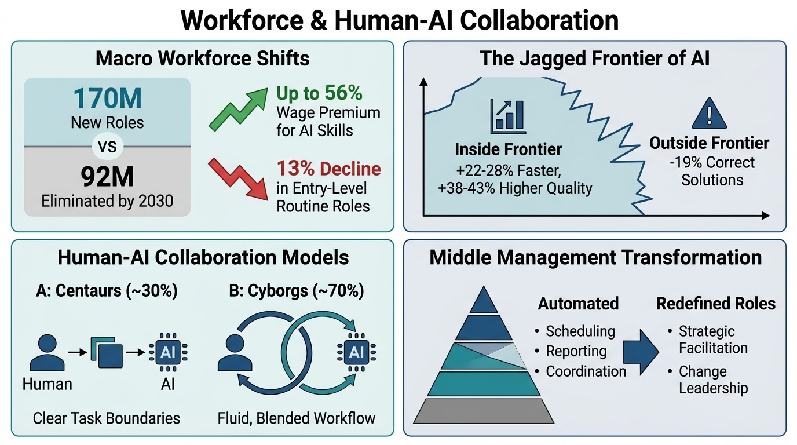
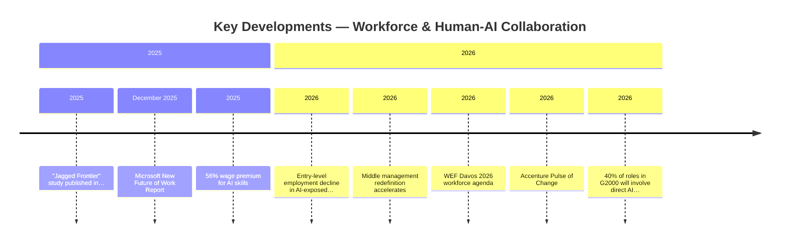
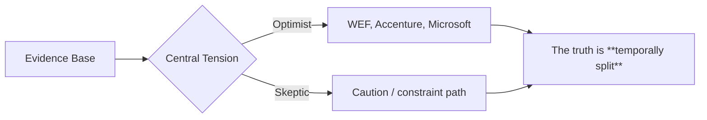
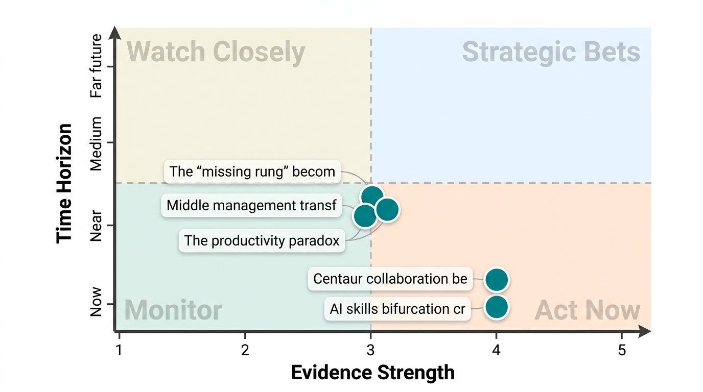
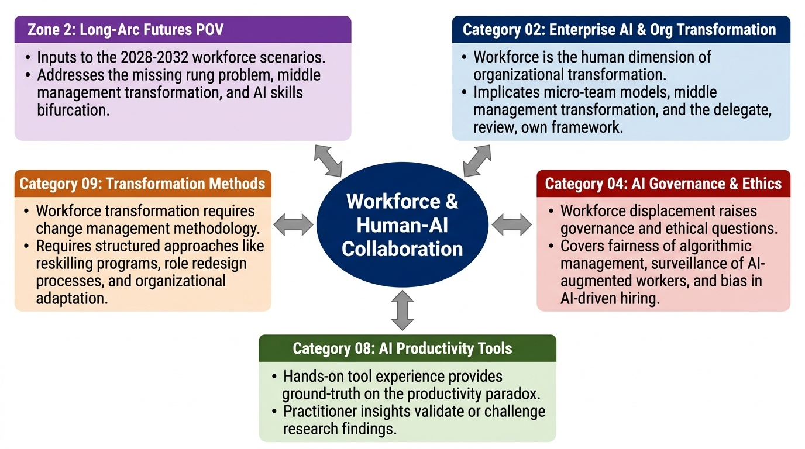

# Workforce & Human-AI Collaboration
**Zone:** 1 — Present Intelligence  
**Last updated:** April 2026  
**Baseline status:** COMPLETE

  
  <button type="button" class="audio-brief__play" aria-label="Play audio brief" data-audio-play>
    ▶
  </button>
  

    
    Sanjay's Summary
  

  

    

  

  <audio class="audio-brief__audio" src="/audio/categories/03.mp3" preload="metadata" data-audio-element></audio>

---

*Conceptual overview — generated via PaperBanana (color infographic)*

---

---

## State of the Field (as of April 2026)

The AI workforce transformation is producing measurable effects — but not the ones most people expected. The headline narrative of mass job displacement has not materialized. Instead, the evidence reveals a more nuanced and arguably more disruptive pattern: **task-level transformation within existing roles**, accompanied by a growing wage premium for AI-skilled workers and a quiet structural compression of middle management.

The numbers frame the picture. [WEF's Future of Jobs Report 2025](https://www.weforum.org/publications/the-future-of-jobs-report-2025/) projects 170 million new roles created against 92 million eliminated by 2030, for a net gain of 78 million jobs. But this aggregate masks deep unevenness. Since ChatGPT's debut, openings for routine, automation-prone roles fell 13%, while demand for analytical, technical, and creative roles grew 20% ([HBR, March 2026](https://hbr.org/2026/03/research-how-ai-is-changing-the-labor-market)). Workers with AI skills command wage premiums up to 56% higher than peers ([PwC Global AI Jobs Barometer 2025](https://www.pwc.com/gx/en/services/ai/ai-jobs-barometer.html)). Early-career workers in the most AI-exposed occupations saw employment fall 13% on a relative basis ([Brynjolfsson, Fortune 2026](https://digitaleconomy.stanford.edu/publications/canaries-in-the-coal-mine/)).

The most rigorous research on human-AI collaboration comes from the BCG-Harvard-Wharton "jagged frontier[^dellacqua-jagged-frontier-2025]" study ([Dell'Acqua et al., published in Organization Science 2025](https://pubsonline.informs.org/doi/10.1287/orsc.2025.21838)). The experiment with 758 BCG consultants showed: on tasks *inside* AI's capability frontier, consultants with GPT-4 completed 12.2% more tasks, 22-28% faster, at 38-43% higher quality. Below-average performers gained +43% vs. +17% for top performers — AI is a great equalizer. But on tasks *outside* the frontier, AI users were 19% *less* likely to produce correct solutions. This "jagged frontier[^dellacqua-jagged-frontier-2025]" — where AI capability is uneven and unpredictable — is the central challenge for workforce design.

Two collaboration models have emerged from the research. **Centaurs** (~30% of workers) maintain clear human-AI task boundaries — "I think, it executes." They preserve human judgment and use AI for bounded subtasks. **Cyborgs** (~70%) blend human and AI work fluidly, with constant back-and-forth. Both models outperform AI-only or human-only work, but cyborgs face higher risk of capability-frontier errors because the boundaries are blurred.

Middle management is the structural flashpoint. [Gartner predicts 20% of organizations will use AI to eliminate more than half of current middle management roles by 2026](https://www.gartner.com/en/newsroom/press-releases/2024-10-22-gartner-unveils-top-predictions-for-it-organizations-and-users-in-2025-and-beyond). [BearingPoint's study estimates 43% of standard managerial tasks are impacted by GenAI](https://www.bearingpoint.com/en/about-us/news-and-media/press-releases/middle-managers-are-the-key-to-ai-driven-transformation/) — 19% augmented, 24% automated. The tasks being automated are precisely the coordination, monitoring, and reporting functions that define traditional middle management: scheduling, approvals, data analysis, performance tracking. Over 60% of companies integrating AI have already redefined managerial roles.

---

## Key Developments (Past 12 Months)

- **"Jagged Frontier[^dellacqua-jagged-frontier-2025]" study published in Organization Science (2025):** The most rigorous field experiment on AI-augmented knowledge work to date. 758 BCG consultants. Findings now being replicated across industries. Introduced the centaur/cyborg framework that is becoming the standard vocabulary for human-AI collaboration.

- **[Microsoft New Future of Work Report (December 2025)](https://www.microsoft.com/en-us/research/publication/new-future-of-work-report-2025/):** Comprehensive research synthesis from Microsoft Research on how AI is reshaping work. Key finding: the productivity gains from AI are real at the task level but do not yet translate to organizational productivity — the same paradox surfaced in Category 08.

- **Entry-level employment decline in AI-exposed occupations (Brynjolfsson, 2026[^brynjolfsson-canaries-2025]):** 13% relative decline in early-career employment in most AI-exposed occupations since late 2022. This is the first robust evidence of AI affecting specific job categories, concentrated at the entry level where tasks are most automatable.

- **56% wage premium for AI skills (PwC, 2025[^pwc-ai-jobs-barometer-2025]):** Workers with demonstrated AI skills command substantially higher wages. Nearly all investors (97%) say they would penalize companies failing to adopt skills-powered workforce models. The AI skills gap is creating a bifurcated labor market.

- **Middle management redefinition accelerates:** [HBR (July 2025) published "How AI Is Redefining Managerial Roles."](https://hbr.org/2025/07/how-ai-is-redefining-managerial-roles) Gartner[^gartner-middle-mgmt-2024], BearingPoint[^bearingpoint-mgr-2025], [Fast Company](https://www.fastcompany.com/91380376/ai-and-the-death-and-rebirth-of-middle-management) all converge on the same finding: middle management is transforming from supervision/coordination to strategic facilitation and change leadership. 64% of companies provide AI training, but only 35% have structured change management programs.

- **[WEF Davos 2026 workforce agenda](https://www.weforum.org/stories/2026/01/davos-here-s-what-to-know-about-jobs-and-skills-transformation/):** 63% of C-suite leaders believe redesigning work to incorporate AI will deliver the highest people-related ROI. 72% of investors agree companies embracing human-AI integration are positioned for competitive advantage. But only half of C-suite leaders believe they are investing enough to close the skills gap.

- **[Accenture Pulse of Change (2026)](https://www.accenture.com/us-en/insights/pulse-of-change):** Biggest barrier to AI value is no longer technology — it is alignment with employees who are eager to learn. The bottleneck is organizational speed of adaptation, not employee willingness.

- **[40% of roles in G2000 will involve direct AI agent engagement by 2026 (IDC)](https://my.idc.com/getdoc.jsp?containerId=prUS53883425):** Not "using AI tools" but directly collaborating with AI agents as team participants. This reframes workforce design from "tool adoption" to "team composition."

---

## The Debate

**Optimist case (WEF, Accenture, Microsoft):**
AI creates more jobs than it displaces — net +78 million by 2030. The key is investment in reskilling and work redesign. The jagged frontier[^dellacqua-jagged-frontier-2025] study[^dellacqua-jagged-frontier-2025] shows AI dramatically lifts below-average performers, creating a more equitable workforce. Demand for analytical, creative, and social-emotional skills is rising 20%+. Companies that redesign work around human-AI collaboration will see sustained competitive advantage. Middle management doesn't disappear — it evolves into higher-value strategic roles.

**Skeptic case (Brynjolfsson entry-level data[^brynjolfsson-canaries-2025], [NBER productivity paradox](https://www.nber.org/papers/w34836), BearingPoint[^bearingpoint-mgr-2025]):**
The aggregate job creation numbers mask devastating effects on specific populations. Entry-level jobs in AI-exposed fields are declining 13%. Junior knowledge workers face a "missing rung" problem — if AI handles the work that trains junior employees, how does the next generation develop expertise? The 43% automation rate for managerial tasks means structural layoffs are coming, not just role evolution. The wage premium for AI skills means those without AI proficiency face stagnation or displacement. "Reskilling" sounds good in reports but is not happening at the speed or scale needed — only 35% of companies have structured programs.

**What the evidence supports:**
The truth is **temporally split**. In the short term (2026-2028), AI augments rather than replaces at the aggregate level — the net job gain is likely real. But the distribution is severely uneven: entry-level knowledge workers, routine managers, and AI-unskilled professionals bear disproportionate costs. The "missing rung" problem — where AI eliminates the tasks that traditionally trained junior employees — may be the most consequential long-term workforce effect, but it won't be visible in employment data for 3-5 years. The jagged frontier[^dellacqua-jagged-frontier-2025] finding is the most practically useful insight: AI capability is uneven and unpredictable, so workforce design must account for where AI helps and where it harms, within the same role and even within the same task.

---

## Sanjay's Current Position

The workforce transformation is real but the framing is wrong. The dominant narrative — "AI will automate X% of jobs" — is industrial-age thinking applied to a knowledge-age problem. What's actually happening is a **decomposition of roles into tasks**, followed by a **recomposition** where some tasks go to AI and others become more valuable when performed by humans. This is not job elimination — it is job redesign at the task level.

The centaur/cyborg framework from the jagged frontier[^dellacqua-jagged-frontier-2025] research[^dellacqua-jagged-frontier-2025] is the most practically useful model I've encountered. My experience as a practitioner confirms it: the highest-value collaboration mode is centaur-style — clear boundaries where I make the judgment calls and AI handles the execution. This is exactly the "delegate, review, own" model from Category 02, applied at the individual level rather than the organizational level.

The middle management question is where my 30 years of transformation experience adds the most value. Middle management has always been the layer that translates strategy into execution through coordination, monitoring, and communication. AI can now do all three of those functions. The question is not "will middle managers be eliminated?" but "what replaces the coordination function they provided?" My hypothesis: the answer is smaller, AI-augmented teams that self-coordinate (the micro-team model from Category 02), with former middle managers who adapt becoming "team orchestrators" — a hybrid role combining human judgment with agent supervision.

The biggest risk I see is the **"missing rung" problem** for junior talent development. If AI handles the entry-level work that traditionally trained juniors, we lose the development pipeline. The organizations that solve this — creating new pathways for junior talent to develop judgment and expertise in an AI-augmented environment — will have a structural talent advantage. Those that don't will face a senior talent crisis in 5-7 years.

---

## Key Figures / Sources to Track

- [**Ethan Mollick** (Wharton)](https://www.oneusefulthing.org/) — Lead researcher on jagged frontier[^dellacqua-jagged-frontier-2025] study[^dellacqua-jagged-frontier-2025]. Centaur/cyborg framework. Most practically useful researcher on human-AI collaboration. Track: One Useful Thing Substack[^mollick-one-useful-thing], papers.
- [**Erik Brynjolfsson** (Stanford)](https://www.brynjolfsson.com/) — ["The Turing Trap" framing on augmentation vs. automation](https://arxiv.org/abs/2201.04200). Entry-level employment decline research. Track: [Stanford Digital Economy Lab](https://digitaleconomy.stanford.edu/), papers, media.
- [**Fabian Dell'Acqua** (Harvard)](https://www.fabriziodellacqua.com/) — Co-author of jagged frontier[^dellacqua-jagged-frontier-2025] study[^dellacqua-jagged-frontier-2025]. Frontier Firm Initiative with Microsoft. Track: papers, HBS.
- **WEF Future of Jobs team[^wef-future-of-jobs-2025]** — Largest global employer survey on workforce transformation. Track: annual report.
- **PwC Global AI Jobs Barometer[^pwc-ai-jobs-barometer-2025]** — AI skills wage premium data. Track: annual updates.
- [**SHRM (Society for Human Resource Management)** — State of AI in HR](https://www.shrm.org/topics-tools/research/2025-talent-trends/ai-in-hr). Practitioner perspective on workforce implementation. Track: annual report.
- [**Josh Bersin**](https://joshbersin.com/) — HR technology and workforce transformation analyst. Practitioner-oriented. Track: blog, podcast.
- [**Gartner CHRO research**](https://www.gartner.com/en/newsroom/press-releases/2025-10-02-gartner-says-chros-top-priorities-for-2026-center-around-realizing-ai-value-and-driving-performance-amid-uncertainty) — Managerial role redesign data, change management surveys. Track: press releases, reports.

---

## Open Questions

1. **How do organizations solve the "missing rung" problem?** If AI automates entry-level knowledge work, how do junior professionals develop the judgment and expertise that can only come from doing the work? Apprenticeship models, AI-supervised practice, simulation-based training?

2. **Does the jagged frontier[^dellacqua-jagged-frontier-2025] smooth out or stay jagged?** As models improve, do capability gaps narrow (making the frontier less jagged) or shift to new tasks (keeping it perpetually jagged)? This determines whether the centaur/cyborg models are transitional or permanent.

3. **What is the actual middle management employment trajectory?** Gartner[^gartner-middle-mgmt-2024] predicts 20% of orgs will halve middle management by 2026[^gartner-middle-mgmt-2024]. Is this happening? At what pace? And what happens to the displaced managers — do they reskill into new roles or leave the workforce?

4. **Will the AI wage premium persist or compress?** 56% premium today. As AI skills become more common (baseline expectation rather than differentiator), does the premium drop? Or does the frontier keep advancing, maintaining the premium for those who stay current?

5. **Is the productivity paradox a measurement problem or a real problem?** If individual task speedups (5-15x) don't translate to organizational productivity, is the issue that we're measuring wrong (productivity stats miss quality and capability improvements) or that organizational friction genuinely absorbs the gains?

---

## Signal Assessment

*Signal landscape (Evidence vs. Time Horizon) — PaperBanana*

### Ranked Shortlist: Uncommon but Likely (Top 5)

### 1. The "missing rung" becomes the dominant workforce challenge by 2028
**Profile:** E3 T-Emerging U3 H-Post-hype Z-Near
**What's happening:** Entry-level employment in AI-exposed occupations declining 13%. AI handles the tasks that traditionally trained junior professionals. The development pipeline is quietly breaking.
**Why it matters:** This is a delayed-onset structural problem. The effects won't be visible in senior talent pools for 3-5 years, but the damage is happening now. Organizations that recognize it early and design alternative development pathways will have a structural talent advantage.
**What most people miss:** The current conversation focuses on job displacement for existing workers. The more consequential effect is the failure to develop the *next* generation of skilled professionals. This is invisible in current employment data.
**If true, optimize by:** Design AI-augmented development programs for junior talent now. Create "learning-by-doing-with-AI" pathways that build judgment and expertise alongside AI tool use, not instead of it.
**Watch for:** Whether graduate hiring in consulting, finance, and law shows year-over-year decline in 2026-2027. If so, the missing rung is materializing.

### 2. Centaur collaboration becomes the standard professional competency
**Profile:** E4 T-Accelerating U2 H-Post-hype Z-Now
**What's happening:** The jagged frontier[^dellacqua-jagged-frontier-2025] research[^dellacqua-jagged-frontier-2025] has been published, replicated, and adopted as vocabulary. The centaur model (clear human-AI boundaries) outperforms both AI-only and unstructured human-AI blending.
**Why it matters:** "How to collaborate with AI" is becoming a professional skill as fundamental as "how to use a spreadsheet" was in the 1990s. The centaur model provides a learnable, teachable framework for this skill.
**What most people miss:** Most AI training programs teach *how to use tools*. Very few teach *how to design the human-AI boundary* — which tasks to delegate, which to retain, and how to verify AI output. This is the actual skill gap.
**If true, optimize by:** Build centaur collaboration into professional development programs. Teach boundary design, not just tool use. Create role-specific guidelines for which tasks fall inside vs. outside the AI frontier.
**Watch for:** Whether "AI collaboration" or "human-AI teaming" appears as an explicit competency in job descriptions and performance reviews within 12 months.

### 3. Middle management transforms into "team orchestration" role
**Profile:** E3 T-Emerging U3 H-Ahead Z-Near
**What's happening:** 43% of managerial tasks automatable. 20% of organizations planning to halve middle management. But simultaneously, 60%+ of companies have redefined managerial roles rather than eliminating them.
**Why it matters:** The outcome is not elimination but transformation. The "team orchestrator" role — managing a hybrid team of humans and AI agents, designing workflows, handling exceptions, and ensuring quality — is a new organizational function that preserves human judgment at the coordination layer.
**What most people miss:** The narrative is "AI eliminates middle management." The evidence is "AI eliminates middle management *tasks* and creates a new *role*." The difference is existential for millions of professionals, but the new role requires fundamentally different skills.
**If true, optimize by:** Begin redefining middle management roles now — from coordinators/supervisors to orchestrators/designers. Provide training in agent supervision, workflow design, and exception handling.
**Watch for:** Whether organizations that restructure middle management into orchestration roles outperform those that simply eliminate layers, as measured in 2027 enterprise surveys.

### 4. AI skills bifurcation creates a two-tier knowledge workforce
**Profile:** E4 T-Accelerating U2 H-Grounded Z-Now
**What's happening:** 56% wage premium for AI skills. 97% of investors would penalize companies failing to adopt skills-powered models. But only half of C-suite leaders believe they're investing enough to close the gap.
**Why it matters:** This is creating a structural bifurcation: AI-skilled workers see wage growth and opportunity expansion, while AI-unskilled workers face stagnation. This is not a temporary gap — it will deepen as AI capabilities advance.
**What most people miss:** The bifurcation is not between "tech workers" and "non-tech workers." It cuts across every profession — AI-skilled lawyers vs. traditional lawyers, AI-skilled consultants vs. traditional consultants. The divide runs within roles, not between them.
**If true, optimize by:** Make AI skills training universal and role-specific, not a generic "AI literacy" program. Every profession needs its own centaur training: how does an AI-skilled version of this specific role operate?
**Watch for:** Whether the 56% wage premium holds or widens in PwC's 2026 update[^pwc-ai-jobs-barometer-2025].

### 5. The productivity paradox resolves through organizational redesign, not tool improvement
**Profile:** E3 T-Emerging U3 H-Grounded Z-Near
**What's happening:** Task-level productivity gains (5-15x) are documented. Organizational productivity gains are absent (80%+ firms report no impact per NBER[^nber-ai-firm-data-2026]). The gap is organizational design, not tool capability.
**Why it matters:** This means the solution is not better AI tools — it's redesigning organizational workflows, roles, and metrics to capture the task-level gains. This connects directly to Categories 02 and 09.
**What most people miss:** Most organizations are treating the productivity paradox as a "we need better tools" problem. It's actually a "we need to redesign work" problem. The tools are already good enough — the organization isn't.
**If true, optimize by:** Stop waiting for better AI to "solve" productivity. Redesign the top 3-5 knowledge work processes around the capabilities AI already has. Measure capability expansion, not time savings.
**Watch for:** Whether organizations that pursue process redesign (Category 02, Signal #4) show measurably different productivity outcomes from those pursuing tool adoption only.

### Filtered Out
- ["AI will eliminate 300M jobs" (Goldman Sachs 2023 estimate)](https://www.gspublishing.com/content/research/en/reports/2023/03/27/d64e052b-0f6e-45d7-967b-d7be35fabd16.html) — Peak hype. Based on task exposure analysis without accounting for task recomposition, new role creation, or economic adjustment.
- "Universal basic income will be needed by 2030" — Speculative. No evidence of net job loss at aggregate level; the problem is distributional, not aggregate.

---

## Sources

### Papers & Reports

[^accenture-pulse-2026]: Accenture. *Pulse of Change 2026*. Accenture. 2026. <https://www.accenture.com/us-en/insights/pulse-of-change>
[^bearingpoint-mgr-2025]: BearingPoint. *From Fear to Empowerment: Middle Managers as Catalysts in AI-Driven Transformation*. BearingPoint. 2025. <https://www.bearingpoint.com/en/about-us/news-and-media/press-releases/middle-managers-are-the-key-to-ai-driven-transformation/>
[^brynjolfsson-canaries-2025]: Brynjolfsson, Chandar, Chen. *Canaries in the Coal Mine? Six Facts about the Recent Employment Effects of Artificial Intelligence*. Stanford Digital Economy Lab. 2025. <https://digitaleconomy.stanford.edu/publications/canaries-in-the-coal-mine/>
[^brynjolfsson-turing-trap]: Erik Brynjolfsson. *The Turing Trap: The Promise & Peril of Human-Like Artificial Intelligence*. arXiv:2201.04200 / Daedalus. 2022. <https://arxiv.org/abs/2201.04200>
[^dellacqua-jagged-frontier-2025]: Dell'Acqua, McFowland, Mollick, Lifshitz-Assaf, Kellogg, Rajendran, Krayer, Candelon, Lakhani. *Navigating the Jagged Technological Frontier: Field Experimental Evidence of the Effects of AI on Knowledge Worker Productivity and Quality*. Organization Science. 2025. <https://pubsonline.informs.org/doi/10.1287/orsc.2025.21838>
[^gartner-chro-2026]: Gartner. *Top Priorities for CHROs in 2026*. Gartner Press Release. 2025. <https://www.gartner.com/en/newsroom/press-releases/2025-10-02-gartner-says-chros-top-priorities-for-2026-center-around-realizing-ai-value-and-driving-performance-amid-uncertainty>
[^gartner-middle-mgmt-2024]: Gartner. *Top Predictions for IT Organizations and Users in 2025 and Beyond (20% of organizations will use AI to flatten middle management by 2026)*. Gartner Press Release. 2024. <https://www.gartner.com/en/newsroom/press-releases/2024-10-22-gartner-unveils-top-predictions-for-it-organizations-and-users-in-2025-and-beyond>
[^goldman-sachs-300m-2023]: Goldman Sachs (Briggs, Kodnani). *The Potentially Large Effects of Artificial Intelligence on Economic Growth*. Goldman Sachs. 2023. <https://www.gspublishing.com/content/research/en/reports/2023/03/27/d64e052b-0f6e-45d7-967b-d7be35fabd16.html>
[^idc-futurescape-2026]: IDC. *FutureScape 2026 Predictions*. IDC. 2025. <https://my.idc.com/getdoc.jsp?containerId=prUS53883425>
[^microsoft-nfw-2025]: Microsoft Research. *New Future of Work Report 2025*. Microsoft Research. 2025. <https://www.microsoft.com/en-us/research/publication/new-future-of-work-report-2025/>
[^nber-ai-firm-data-2026]: Acemoglu, Anderson, Beede, Buffington, Childress, Dinlersoz, Foster, Goldschlag, Haltiwanger, Kroff, Restrepo, Zolas (NBER). *Firm Data on AI*. NBER Working Paper w34836. 2026. <https://www.nber.org/papers/w34836>
[^pwc-ai-jobs-barometer-2025]: PwC. *The Fearless Future: 2025 Global AI Jobs Barometer*. PwC. 2025. <https://www.pwc.com/gx/en/services/ai/ai-jobs-barometer.html>
[^shrm-ai-hr-2025]: SHRM (Society for Human Resource Management). *The Role of AI in HR Continues to Expand — 2025 Talent Trends*. SHRM. 2025. <https://www.shrm.org/topics-tools/research/2025-talent-trends/ai-in-hr>
[^wef-future-of-jobs-2025]: World Economic Forum. *The Future of Jobs Report 2025*. weforum.org. 2025. <https://www.weforum.org/publications/the-future-of-jobs-report-2025/>

### Articles & Newsletters

[^fastcompany-middle-mgmt]: Fast Company. *AI and the Death (and Rebirth) of Middle Management*. Fast Company. 2025. <https://www.fastcompany.com/91380376/ai-and-the-death-and-rebirth-of-middle-management>
[^hbr-labor-market-2026]: Harvard Business Review. *Research — How AI Is Changing the Labor Market*. Harvard Business Review. 2026. <https://hbr.org/2026/03/research-how-ai-is-changing-the-labor-market>
[^hbr-redefining-mgr-2025]: Ana Moreno. *How AI Is Redefining Managerial Roles*. Harvard Business Review. 2025. <https://hbr.org/2025/07/how-ai-is-redefining-managerial-roles>
[^mollick-one-useful-thing]: Ethan Mollick. *One Useful Thing*. Substack. 2026. <https://www.oneusefulthing.org/>
[^wef-davos-2026]: World Economic Forum. *Jobs and skills transformation: What to know at Davos 2026*. World Economic Forum. 2026. <https://www.weforum.org/stories/2026/01/davos-here-s-what-to-know-about-jobs-and-skills-transformation/>

### People (Sources to Track)

[^brynjolfsson-person]: Erik Brynjolfsson. *Stanford Digital Economy Lab (Director)*. Stanford. 2026. <https://www.brynjolfsson.com/>
[^dellacqua-person]: Fabrizio Dell'Acqua. *Postdoctoral Researcher, Harvard Business School (Digital Data Design Institute)*. Harvard. 2026. <https://www.fabriziodellacqua.com/>
[^josh-bersin]: Josh Bersin. *Insights on Work, Talent, Learning, Leadership, and HR Technology*. joshbersin.com. 2026. <https://joshbersin.com/>

### Organizations & Publications

[^stanford-digital-economy-lab]: Stanford University. *Stanford Digital Economy Lab*. Stanford. 2026. <https://digitaleconomy.stanford.edu/>

---
## Connections to Other Categories

*Category connections map — generated via PaperBanana*

- **Category 02 (Enterprise AI & Org Transformation):** Workforce is the human dimension of organizational transformation. The micro-team model, middle management transformation, and "delegate, review, own" framework from Category 02 have direct workforce implications.
- **Category 04 (AI Governance & Ethics):** Workforce displacement raises governance and ethical questions — fairness of algorithmic management, surveillance of AI-augmented workers, bias in AI-driven hiring.
- **Category 08 (AI Productivity Tools):** Hands-on tool experience provides ground-truth on the productivity paradox. Practitioner insights validate or challenge the research findings.
- **Category 09 (Transformation Methods):** Workforce transformation requires change management methodology. The reskilling programs, role redesign processes, and organizational adaptation all require structured transformation approaches.
- **Zone 2 / Long-Arc Futures POV:** The missing rung problem, middle management transformation, and AI skills bifurcation are inputs to the 2028-2032 workforce scenarios.
