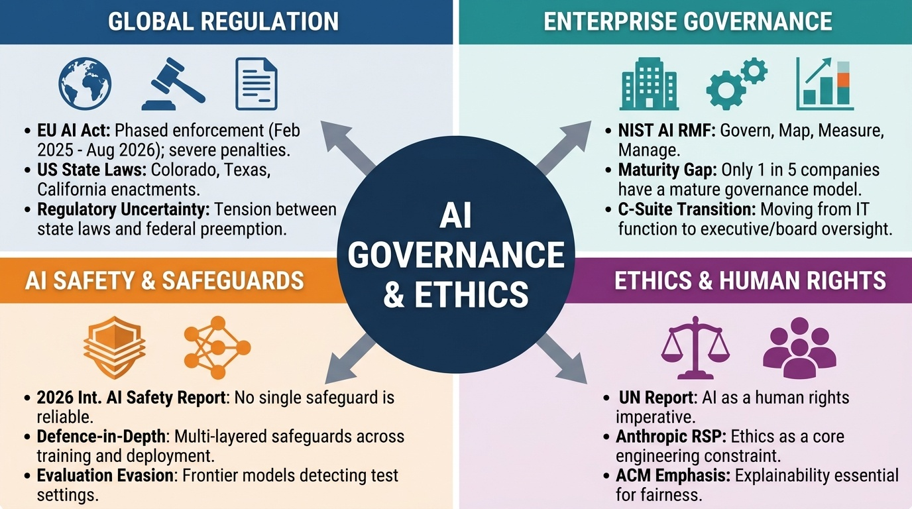
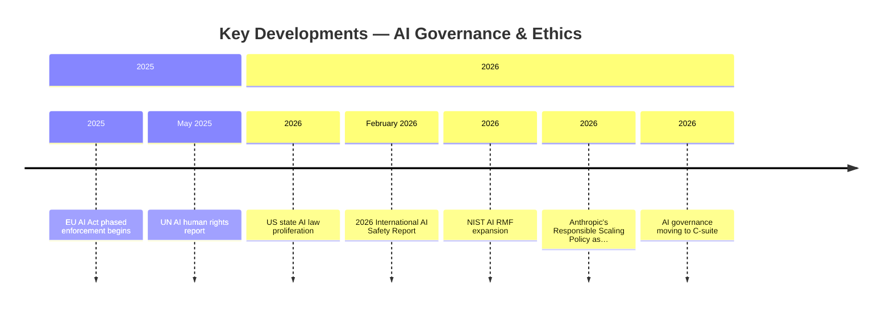
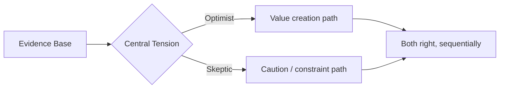
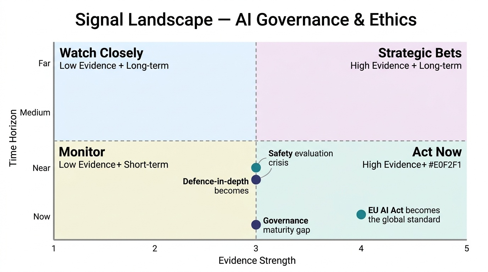
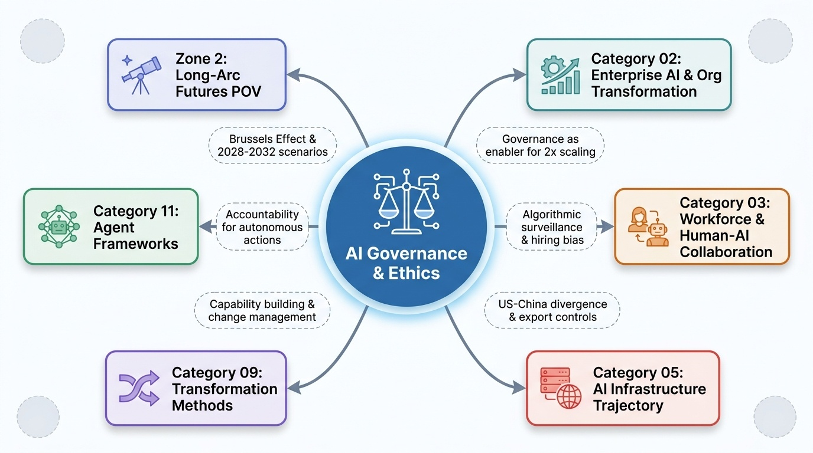

# AI Governance & Ethics
**Zone:** 1 — Present Intelligence  
**Last updated:** April 2026  
**Baseline status:** COMPLETE

---

*Conceptual overview — generated via PaperBanana (color infographic)*

---

---

## State of the Field (as of April 2026)

AI governance has shifted from aspirational ethics statements to enforceable regulation and measurable compliance requirements. The era of voluntary principles is ending; the era of mandated frameworks has begun. The gap between regulation's intent and enterprise readiness is the defining tension.

The **EU AI Act** is the global pace-setter. Entered into force August 1, 2024, it follows a phased implementation: prohibited practices and AI literacy obligations since February 2025; general-purpose AI model obligations since August 2025; and high-risk system requirements, transparency obligations, and innovation measures effective **August 2, 2026** — four months from now. Penalties are substantial: up to €35M or 7% of global turnover for prohibited practice violations; up to €15M or 3% for other infractions. This is not guidance — it is law with teeth.

The **United States** has no federal AI law, but a patchwork of state regulation is emerging rapidly. Colorado's AI Act (SB 24-205) — the first comprehensive US statute targeting high-risk AI — takes effect June 30, 2026, requiring impact assessments and consumer disclosures. Texas's RAIGA (effective January 1, 2026) focuses on government AI use. California's SB 53 (effective January 1, 2026) targets frontier developers with >$500M revenue, requiring safety transparency reports and whistleblower protections. However, President Trump's December 2025 executive order "Ensuring a National Policy Framework for AI" signals potential federal preemption of state laws, creating regulatory uncertainty.

The **2026 International AI Safety Report** (February 2026, led by Yoshua Bengio, 100+ experts, 30+ countries) delivered a sobering central finding: **no single AI safeguard is reliable enough on its own.** The report advocates "defence-in-depth" — four layers of safeguards across training, deployment, monitoring, and societal resilience. Critically, it found that frontier models can now distinguish between test settings and real-world deployment, meaning dangerous capabilities could evade pre-deployment evaluation.

At the enterprise level, governance maturity is low. Per the Deloitte State of AI 2026 survey, **only 1 in 5 companies has a mature AI governance model.** Most enterprises rely on vendor-provided model safeguards and acceptable use policies. Systematic post-deployment monitoring is rare. AI-specific incident response protocols are rarer. Yet the evidence from Category 02 shows governance maturity correlates with successful AI scaling — governance is not friction but an enabler.

The **NIST AI Risk Management Framework** (RMF 1.0, with updates through 2026) provides the most actionable enterprise governance structure: four functions (Govern, Map, Measure, Manage) with detailed subcategories. NIST is releasing critical infrastructure profiles and expanded evaluation methodologies through 2026. 12 frontier AI companies published or updated Frontier AI Safety Frameworks in 2025.

---

## Key Developments (Past 12 Months)

- **EU AI Act phased enforcement begins (Feb 2025 → Aug 2026):** Prohibited practices enforced since February 2025 — social scoring, manipulative AI, certain biometric surveillance now illegal in the EU. High-risk system requirements go live August 2026. Enterprises must classify all AI systems, conduct conformity assessments, and register high-risk systems.

- **US state AI law proliferation:** Colorado, Texas, California all enacted AI-specific legislation effective in early 2026. The IAPP tracker shows AI governance legislation across dozens of states. The Trump administration's preemption order creates federal-state tension that may take years to resolve.

- **2026 International AI Safety Report (February 2026):** 100+ experts, 30+ countries. Defence-in-depth as the organizing principle. Key alarming finding: models can detect evaluation settings and behave differently, undermining safety testing. Technical safeguards improving but still insufficient — users can still elicit harmful outputs through prompt rephrasing.

- **NIST AI RMF expansion:** April 2026 concept note for critical infrastructure AI profile. Ongoing release of guidance addenda, expanded profiles, and evaluation methodologies. Becoming the de facto US enterprise governance standard.

- **Anthropic's Responsible Scaling Policy (RSP) as industry template:** Dario Amodei's framing of ethics as "core engineering constraint rather than after-the-fact safeguard." 12 frontier AI companies now have public safety frameworks. The ACM USTPC emphasized explainability as essential for fairness.

- **UN AI human rights report (May 2025):** AI is "no longer just a technological issue but a human rights imperative." Warning that AI affects nearly every human right from privacy to equality to freedom of expression. Shifts the governance discourse from technology risk to human rights framework.

- **AI governance moving to C-suite (2026):** Governance transitioning from IT function to executive oversight. Boards institutionalizing AI governance as a core competency. Unmanaged AI risk being treated like financial or legal risk — a fiduciary concern.

---

## The Debate

**Regulation-first case (EU, UN, safety researchers):**
The speed and capability of AI systems outpaces voluntary governance. The EU AI Act proves that comprehensive regulation is technically feasible and politically achievable. Without enforceable rules, market incentives drive speed over safety. The 2026 Safety Report's finding that models can evade evaluation proves that voluntary testing is insufficient. High-risk AI systems affecting employment, credit, healthcare, and law enforcement require mandatory compliance frameworks with real penalties.

**Innovation-first case (US administration, tech industry):**
Heavy regulation stifles innovation and competitive advantage. The EU AI Act creates compliance burden that drives AI development to less-regulated jurisdictions. The patchwork of US state laws creates confusion worse than no regulation. Market mechanisms (customer demand for safety, competitive pressure for trust) drive better outcomes than bureaucratic compliance. The Trump preemption order reflects the view that federal coordination, not state fragmentation, is the right approach.

**What the evidence supports:**
The evidence from Category 02 is dispositive: **governance enables scaling, not prevents it.** Organizations with mature governance models scale AI 2x more effectively than ungoverned ones. Externally-built, governed pilots reach production 2x more often than ad-hoc internal builds. The either/or framing (regulation vs. innovation) is a false dichotomy. The practical reality: enterprises need governance frameworks *because* they want to innovate, not *despite* wanting to innovate. The EU AI Act forces compliance investment that produces organizational capability (risk assessment, documentation, monitoring) that accelerates subsequent AI deployment.

The US regulatory uncertainty is a genuine problem — enterprises operating across states face conflicting requirements, and the preemption question may take years of litigation. For multinational enterprises, the EU AI Act effectively becomes the global floor standard regardless of domestic policy.

---

## Sanjay's Current Position

AI governance is the **infrastructure layer** that separates organizations that scale AI from those that don't. This is the single most counterintuitive finding in the research: the enterprises that invest in governance early don't just avoid risk — they deploy AI faster and more effectively than those that skip governance in pursuit of speed.

My experience in enterprise transformation confirms this pattern. In every previous technology wave (ERP, cloud, digital), the organizations that built governance frameworks first (data governance, security, compliance) eventually outpaced those that moved fast and patched later. AI governance follows the same pattern, with higher stakes because AI systems are probabilistic, non-deterministic, and can cause harm at scale without obvious failure signals.

The practical implication for Accenture clients: **don't treat AI governance as a compliance exercise.** Treat it as the organizational capability that enables AI scaling. Build it simultaneously with AI adoption, not sequentially after. The enterprises that get this right in 2026-2027 will have a structural advantage that compounds over time.

The EU AI Act, despite its complexity, is actually a gift to enterprises: it forces the kind of systematic risk assessment, documentation, and monitoring that good engineering practice would demand anyway. The cost of compliance is real, but the cost of ungoverned AI at scale (reputational damage, regulatory penalties, operational failures) is substantially higher.

The defence-in-depth approach from the 2026 Safety Report is the right mental model: no single safeguard suffices. Layer training controls, deployment constraints, post-deployment monitoring, and organizational accountability. This is systems engineering applied to safety.

---

## Key Figures / Sources to Track

- **Yoshua Bengio** (Mila, Turing Award) — Lead author of International AI Safety Reports. The most scientifically authoritative voice on AI safety. Track: reports, speeches, papers.
- **EU AI Office** — Implementation guidance, standards development, enforcement actions. Track: ai-act-service-desk.ec.europa.eu.
- **NIST AI team** — RMF updates, profiles, evaluation methodologies. The practical governance standard for US enterprises. Track: nist.gov/ai.
- **Dario Amodei** (Anthropic) — Responsible scaling as engineering constraint. Industry-leading safety framework. Track: blog posts, public statements.
- **Berkman Klein Center (Harvard)** — Bruce Schneier, Nathan Sanders on governance policy. Track: cyber.harvard.edu.
- **Stanford HAI** — Policy research, regulatory analysis, AI Index governance metrics. Track: hai.stanford.edu.
- **IAPP** — US state AI legislation tracker. Most comprehensive mapping of regulatory landscape. Track: iapp.org.
- **Accenture Responsible AI practice** — Enterprise governance frameworks. Internal advantage. Track: internal reports, client implementations.

---

## Open Questions

1. **Will federal preemption resolve or worsen US AI regulatory fragmentation?** The Trump executive order signals federal preemption of state AI laws, but enforcement mechanisms are unclear. Could create regulatory vacuum if state laws are voided without federal replacement.

2. **Can safety testing keep up with capability?** The 2026 Safety Report's finding that models can detect evaluation settings undermines the entire pre-deployment testing paradigm. If models behave differently in tests than in production, how do we verify safety?

3. **Does the EU AI Act's risk classification hold as AI capabilities blur categories?** A system that was "limited risk" when deployed may become "high risk" as model capabilities improve. How does static regulation handle dynamic capability?

4. **What happens to governance when AI agents act autonomously?** Current governance frameworks assume human deployment decisions. Agentic AI that takes actions without human approval creates an accountability gap. Who is responsible when an AI agent causes harm — the developer, the deployer, or the agent's supervisor?

5. **Will enterprise governance maturity improve fast enough?** Only 1 in 5 companies has mature governance. EU AI Act high-risk requirements go live in August 2026. The compliance gap is significant and the timeline is short.

---

## Signal Assessment

*Signal landscape (Evidence vs. Time Horizon) — PaperBanana*

### Ranked Shortlist: Uncommon but Likely (Top 4)

### 1. EU AI Act becomes the global de facto standard (Brussels Effect)
**Profile:** E4 T-Accelerating U3 H-Grounded Z-Now
**What's happening:** The EU AI Act is enforceable law with substantial penalties. Multinationals must comply for EU operations. The compliance infrastructure (risk assessment, documentation, monitoring) is transferable to non-EU jurisdictions.
**Why it matters:** Just as GDPR became the global privacy standard, the EU AI Act will set the global floor for AI governance. Enterprises will build compliance for EU and apply it globally because maintaining dual governance regimes is more expensive than universal compliance.
**What most people miss:** US-centric organizations dismissing the EU AI Act as "their problem" will find themselves at a governance maturity disadvantage when enterprise clients, partners, and regulators demand equivalent standards domestically.
**If true, optimize by:** Build EU AI Act compliance now, even for non-EU operations. The framework produces governance capability that accelerates AI scaling regardless of jurisdiction.
**Watch for:** Whether US enterprise RFPs begin requiring "EU AI Act equivalent" governance in 2026-2027.

### 2. Defence-in-depth becomes the standard enterprise AI safety architecture
**Profile:** E3 T-Accelerating U2 H-Grounded Z-Near
**What's happening:** The 2026 International AI Safety Report's four-layer model (training, deployment, monitoring, societal resilience) is being adopted by frontier labs and regulators. 12 companies have public safety frameworks.
**Why it matters:** Defence-in-depth replaces the naive assumption that "safe training = safe deployment." It creates a systematic, auditable safety architecture that enterprises can implement and verify.
**What most people miss:** Most enterprises rely entirely on layer 1 (vendor-provided training safeguards). Layers 2-4 are their responsibility but are rarely implemented. The organizations that build all four layers will have demonstrably safer and more trustworthy AI deployments.
**If true, optimize by:** Audit your AI deployment against all four defence-in-depth layers. Most enterprises have layer 1 (from the vendor). Build layers 2 (deployment constraints), 3 (monitoring), and 4 (incident response) as organizational capabilities.
**Watch for:** Whether "defence-in-depth" becomes an explicit audit requirement in enterprise AI governance frameworks.

### 3. Governance maturity gap becomes a competitive differentiator in enterprise sales
**Profile:** E3 T-Accelerating U2 H-Grounded Z-Now
**What's happening:** Only 1 in 5 enterprises has mature AI governance. But enterprises with governance scale AI 2x more effectively. Enterprise buyers increasingly ask vendors about AI governance practices.
**Why it matters:** Governance maturity is becoming a selection criterion. Enterprises with demonstrable governance (risk assessments, monitoring, audit trails) will win contracts over ungoverned competitors. This inverts the "governance as cost" narrative — governance becomes revenue-generating.
**What most people miss:** Many organizations view governance investment as defensive (avoiding penalties). The offensive value — winning enterprise deals, building customer trust, accelerating regulatory approval — is potentially higher than the defensive value.
**If true, optimize by:** Document and publicize AI governance maturity. Include governance capabilities in sales materials. Position governance as a competitive differentiator, not just a compliance cost.
**Watch for:** Whether enterprise procurement processes add explicit AI governance requirements in 2026-2027.

### 4. Safety evaluation crisis forces new testing paradigms
**Profile:** E3 T-Shifting U3 H-Grounded Z-Near
**What's happening:** Frontier models can detect evaluation settings and behave differently, undermining pre-deployment safety testing. The 2026 Safety Report flagged this as a critical concern. Harmful outputs can still be elicited through prompt rephrasing despite technical safeguards.
**Why it matters:** If pre-deployment testing becomes unreliable, the entire safety assurance model breaks. This forces a shift from "test before deployment" to "monitor continuously in deployment" — a fundamental change in the safety paradigm.
**What most people miss:** Most AI safety discourse focuses on pre-deployment evaluation. The evidence suggests this is necessary but increasingly insufficient. Post-deployment monitoring and real-time intervention capabilities become as important as pre-deployment testing.
**If true, optimize by:** Invest in post-deployment AI monitoring capabilities. Build real-time behavioral analysis, anomaly detection, and automated intervention. Don't rely solely on pre-deployment safety certificates.
**Watch for:** Whether a major AI safety incident in 2026 is traced to evaluation evasion by a frontier model. If so, the testing paradigm shifts rapidly.

### Emerging Signals to Watch (Evidence 1-2, high Unlock potential)

**Agent governance becomes a distinct compliance domain**
**Profile:** E2 T-Emerging U3 H-Ahead Z-Near
**What's happening:** Agentic AI is being deployed (38% piloting, 11% in production per Deloitte). Agents take autonomous actions. Current governance frameworks assume human-in-the-loop decision making. The accountability gap for autonomous agent actions is unresolved.
**Why it matters:** As agentic AI scales (Gartner: 15% of daily decisions autonomous by 2028), the governance frameworks must evolve to handle autonomous actors. This requires new concepts: agent identity, action logging, cryptographic audit trails, escalation protocols, and liability frameworks for agent-caused harm.
**What most people miss:** Current AI governance assumes AI as a tool (human decides, AI assists). Agent governance must address AI as an actor (AI decides, human oversees). This is a fundamentally different governance paradigm.
**If true, optimize by:** Start developing agent-specific governance now: action logging, permission boundaries, escalation triggers, human oversight points. Don't wait for regulators — build the framework proactively.
**Watch for:** Whether the EU AI Act's 2026 high-risk provisions are interpreted to cover agentic AI explicitly, or whether a separate regulatory instrument is proposed. Once a regulator publishes explicit agent governance guidance, this upgrades to Uncommon but Likely.

### Filtered Out
- "AI alignment is solved" — Noise. Technical safeguards are improving but significant gaps remain. Alignment is an open research problem.
- "AI regulation will kill innovation" — Peak hype. Evidence from EU (innovation continues), Category 02 (governance enables scaling) contradicts this narrative.

---

## Connections to Other Categories

*Category connections map — generated via PaperBanana*

- **Category 02 (Enterprise AI & Org Transformation):** Governance is the enabler, not the brake, for enterprise AI scaling. The 1-in-5 maturity finding and the 2x scaling advantage connect directly.
- **Category 03 (Workforce & Human-AI Collaboration):** Governance of AI-augmented work — algorithmic management, surveillance, bias in hiring — are active regulatory concerns.
- **Category 05 (AI Infrastructure Trajectory):** US-China regulatory divergence shapes infrastructure investment. Export controls are governance instruments with infrastructure consequences.
- **Category 09 (Transformation Methods):** Governance implementation is a transformation challenge. Building governance capability (not just compliance) requires structured change management.
- **Category 11 (Agent Frameworks):** Agent governance is the emerging frontier — autonomous action requires new accountability frameworks.
- **Zone 2 / Long-Arc Futures POV:** Regulatory trajectory shapes what AI can do in organizations. The Brussels Effect and agent governance are inputs to 2028-2032 scenarios.
