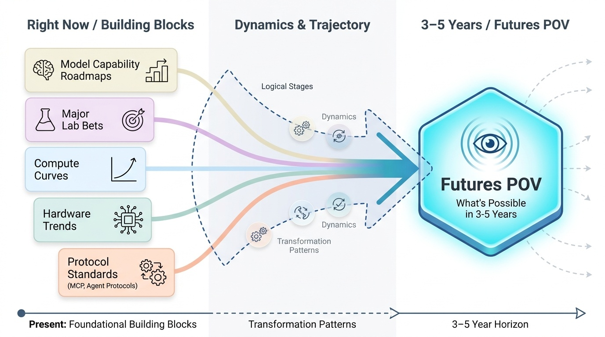
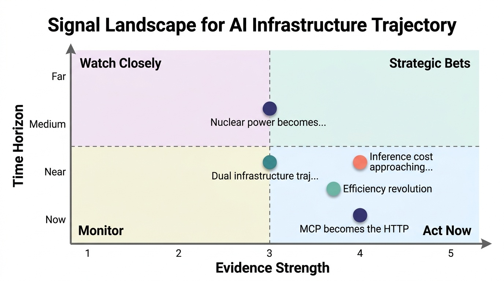
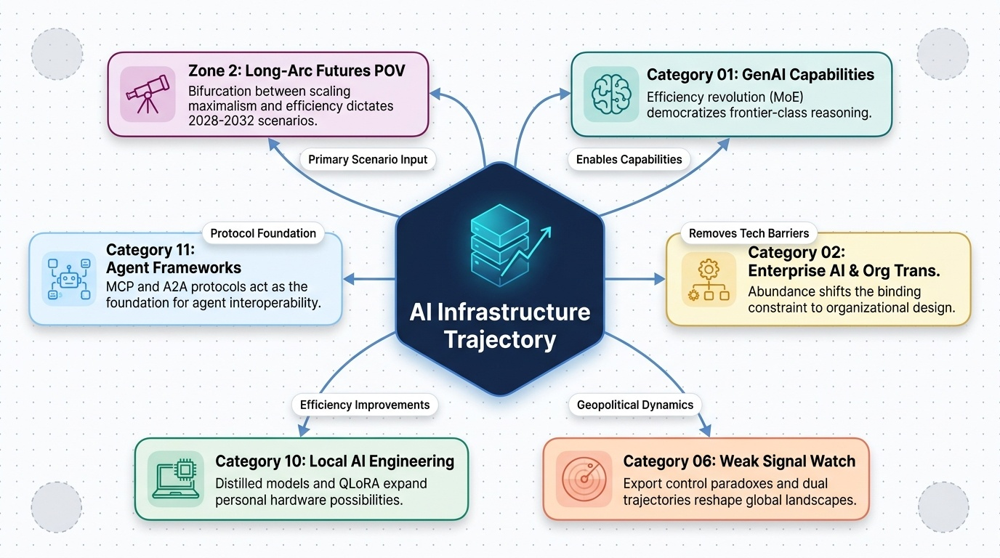

# AI Infrastructure Trajectory
**Zone:** 2 — Futures Intelligence  
**Last updated:** April 2026  
**Baseline status:** COMPLETE

---

*Conceptual overview — generated via PaperBanana (color infographic)*

---

## What This Category Tracks
The structural forces being built *right now* that will determine what's possible in 3–5 years. Compute curves, model capability roadmaps, protocol standards (MCP, agent protocols), major lab bets, hardware trends. These are the inputs to the futures POV — not speculation, but the real building blocks being laid.

---

## Current Infrastructure State (as of April 2026)

AI infrastructure is experiencing three simultaneous and partially contradictory forces: **exponential compute scaling**, **radical efficiency gains**, and **hard physical constraints** on energy and data. Understanding which force dominates in each time horizon is the key to reading the trajectory correctly.

### Compute Scaling

Training compute for frontier language models grows at **4-5x per year**, doubling every ~5.2 months since 2020 (Epoch AI). The number of frontier models exceeding 10^26 FLOP is projected to rise from 10 in 2026 to 80 by 2028 and 200+ by 2030. Leading training clusters have scaled to 100,000 GPUs, with 300,000+ GPU clusters in development. Training costs are climbing at 3.5x annually: GPT-4 cost ~$100M, while next-generation frontier models are expected to exceed $1B.

But the Kurzweil-style exponential view must be tempered by the efficiency story. Pre-training compute efficiency improves at ~3x per year — meaning the same performance can be achieved with 3x less compute each year through algorithmic improvements alone (Epoch AI). Hardware performance-per-dollar improves ~40% per year across 20+ AI accelerator generations.

### The DeepSeek Disruption

DeepSeek R1 (January 2026) was the most structurally significant single event in AI infrastructure this period. An open-weight model trained for reported ~$5.6M (actual costs including hardware overhead: ~$51M for the infrastructure, ~$5.6M in direct training compute) achieving reasoning performance competitive with models that cost 10-20x more to train. The mechanism: Mixture-of-Experts (MoE) architecture + reinforcement learning, reducing active parameters during inference to a fraction of total model size.

The implication is profound: **massive compute investment is not structurally required for frontier-class performance.** This challenged the dominant "scaling maximalist" narrative and triggered an industry-wide reassessment. DeepSeek's January 2026 paper signals continued push toward training bigger models for less, suggesting this efficiency trajectory will continue.

### Inference Economics

Inference now accounts for approximately two-thirds of all AI compute demand, up from one-third in 2023. The cost trajectory is dramatic: GPT-4 equivalent performance now costs ~$0.40 per million tokens, down from ~$20 in late 2022 — a **50x reduction in 3 years**, or roughly 10x annually. NVIDIA reports leading inference providers cutting cost-per-token by up to 10x using optimized stacks on Blackwell. Inference frameworks (vLLM, TensorRT-LLM, SGLang) improved GPU utilization from 30-40% to 70-80%.

This cost collapse is the infrastructure foundation for enterprise agentic AI: when inference is cheap enough, autonomous multi-step workflows become economically viable at scale.

### Protocol Infrastructure: MCP as the Standard

The Model Context Protocol (MCP) has become the defining infrastructure standard for AI-to-tool communication in 2025-2026. Timeline:
- November 2024: Anthropic releases MCP as open standard
- March 2025: OpenAI adopts MCP across products
- July 2025: Microsoft integrates into Copilot Studio (45M users)
- November 2025: AWS adds support (68M users)
- December 2025: Anthropic donates MCP to Linux Foundation's Agentic AI Foundation (AAIF), co-founded with Block and OpenAI, supported by Google, Microsoft, AWS, Cloudflare
- March 2026: 10,000+ active public MCP servers, 97M monthly SDK downloads

Complementary protocols: Google's A2A (Agent-to-Agent, 150+ supporting organizations) for agent-to-agent communication, and ACP (open standard) for RESTful agent collaboration. Forrester predicts 30% of enterprise app vendors will launch MCP servers in 2026.

---

## Key Infrastructure Bets (Past 12 Months)

- **NVIDIA Vera Rubin platform (H2 2026):** Next-generation after Blackwell. 5x inference performance, 10x lower cost-per-token than Blackwell, 4x fewer GPUs needed to train MoE models. Rubin Ultra (2027) brings NVL576 racks — 576 GPUs in a single system — running 21x faster than Blackwell. Feynman architecture on the roadmap after Rubin. AWS, Google Cloud, Microsoft, OCI among first cloud deployers.

- **Capital expenditure surge:** Microsoft committed $80B in FY2025 for data center expansion. Amazon allocated $86B for AI infrastructure. McKinsey forecasts $5.2 trillion cumulative AI data center capex by 2030 for 156GW of capacity. These are not speculative — they are committed capital.

- **Efficiency-first architectures:** DeepSeek's MoE approach demonstrated 90%+ training cost reduction vs. dense models at equivalent performance. Distilled models (1.5B-70B parameters) run on consumer hardware. QLoRA/PEFT make fine-tuning practical on single GPUs. This signals a parallel "small model" infrastructure trajectory alongside the scaling maximalist path.

- **Nuclear power for AI data centers:** Pipeline of conditional agreements between data center operators and SMR nuclear projects grew from 25GW (end 2024) to 45GW (April 2026). Tech companies have plans to finance 20+ GW of SMRs. China approved 10 new nuclear reactors in April 2025 ($27.45B investment), targeting 200GW nuclear capacity by 2030. IEA projects data center electricity consumption doubling by 2030, with AI-focused centers tripling.

- **MCP ecosystem buildout:** From zero to 10,000+ servers and 97M monthly SDK downloads in 18 months. Linux Foundation governance. All major providers on board. This is not a protocol experiment — it is infrastructure becoming standard.

- **Chinese AI labs as infrastructure competitors:** DeepSeek (reasoning efficiency), Qwen/Alibaba (broadest open-source benchmark leader with Qwen 3), Baidu (domestic ecosystem). China's approach: maximize performance-per-dollar under export restrictions. This creates a dual infrastructure trajectory: Western compute-maximalist vs. Chinese efficiency-maximalist.

---

## Structural Constraints

### Energy
Data center electricity consumption surged 17% in 2025 (IEA). AI-focused data centers growing even faster. US data centers consumed 17GW in 2022, forecast to reach 130GW by 2030 (12% of national electricity). Natural gas and coal expected to meet 40%+ of additional demand until 2030. SMRs enter the mix post-2030. **Energy is the most likely physical bottleneck for continued compute scaling through 2028-2030.**

### Data
High-quality training data is approaching exhaustion for text. Synthetic data generation is the primary mitigation strategy, but introduces quality degradation risks (model collapse). Multimodal data (video, sensor, scientific) is the next frontier but requires different processing infrastructure.

### Hardware Supply Chain
NVIDIA dominates AI accelerators (~80%+ market share for training). US-China export controls constrain GPU availability for Chinese labs (forcing efficiency innovations). AMD MI300/MI400 and custom silicon (Google TPU, Amazon Trainium, Microsoft Maia) are alternative paths but lag NVIDIA in software ecosystem maturity.

### Economic Viability
The paradox: inference costs are plummeting (good for adoption) while infrastructure investment is surging (requiring massive returns). If enterprise AI continues its 80% failure rate in delivering value, the $5.2T infrastructure investment faces a demand-side problem. The infrastructure is being built on the assumption that enterprises will figure out how to use it.

---

## Sanjay's Read on the Trajectory

The infrastructure trajectory reveals a **bifurcation** that most analysts are missing. Two parallel paths are emerging, and the winner is not obvious:

**Path 1: Scale Maximalism.** Bigger models, bigger clusters, bigger capex. NVIDIA's roadmap (Blackwell → Rubin → Feynman), the $80B+ annual commitments from Microsoft/Amazon, and the 300K+ GPU clusters all point to continued exponential scaling. This path assumes that more compute = more capability, and that the economic returns will justify the investment.

**Path 2: Efficiency Revolution.** DeepSeek R1, MoE architectures, distilled models, QLoRA fine-tuning. This path says: you don't need $100M to build a frontier model. The performance-per-dollar curve is improving so fast that the compute moat is eroding. Small teams with clever architectures can compete with billion-dollar training runs.

My read: **both paths will coexist, but Path 2 is more consequential for organizational transformation.** Path 1 serves the labs racing for AGI-level capability. Path 2 serves the enterprises that need to deploy AI at scale without trillion-dollar budgets. The 1,000x inference cost collapse is the infrastructure fact that enables the micro-team organizational model (Category 02) — when AI is cheap enough per query, you can embed agents into every workflow.

The protocol story (MCP → Linux Foundation, A2A → 150+ orgs) is the infrastructure layer that most technology observers underweight. Standards are boring until they become the platform on which everything is built. MCP becoming the universal AI-to-tool interface is as structurally significant as HTTP was for the web or REST was for APIs. It means **any tool, any model, any agent can interoperate** — and that interoperability is the foundation for the agentic enterprise operating model.

**For 2028-2032:** The combination of cheap inference, standardized protocols, efficient architectures, and nuclear/renewable power scaling means AI infrastructure ceases to be a competitive differentiator and becomes a utility. The differentiation shifts entirely to the organizational capability to use that infrastructure — which circles back to Category 02. Infrastructure abundance makes organizational design the bottleneck, not compute availability.

---

## Key Figures / Sources to Track

- **Epoch AI** (epochai.org) — Most rigorous compute trend tracking. Independent, academic-quality. Essential for any quantitative infrastructure claim.
- **Jensen Huang / NVIDIA** — GPU roadmap defines the compute ceiling. GTC keynotes, earnings calls. Track hardware trajectory, not hype.
- **Dylan Patel / Semianalysis** — Deepest independent semiconductor + AI infrastructure analysis. Where professionals go for hardware economics.
- **DeepSeek team** — Efficiency frontier. Each paper signals what's achievable with fewer resources. Watch for continued MoE improvements and training methodology papers.
- **IEA (International Energy Agency)** — Energy constraint data. Their data center electricity reports are the most authoritative source for the energy bottleneck question.
- **AI 2027 team** (ai-2027.com) — Compute forecast models with transparent methodology. Scenario-based projections.
- **Dell'Oro Group** — Data center infrastructure market data. GTC analysis. Enterprise deployment reality vs. announcements.
- **MCP / AAIF (Linux Foundation)** — Protocol roadmap. 2026 roadmap includes transport scalability, agent communication, governance, enterprise readiness.

---

## Open Questions

1. **Does the efficiency trajectory undermine the scaling maximalist investment thesis?** If DeepSeek-class efficiency continues improving 3x/year, the massive capex bets may face demand destruction. When does "good enough" performance at 1/10th the cost make trillion-dollar clusters economically irrational?

2. **Can the energy constraint be solved in time?** 45GW of SMR agreements exist on paper, but no commercial SMR is yet powering a data center at scale. The gap between 2026 (energy constrained) and 2030+ (nuclear available) is a bottleneck that could slow compute scaling regardless of GPU capability.

3. **Will MCP's dominance hold, or will fragmentation emerge?** The protocol has near-universal adoption now, but enterprise-specific requirements, security concerns, or competitive dynamics could fracture the standard. The Linux Foundation governance helps, but is not guaranteed to prevent forking.

4. **How does the US-China infrastructure bifurcation resolve?** Export controls are forcing Chinese labs toward efficiency innovation (DeepSeek, Qwen). If efficiency-optimized architectures outperform compute-maximalist ones, the export controls may have inadvertently accelerated Chinese AI capability rather than constraining it.

5. **What happens when inference is effectively free?** The 1,000x cost collapse trajectory, if sustained, means inference approaches zero marginal cost within 2-3 years. This changes the economics of every AI application — but also creates new bottlenecks (orchestration, reliability, governance) that current infrastructure doesn't address.

---

## Signal Assessment

*Signal landscape (Evidence vs. Time Horizon) — PaperBanana*

### Ranked Shortlist: Uncommon but Likely (Top 5)

### 1. Efficiency revolution outpaces scaling maximalism for enterprise-relevant AI
**Profile:** E4 T-Accelerating U3 H-Post-hype Z-Near
**What's happening:** DeepSeek demonstrated 90%+ training cost reduction. Pre-training efficiency improves 3x/year. Inference costs dropping 10x/year. Distilled models run on consumer hardware.
**Why it matters:** If the efficiency trajectory continues, the compute moat erodes. Enterprise AI becomes accessible without hyperscaler-scale investment. The competitive advantage shifts from "who has more GPUs" to "who can design better architectures and workflows."
**What most people miss:** The venture/hyperscaler narrative is built around scale maximalism because that's where the money flows. But DeepSeek's approach suggests the winning strategy may be architectural cleverness, not capital spending. Chinese labs, forced into efficiency by export controls, may have found the more generalizable approach.
**If true, optimize by:** Invest in model efficiency capabilities (MoE, distillation, fine-tuning) rather than competing on raw compute. Build organizational skill in deploying small, efficient, task-specific models rather than depending on frontier API access.
**Watch for:** Whether the next generation of frontier models (GPT-5 class, Claude 5 class) are matched by open-weight efficient alternatives within 6 months of release, as DeepSeek R1 matched o1.

### 2. MCP becomes the HTTP of AI — the universal integration layer
**Profile:** E4 T-Accelerating U3 H-Grounded Z-Now
**What's happening:** 10,000+ servers, 97M monthly downloads, Linux Foundation governance, all major providers adopted. Forrester predicts 30% of enterprise SaaS vendors launch MCP servers in 2026.
**Why it matters:** MCP standardizes how AI interacts with the world. Just as REST APIs made web services interoperable, MCP makes AI tools interoperable. This is the infrastructure layer that enables enterprise agentic AI at scale.
**What most people miss:** MCP adoption happened faster than any comparable protocol in history. Most enterprise architects are still thinking about AI as a model API problem, not as a protocol-and-integration problem. The companies building MCP-native tooling now will have the integration advantage when agentic AI scales.
**If true, optimize by:** Ensure all new enterprise tools and data sources are MCP-accessible. Treat MCP server buildout as infrastructure investment equivalent to building REST APIs in the 2010s.
**Watch for:** Whether the 30% SaaS vendor prediction materializes by end of 2026. If it exceeds that, MCP has reached escape velocity.

### 3. Nuclear power becomes an AI infrastructure necessity, not a choice
**Profile:** E3 T-Shifting U3 H-Grounded Z-Medium
**What's happening:** Data center electricity demand up 17% in 2025, tripling by 2030 for AI-focused centers. 45GW of SMR agreements. IEA projects gas/coal meeting 40%+ of incremental demand until 2030. The energy gap between demand growth and clean supply is widening.
**Why it matters:** Energy is the binding physical constraint on AI scaling. Unlike compute efficiency (which improves via software), energy requires physical infrastructure with 5-10 year build cycles. The organizations and nations that secure reliable power will determine where AI infrastructure concentrates.
**What most people miss:** The clean energy narrative obscures the near-term reality: fossil fuels will power the AI scaling surge through 2030. SMRs are the long-term answer but none are commercially operational for data centers yet. The 2026-2030 gap is the real constraint.
**If true, optimize by:** Factor energy availability into AI infrastructure planning. Data center location, power purchase agreements, and energy diversification become strategic decisions with 5-year consequences.
**Watch for:** First commercial SMR deployment powering a production data center. Expected 2027-2028. This is the milestone that confirms the nuclear-AI trajectory.

### 4. Dual infrastructure trajectories create a "two-speed" AI world
**Profile:** E3 T-Emerging U3 H-Grounded Z-Near
**What's happening:** Western labs (OpenAI, Anthropic, Google) pursue compute-maximalist scaling with $80B+ annual infrastructure budgets. Chinese labs (DeepSeek, Qwen, Baidu) pursue efficiency-first approaches forced by export controls. Both trajectories are producing frontier-class results.
**Why it matters:** If the efficiency path produces competitive results at 1/10th the cost, the strategic calculus for enterprises changes. You don't need hyperscaler partnership to deploy frontier AI — you need architectural capability. Export controls may have inadvertently created a more accessible AI paradigm.
**What most people miss:** The policy assumption behind export controls is that limiting compute access limits AI capability. DeepSeek's results challenge this directly. If efficiency improvements continue at 3x/year, compute restrictions become irrelevant within 2-3 years.
**If true, optimize by:** Track both trajectories. Don't assume the Western scaling path is the only relevant one. Build capacity to evaluate and deploy efficient open-weight models alongside frontier API access.
**Watch for:** Whether Chinese labs continue releasing open-weight models that match Western frontier performance. If this pattern persists for 2+ more model generations, the "two-speed" world has collapsed into one.

### 5. Inference cost approaching zero marginal cost restructures all AI economics
**Profile:** E4 T-Accelerating U4 H-Grounded Z-Near
**What's happening:** 1,000x inference cost reduction over 3 years. Vera Rubin promises another 10x cost-per-token reduction over Blackwell. At current trajectory, GPT-4-class inference approaches ~$0.01 per million tokens by 2028.
**Why it matters:** When inference is effectively free, the entire economic model of AI shifts. API pricing becomes irrelevant. The bottleneck moves from "can we afford to run this model" to "can we orchestrate, govern, and integrate the outputs." This is a paradigm shift (Unlock = 4) because it enables always-on, embedded AI in every process at negligible marginal cost.
**What most people miss:** Current enterprise AI business cases are built around inference cost assumptions that will be obsolete within 18 months. Organizations designing AI architectures around cost-per-query optimization are solving yesterday's problem. The real design challenge is orchestration, reliability, and governance at scale — not cost.
**If true, optimize by:** Stop optimizing for inference cost. Start designing for inference abundance. Build architectures that assume embedded AI everywhere — the constraint is orchestration and governance, not compute budget.
**Watch for:** When major cloud providers stop highlighting cost-per-token as a differentiator and start competing on orchestration, reliability, and governance tooling.

### Additional Strong Signals (Established)
- NVIDIA dominance in AI training hardware continues (E5, Maturing, U1, Grounded, Now) — real but widely known
- Transformer architecture remains dominant paradigm (E5, Maturing, U1, Grounded, Now)
- Cloud providers (AWS, Azure, GCP) consolidate as primary AI infrastructure access points (E5, Maturing, U1, Grounded, Now)

### Filtered Out
- "AGI by 20XX" timeline predictions — Peak hype. No evidence-based methodology behind specific dates.
- "Quantum computing will transform AI" — Evidence Strength 1, Horizon Far. Theoretical potential, no near-term practical application.

---

## Connections to Other Categories

*Category connections map — generated via PaperBanana*

- **Category 01 (GenAI Capabilities):** Today's capabilities are downstream of yesterday's infrastructure. The efficiency revolution (DeepSeek, MoE) directly enables the democratization of frontier-class reasoning.
- **Category 02 (Enterprise AI & Org Transformation):** Infrastructure abundance (cheap inference, MCP standardization) removes the technology barrier — making organizational design the binding constraint on enterprise AI value.
- **Category 06 (Weak Signal Watch):** Dual infrastructure trajectories and the export control paradox are weak signals about geopolitical AI dynamics that could reshape the global innovation landscape.
- **Category 10 (Local AI Engineering):** Efficiency improvements (distilled models, QLoRA) directly expand what's possible on personal hardware. Sanjay's GPU machine benefits from every step of the efficiency trajectory.
- **Category 11 (Agent Frameworks):** MCP and A2A protocols are the infrastructure foundation for agent interoperability. Agent framework capabilities are constrained by protocol maturity.
- **Zone 2 / Long-Arc Futures POV:** Infrastructure trajectory is the primary input to futures scenarios. The bifurcation between scaling maximalism and efficiency revolution is the most important structural question for 2028-2032 scenarios.
