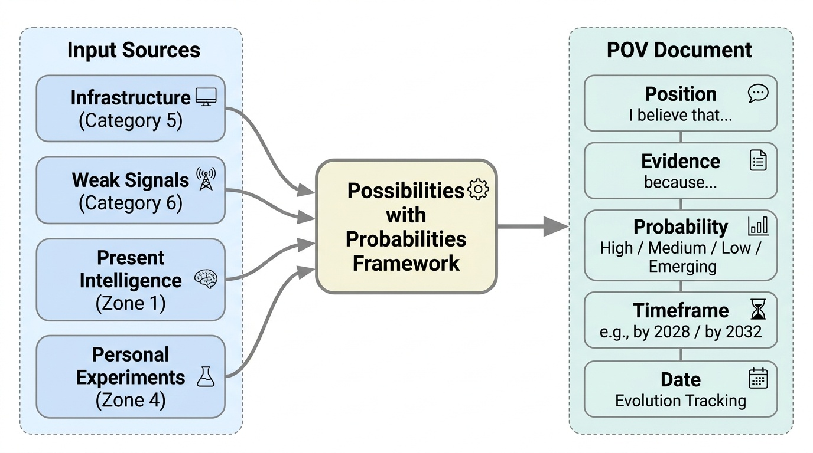
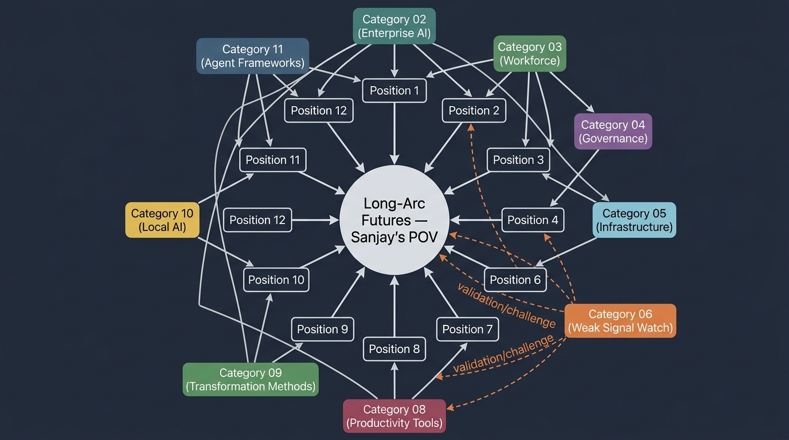

# Long-Arc Futures — Sanjay's POV
**Zone:** 2 — Futures Intelligence  
**Last updated:** April 2026  
**Baseline status:** COMPLETE (first edition — updated quarterly)

  
  <button type="button" class="audio-brief__play" aria-label="Play audio brief" data-audio-play>
    ▶
  </button>
  

    
    Sanjay's Summary
  

  

    

  

  <audio class="audio-brief__audio" src="/audio/categories/07.mp3" preload="metadata" data-audio-element></audio>

---

*Conceptual overview — generated via PaperBanana (color infographic)*

---

## What This Document Is

This is not a research document — it is a **point of view document**. It contains Sanjay's original, evidence-grounded stakes in the ground about what the future looks like, given what we know about:
- The infrastructure being built (Category 5)
- The weak signals being watched (Category 6)
- The present intelligence in Zone 1
- Personal experiments in Zone 4

**This document is the output of the "Possibilities with Probabilities" framework.**

Every position is:
1. Clearly stated ("I believe that...")
2. Grounded in evidence ("because...")
3. Assigned a probability ("High / Medium / Low / Emerging")
4. Given a timeframe ("by 2028 / by 2032")
5. Dated (so evolution can be tracked)

---

## How to Read This Document

Positions are not permanent. Each is updated quarterly with a dated note explaining what evidence prompted a change. This is the intellectual honesty mechanism — the record of how thinking evolves.

**Probability definitions:**
- **High (>70%):** Multiple strong signals converge. I would bet my reputation on this direction.
- **Medium (40-70%):** Evidence is directional but not conclusive. I believe this is more likely than not.
- **Low (15-40%):** Plausible scenario with some supporting evidence. Worth planning for but not betting on.
- **Emerging (<15%):** Weak signals only. Too early for confidence. Watching closely.

---

## The Central Thesis

**I believe the defining story of the next decade is not "AI gets smarter" — it is "organizations learn to restructure around AI."** The technology capability is advancing on a predictable trajectory (Category 05: 4-5x compute growth per year, 10x inference cost reduction per year, 3x efficiency improvement per year). The organizational capacity to absorb and leverage that capability is advancing much slower and much less predictably. The gap between technology readiness and organizational readiness is the central tension of 2026-2035.

This is why the brand is "Possibilities with Probabilities" — the possibilities are defined by the technology trajectory; the probabilities are determined by organizational design, governance, and human adaptation.

---

## Horizon 1: Near-Term (2026–2028)

### Position 1: Organizational design becomes the acknowledged primary constraint on AI value
**Probability:** High (>80%)  
**Timeframe:** Fully recognized by mid-2027  
**Date:** April 2026

**I believe that** by 2027, the mainstream enterprise conversation will have shifted from "how do we adopt AI?" to "how do we redesign the organization for AI?" — and that this shift will be reflected in consulting spend, executive priorities, and board agendas.

**Because:** The evidence is already overwhelming. [Stanford's Enterprise AI Playbook](https://digitaleconomy.stanford.edu/publication/enterprise-ai-playbook/): "The difference was never the AI model. It was always the organization." 80% AI project failure rate concentrated in organizations that layer AI onto existing structures (Category 02). The productivity paradox — 5-15x individual task speedups producing zero organizational productivity gains (Categories 03, 08). Governance enables rather than constrains scaling (Category 04). Every major research source ([Deloitte](https://www.deloitte.com/global/en/issues/generative-ai/state-of-ai-in-enterprise.html), BCG, [McKinsey](https://www.mckinsey.com/capabilities/quantumblack/our-insights/the-state-of-ai), [Accenture](https://newsroom.accenture.com/news/2025/accenture-technology-vision-2025-new-age-of-ai-to-bring-unprecedented-autonomy-to-business)) now converges on this finding.

**The weak signal cluster "Organizational design as the binding constraint"** (Category 06) has 5+ independent data points. It is close to upgrading from weak cluster to established consensus.

**What this means for action:** Transformation practitioners who can bridge AI capability and organizational design (the exact intersection of Sanjay's expertise) will be in extraordinary demand. The organizations that recognized this early (2025-2026) will have a 12-18 month lead.

---

### Position 2: The micro-team model (3-7 people + AI agents) becomes the standard organizational unit for knowledge work
**Probability:** Medium-High (60-70%)  
**Timeframe:** Visible in leading enterprises by late 2027; mainstream by 2028  
**Date:** April 2026

**I believe that** the traditional team structure (10-15 people, role-specialized, hierarchically managed) will be progressively replaced by small, cross-functional teams augmented with AI agents, starting in engineering and expanding to other knowledge work functions.

**Because:** Multiple independent signals converge. Micro-teams shipping production AI in weeks vs. quarters (Category 02). The centaur collaboration model showing human-AI team outperformance (Category 03). Agile's original insight — small, cross-functional, empowered teams — amplified by AI capability (Category 09). Inference cost collapse making embedded AI economically viable per workflow (Category 05). Claude Code Routines enabling small teams to automate what previously required dedicated ops (Category 08).

**The key uncertainty:** Whether this pattern extends beyond engineering/software teams to other functions (finance, legal, HR, operations). If it does, the organizational implications are profound — fewer management layers, different coordination mechanisms, fundamentally different career paths.

---

### Position 3: The efficiency revolution (not scaling maximalism) defines the practical AI landscape for most organizations
**Probability:** High (>75%)  
**Timeframe:** Already underway; decisive by 2028  
**Date:** April 2026

**I believe that** for the vast majority of enterprise and individual AI use cases, the efficiency trajectory (DeepSeek, MoE architectures, distilled models, [QLoRA fine-tuning](https://arxiv.org/abs/2305.14314)) will matter more than the frontier scaling trajectory (bigger models, bigger clusters, bigger capex).

**Because:** [DeepSeek R1 demonstrated 90%+ training cost reduction at frontier-class reasoning](https://arxiv.org/abs/2501.12948) (Category 05). [Pre-training efficiency improves 3x per year (Epoch AI)](https://arxiv.org/abs/2403.05812). Inference costs dropping 10x per year. Open-weight models matching frontier performance within 6 months of release. The practical pipeline — [Hugging Face](https://huggingface.co/) → [Ollama](https://ollama.com/) → fine-tune → deploy — is production-ready on consumer hardware (Category 10). The "two-speed" infrastructure trajectory (Category 05, Signal #4) is resolving in favor of efficiency for enterprise use cases.

**Important caveat:** The frontier labs (OpenAI, Anthropic, Google) will continue pushing scaling maximalism for AGI-class capability. That trajectory matters for the long arc (Horizon 3). But for the 2026-2028 enterprise deployment reality, efficiency is the operative paradigm.

---

### Position 4: [MCP](https://www.anthropic.com/news/model-context-protocol) becomes the universal integration standard for AI — the "HTTP of agents"
**Probability:** High (>80%)  
**Timeframe:** De facto standard by end 2027  
**Date:** April 2026

**I believe that** MCP will achieve the same kind of infrastructure ubiquity that REST APIs achieved for web services and that HTTP achieved for the web. Every enterprise tool and service will be expected to have an MCP interface.

**Because:** The adoption velocity is historically unprecedented: 0 → 10,000+ servers and 97M monthly SDK downloads in 18 months (Category 05). [Linux Foundation governance (Category 05)](https://www.anthropic.com/news/donating-the-model-context-protocol-and-establishing-of-the-agentic-ai-foundation). All major providers adopted (Anthropic, OpenAI, Microsoft, Google, AWS). [Forrester predicts 30% of enterprise SaaS vendors ship MCP servers in 2026](https://www.forrester.com/blogs/predictions-2026-ai-agents-changing-business-models-and-workplace-culture-impact-enterprise-software/) (Category 11). The protocol solves a real problem — AI-to-tool interoperability — that has no viable alternative.

---

### Position 5: AI governance becomes a competitive differentiator, not a compliance burden
**Probability:** Medium-High (60-70%)  
**Timeframe:** Measurable by late 2027  
**Date:** April 2026

**I believe that** enterprises with mature AI governance will win more contracts, deploy AI faster, and avoid costly failures at higher rates than ungoverned competitors — and that this advantage will be measurable in win rates and revenue.

**Because:** Only 1 in 5 enterprises has mature governance, yet governed enterprises scale AI 2x more effectively (Category 02). [The EU AI Act](https://eur-lex.europa.eu/legal-content/EN/TXT/?uri=OJ:L_202401689) forces compliance investment that produces organizational capability (Category 04). Defence-in-depth architecture is both a safety framework and a quality framework (Category 04). Enterprise procurement is increasingly including AI governance as a selection criterion.

---

## Horizon 2: Medium-Term (2028–2030)

### Position 6: Middle management transforms from coordination role to orchestration role
**Probability:** Medium (50-60%)  
**Timeframe:** Structural shift visible by 2029  
**Date:** April 2026

**I believe that** the traditional middle management function — delegation, monitoring, coordination, reporting — will be substantially automated by AI agents, and the surviving middle management role will be "team orchestrator": designing human-AI workflows, handling exceptions, ensuring quality, and providing the judgment that agents lack.

**Because:** [43% of standard managerial tasks are automatable by GenAI (BearingPoint, Category 03)](https://www.bearingpoint.com/en/about-us/news-and-media/press-releases/middle-managers-are-the-key-to-ai-driven-transformation/). [Gartner predicts 20% of orgs will halve middle management by 2026](https://www.gartner.com/en/newsroom/press-releases/2024-10-22-gartner-unveils-top-predictions-for-it-organizations-and-users-in-2025-and-beyond). 15% of daily decisions made autonomously by 2028 (Gartner[^gartner-top-predictions-2025])[^gartner-top-predictions-2025]. The "delegate, review, own" agentic model (Category 02) directly replaces the delegation/monitoring function. But 60%+ of companies have redefined rather than eliminated managerial roles — the role transforms, not disappears.

**The key uncertainty:** Whether middle managers adapt to the orchestration role (skills, mindset, willingness) or resist the transformation. The organizations that manage this transition humanely and effectively will retain institutional knowledge that wholesale elimination would destroy.

---

### Position 7: The "missing rung" problem creates a senior talent crisis in knowledge-intensive industries
**Probability:** Medium (45-55%)  
**Timeframe:** Visible by 2029; acute by 2030  
**Date:** April 2026

**I believe that** the decline in entry-level employment in AI-exposed occupations ([13% relative decline, Brynjolfsson](https://digitaleconomy.stanford.edu/wp-content/uploads/2025/08/Canaries_BrynjolfssonChandarChen.pdf)) will compound into a shortage of senior talent by 2029-2030, because the tasks that traditionally developed junior professionals into senior ones are increasingly handled by AI.

**Because:** Entry-level employment is declining in the most AI-exposed occupations (Category 03). Expertise develops through doing — the apprenticeship model that has produced senior professionals for centuries depends on junior professionals doing progressively more complex work. If AI handles the entry-level complexity, juniors don't build the judgment muscles. This is a delayed-onset structural problem — invisible in current data but predictable from first principles.

**This is the highest-conviction contrarian position in this document.** Most workforce analysis focuses on current displacement. The compounding effect on future talent development is underexplored.

---

### Position 8: Inference approaches zero marginal cost, restructuring all AI economics
**Probability:** High (>75%)  
**Timeframe:** Effectively free for GPT-4-class performance by 2028  
**Date:** April 2026

**I believe that** the inference cost trajectory (1,000x reduction in 3 years, another [10x from Vera Rubin platform](https://nvidianews.nvidia.com/news/nvidia-vera-rubin-platform)) will make GPT-4-class inference effectively free by 2028, fundamentally restructuring the economics of every AI application.

**Because:** The cost decline is driven by compounding forces: GPU architecture improvements (40%/year), inference framework optimization (vLLM, TensorRT-LLM), model efficiency (MoE, distillation), and competitive pressure (Category 05). NVIDIA's Vera Rubin[^nvidia-vera-rubin-2026] promises 10x cost-per-token reduction over Blackwell. At current trajectory, GPT-4-class inference reaches ~$0.01 per million tokens by 2028.

**What this means:** When inference is free, the constraint shifts entirely from "can we afford to run AI" to "can we orchestrate, govern, and integrate AI outputs." Cost-per-query optimization — the current focus of most enterprise AI architecture — becomes irrelevant. The valuable skill becomes designing for inference abundance, not inference scarcity.

---

### Position 9: A "two-tier" knowledge workforce emerges — AI-augmented and AI-unaugmented
**Probability:** Medium-High (60-70%)  
**Timeframe:** Structurally entrenched by 2029  
**Date:** April 2026

**I believe that** the [56% wage premium for AI-skilled workers (PwC)](https://www.pwc.com/gx/en/services/ai/ai-jobs-barometer.html) will persist and potentially widen, creating a structural bifurcation in every knowledge profession between those who work as centaurs (human-AI collaboration) and those who work traditionally.

**Because:** The premium is driven by productivity differential — AI-augmented workers produce more, faster, at higher quality for tasks within the AI frontier (Category 03, [BCG study: 12-22% more tasks, 22-28% faster, 38-43% higher quality](https://papers.ssrn.com/sol3/papers.cfm?abstract_id=4573321)). As AI capability expands (more tasks move inside the frontier), the productivity gap widens. The premium reflects genuine value creation, not a temporary market distortion.

**What this means for Sanjay's audience:** Every executive, consultant, and knowledge worker needs a centaur skill development strategy. This is not optional career enhancement — it is career survival by 2029.

---

## Horizon 3: Long-Term (2030–2035)

### Position 10: AI infrastructure becomes a utility — organizational capability becomes the only differentiator
**Probability:** Medium (50-60%)  
**Timeframe:** Substantially true by 2032  
**Date:** April 2026

**I believe that** AI infrastructure (compute, models, protocols, tools) will become a utility by 2032 — ubiquitous, cheap, and standardized — similar to how cloud computing, internet connectivity, and electricity are utilities today. When this happens, no organization will have a technology advantage in AI. The only remaining differentiator will be organizational capability: how well an institution designs work, develops talent, governs AI systems, and adapts to change.

**Because:** The efficiency revolution is democratizing AI capability (Category 05, Position 3). MCP is standardizing integration (Position 4). Open-weight models eliminate vendor lock-in (Category 10). Inference cost approaches zero (Position 8). Each of these trends reduces the technology barrier. When the barrier is zero, competition shifts to the human and organizational layer.

**This is the central long-arc implication of the "Possibilities with Probabilities" system.** The future does not belong to the organizations with the best AI technology. It belongs to the organizations that best redesign themselves to use ubiquitous AI technology. This is fundamentally an organization development challenge — and it is the domain where 30 years of transformation experience creates the most value.

---

### Position 11: The agent reliability problem is solved through architectural innovation, not model improvement
**Probability:** Medium (45-55%)  
**Timeframe:** Meaningful progress by 2030; substantially solved by 2032  
**Date:** April 2026

**I believe that** the current agent reliability ceiling (~55% on complex tasks, multiplicative error accumulation with complexity) will be broken not by smarter models but by better systems architecture — verification loops, graceful degradation, confidence-based human escalation, checkpointing, and orchestration patterns.

**Because:** The reliability formula (inversely proportional to complexity × steps × agents) is an architectural constraint, not a capability constraint (Category 11). [LangGraph's checkpointing and human-in-the-loop patterns (Category 11)](https://www.langchain.com/langgraph) demonstrate that architectural solutions improve reliability independently of model capability. Defence-in-depth (Category 04) applied to agent systems creates layered reliability. The analogy: web applications became reliable not because servers got better, but because distributed systems engineering (load balancing, failover, circuit breakers) solved reliability at the architecture layer.

**What this means:** The organizations that invest in agent reliability engineering (systems engineering applied to AI) will deploy autonomous agents at scale before those waiting for model capability to solve the problem.

---

### Position 12: The transformation methodology inflection creates a new professional discipline
**Probability:** Low-Medium (35-45%)  
**Timeframe:** Emerging by 2030; established by 2033  
**Date:** April 2026

**I believe that** the inadequacy of current transformation frameworks for the AI era (Category 09) will give rise to a new professional discipline — "AI-native organizational design" — that synthesizes OD, agile, change management, and AI engineering into a coherent practice with its own methodology, certification, and body of knowledge.

**Because:** Classic transformation methods are failing at their stated purpose — only 25% of employees believe organizations manage change well; only 32% deliver on time with engagement (Category 09). The methodology gap (continuous change, AI-augmented diagnostics, micro-team transformation) is real and growing. The combination of organizational design expertise and hands-on AI engineering capability is extremely rare (Category 09, Signal #5). Market demand for this combination is growing faster than supply.

**This is the most personal position in this document.** If this future materializes, Sanjay's unique intersection — 30 years transformation + DBA in AI + hands-on GPU experiments — positions him at the founding of a discipline, not just the practice of an existing one.

---

## Scenario Summary: Three Possible 2032 Worlds

### Scenario A: "The Reorganized Enterprise" (most likely, ~50%)
AI infrastructure is a utility. The winning organizations have redesigned around AI: micro-teams, hybrid human-agent workforces, AI-native governance, continuous transformation capability. The transformation practitioners who bridged OD and AI are in high demand. The "Possibilities with Probabilities" framework is validated — organizational design was the binding constraint.

### Scenario B: "The Stalled Majority" (~30%)
AI technology is ubiquitous but organizational transformation stalls for most enterprises. A small elite (15-20%) captures disproportionate value while the majority remains in the productivity paradox — individual gains, organizational stagnation. Governance fragmentation between jurisdictions creates additional friction. The "missing rung" problem is visible but unresolved.

### Scenario C: "The Capability Discontinuity" (~20%)
A frontier model achieves AGI-class capability (reliable autonomous operation on complex, novel tasks) before organizations have redesigned. This creates a disruption shock — existing organizational structures become suddenly obsolete rather than gradually transformed. The transformation challenge becomes urgent rather than planned. This is the scenario where preparation matters most and rewards are highest for those who prepared.

**Note:** These scenarios are not mutually exclusive across sectors. Scenario A may play out in tech-forward industries while Scenario B dominates traditional sectors, with Scenario C triggered by a specific breakthrough that affects all.

---

## Positions That Have Changed

*Dated log of positions that were updated, with the evidence that prompted the change. This log grows over time.*

**April 2026 — Baseline established.** All 12 positions are new. No changes to log yet. First review cycle: July 2026.

---

## Sources

### Papers & Reports

[^accenture-tech-vision-2025]: Accenture. *Technology Vision 2025 — New Age of AI to Bring Unprecedented Autonomy to Business*. Accenture. 2025. <https://newsroom.accenture.com/news/2025/accenture-technology-vision-2025-new-age-of-ai-to-bring-unprecedented-autonomy-to-business>
[^bearingpoint-middle-managers-2025]: BearingPoint. *From Fear to Empowerment — Middle Managers as Catalysts in AI-Driven Transformation*. BearingPoint. 2025. <https://www.bearingpoint.com/en/about-us/news-and-media/press-releases/middle-managers-are-the-key-to-ai-driven-transformation/>
[^brynjolfsson-canaries-2025]: Brynjolfsson, Chandar, Chen. *Canaries in the Coal Mine? Six Facts about the Recent Early-Career Employment Effects of Generative AI*. Stanford Digital Economy Lab. 2025. <https://digitaleconomy.stanford.edu/wp-content/uploads/2025/08/Canaries_BrynjolfssonChandarChen.pdf>
[^deepseek-r1-2025]: DeepSeek-AI. *DeepSeek-R1 — Incentivizing Reasoning Capability in LLMs via Reinforcement Learning*. arXiv:2501.12948. 2025. <https://arxiv.org/abs/2501.12948>
[^dellacqua-jagged-frontier-2023]: Dell'Acqua, McFowland, Mollick, Lifshitz-Assaf, Kellogg, Rajendran, Krayer, Candelon, Lakhani. *Navigating the Jagged Technological Frontier — Field Experimental Evidence of the Effects of AI on Knowledge Worker Productivity and Quality*. Harvard Business School Working Paper 24-013. 2023. <https://papers.ssrn.com/sol3/papers.cfm?abstract_id=4573321>
[^deloitte-state-of-ai-2025]: Deloitte. *The State of AI in the Enterprise — 2026 Report*. Deloitte. 2026. <https://www.deloitte.com/global/en/issues/generative-ai/state-of-ai-in-enterprise.html>
[^epoch-algorithmic-progress]: Ho, Besiroglu, et al. *Algorithmic Progress in Language Models*. arXiv:2403.05812. 2024. <https://arxiv.org/abs/2403.05812>
[^eu-ai-act-2024]: European Parliament and Council. *Regulation (EU) 2024/1689 — Artificial Intelligence Act*. EUR-Lex. 2024. <https://eur-lex.europa.eu/legal-content/EN/TXT/?uri=OJ:L_202401689>
[^forrester-predictions-2026-software]: Forrester. *Predictions 2026 — AI Agents, Changing Business Models, and Workplace Culture Impact Enterprise Software*. Forrester. 2025. <https://www.forrester.com/blogs/predictions-2026-ai-agents-changing-business-models-and-workplace-culture-impact-enterprise-software/>
[^gartner-top-predictions-2025]: Gartner. *Top Predictions for IT Organizations and Users in 2025 and Beyond*. Gartner. 2024. <https://www.gartner.com/en/newsroom/press-releases/2024-10-22-gartner-unveils-top-predictions-for-it-organizations-and-users-in-2025-and-beyond>
[^mckinsey-state-of-ai-2025]: McKinsey & Company (QuantumBlack). *The State of AI in 2025 — Agents, Innovation, and Transformation*. McKinsey & Company. 2025. <https://www.mckinsey.com/capabilities/quantumblack/our-insights/the-state-of-ai>
[^pwc-ai-jobs-barometer-2025]: PwC. *2025 Global AI Jobs Barometer*. PwC. 2025. <https://www.pwc.com/gx/en/services/ai/ai-jobs-barometer.html>
[^qlora-dettmers-2023]: Dettmers, Pagnoni, Holtzman, Zettlemoyer. *QLoRA — Efficient Finetuning of Quantized LLMs*. arXiv:2305.14314. 2023. <https://arxiv.org/abs/2305.14314>
[^stanford-enterprise-ai-playbook]: Brynjolfsson, Andrew Chin, et al. *The Enterprise AI Playbook — Lessons from 51 Successful Developments*. Stanford Digital Economy Lab. 2024. <https://digitaleconomy.stanford.edu/publication/enterprise-ai-playbook/>

### Articles & Newsletters

[^mcp-anthropic-launch]: Anthropic. *Introducing the Model Context Protocol*. Anthropic. 2024. <https://www.anthropic.com/news/model-context-protocol>
[^mcp-linux-foundation]: Anthropic. *Donating the Model Context Protocol and Establishing the Agentic AI Foundation*. Anthropic. 2025. <https://www.anthropic.com/news/donating-the-model-context-protocol-and-establishing-of-the-agentic-ai-foundation>
[^nvidia-vera-rubin-2026]: NVIDIA. *NVIDIA Vera Rubin Opens Agentic AI Frontier*. NVIDIA Newsroom. 2026. <https://nvidianews.nvidia.com/news/nvidia-vera-rubin-platform>

### Organizations & Publications

[^huggingface]: Hugging Face. *Hugging Face — The AI Community Building the Future*. Hugging Face. 2026. <https://huggingface.co/>
[^langgraph]: LangChain. *LangGraph — Agent Orchestration Framework for Reliable AI Agents*. LangChain. 2024. <https://www.langchain.com/langgraph>
[^ollama]: Ollama. *Ollama — Run Large Language Models Locally*. Ollama. 2026. <https://ollama.com/>

---
## Connections to Other Categories

*Category connections map — generated via PaperBanana*
This document synthesizes from all other categories. It is the destination, not a source.

**Primary inputs by position:**
- Positions 1, 2, 6: Category 02 (Enterprise AI), Category 03 (Workforce), Category 09 (Transformation Methods)
- Position 3: Category 05 (Infrastructure), Category 10 (Local AI)
- Position 4: Category 05 (Infrastructure), Category 11 (Agent Frameworks)
- Position 5: Category 02 (Enterprise AI), Category 04 (Governance)
- Position 7: Category 03 (Workforce)
- Position 8: Category 05 (Infrastructure)
- Position 9: Category 03 (Workforce), Category 08 (Productivity Tools)
- Position 10: Categories 02, 05, 09, 10 (convergence of all trajectories)
- Position 11: Category 11 (Agent Frameworks), Category 04 (Governance)
- Position 12: Category 09 (Transformation Methods)
- All positions: Category 06 (Weak Signal Watch) as validation/challenge
