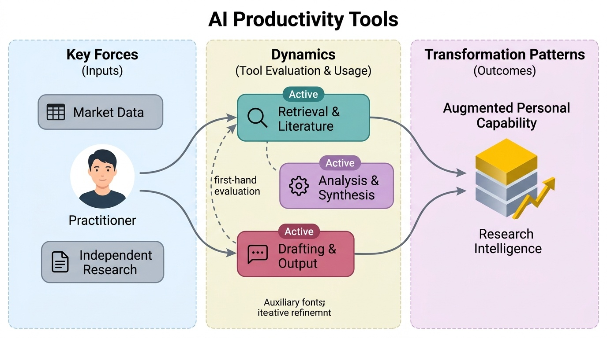
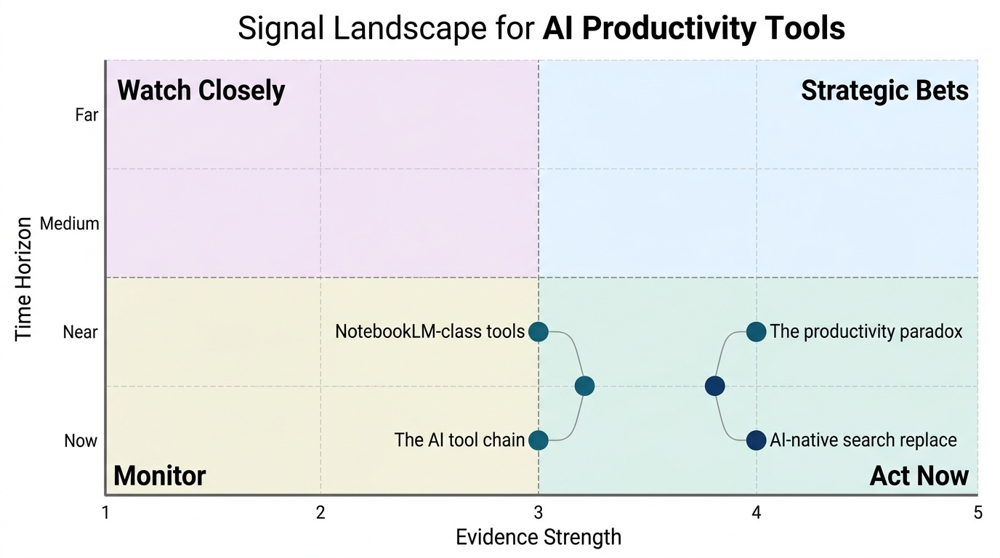
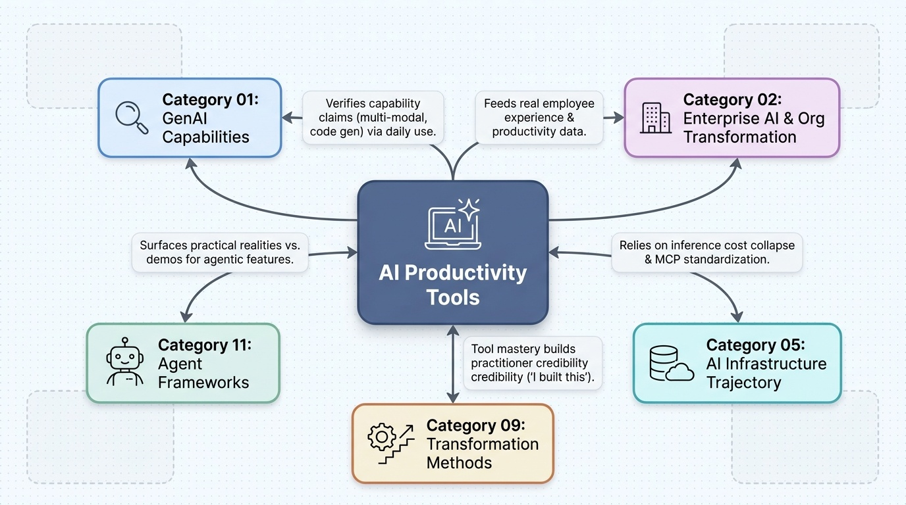

# AI Productivity Tools
**Zone:** 3 — Practitioner Toolkit  
**Last updated:** April 2026  
**Baseline status:** COMPLETE

  
  <button type="button" class="audio-brief__play" aria-label="Play audio brief" data-audio-play>
    ▶
  </button>
  

    
    Sanjay's Summary
  

  

    

  

  <audio class="audio-brief__audio" src="/elite-research-pipeline/audio/categories/08.mp3" preload="metadata" data-audio-element></audio>

---

*Conceptual overview — generated via PaperBanana (color infographic)*

---

## What This Category Tracks
Tools Sanjay actually uses — or has evaluated — that augment personal capability. This is a first-hand practitioner account, not a review aggregation. The authority here comes from personal use, supplemented by market data and independent research.

---

## Tool Landscape (as of April 2026)

The AI productivity tool landscape has consolidated around a few dominant categories while simultaneously fragmenting into specialized niches. [The market exceeded $7.37 billion in 2025 for coding tools alone](https://www.mordorintelligence.com/industry-reports/artificial-intelligence-code-tools-market). Three dynamics define the current moment:

1. **AI coding tools have reached mainstream adoption.** 84% of developers use or plan to use AI tools. 95% use them at least weekly. 75% use AI for at least half their engineering work ([Pragmatic Engineer Survey, Feb 2026](https://newsletter.pragmaticengineer.com/p/ai-tooling-2026)). Claude Code went from zero to #1 most-used AI coding tool in 8 months (May 2025 launch → [$1B ARR by November 2025 — fastest product ramp in enterprise software history](https://www.anthropic.com/news/anthropic-acquires-bun-as-claude-code-reaches-usd1b-milestone)).

2. **The productivity paradox is real.** [A randomized controlled study found experienced developers using AI took 19% *longer* to complete tasks while *believing* they were 20% faster](https://arxiv.org/abs/2507.09089) — a 39-point perception gap. [Individual developers completed 21% more tasks (Faros), but review time increased 91% as teams generated 98% more pull requests](https://www.faros.ai/blog/ai-software-engineering). [An NBER paper (Feb 2026) surveying ~6,000 executives found 80%+ of firms reported AI had *no impact* on aggregate productivity over the preceding three years](https://www.nber.org/papers/w34836). The paradox: individual speedups are real (5-15x on specific tasks), but organizational productivity gains are not materializing at scale.

3. **AI-native search is replacing traditional search.** [Gartner projects 60% of enterprise knowledge workers will use AI-native search tools by 2026, up from 15% in 2023](https://www.gosearch.ai/blog/gartner-market-guide-enterprise-ai-search-2026/). [Perplexity reached 45M monthly active users, $450M+ ARR](https://techstory.in/perplexity-tops-450m-arr-after-record-breaking-month/). This is not an incremental improvement — it is a category shift in how professionals find and synthesize information.

---

## Tools Currently In Use

### Claude (Claude 4.6 / Claude Code)
**Use case:** Primary AI assistant for thinking, writing, research synthesis, code generation, and complex multi-step tasks.  
**What it does well:** Extended thinking for complex reasoning. [Claude Code is the most capable agentic coding tool](https://code.claude.com/docs/en/overview) — autonomous multi-file edits, project understanding, terminal access. 91% CSAT (highest of any AI coding tool surveyed). MCP[^mcp-official] integration provides tool interoperability. Skills and routines enable automated workflows.  
**What it doesn't do well:** Context window management requires attention on large projects. Occasional confident-but-wrong responses require verification. Enterprise deployment still requires API orchestration knowledge.  
**Honest ROI:** Very high for technical work. Claude Code has fundamentally changed how I build software — from writing code to directing an agent that writes code. The shift from "typing" to "supervising" is real and produces 5-10x throughput on well-scoped tasks.

### [GitHub Copilot](https://github.com/features/copilot)
**Use case:** Inline code completion in IDE. Enterprise deployment across Accenture (30,000+ trained).  
**What it does well:** Seamless IDE integration. [55% code completion acceptance rate. 46% of code written by active users is Copilot-generated (up from 27% in 2022). Dominant in enterprise due to Microsoft ecosystem integration — 56% adoption in 10,000+ employee companies](https://github.blog/news-insights/research/research-quantifying-github-copilots-impact-in-the-enterprise-with-accenture/).  
**What it doesn't do well:** Limited to code completion and chat — not agentic. Suggestions can be repetitive on complex logic. Less useful for novel problem-solving vs. pattern completion.  
**Honest ROI:** Moderate. Genuine timesaver for boilerplate and familiar patterns. Not transformative for senior developers on complex work. The value is in reducing mechanical keystrokes, not in augmenting thinking.

### [Perplexity](https://www.perplexity.ai/)
**Use case:** AI-native research and search. Replacing Google Search for research queries.  
**What it does well:** Source-cited answers. Simultaneous web + document search. 45M MAU, $450M+ ARR[^perplexity-450m-arr-2026] — the market has validated the product-market fit. Enterprise version allows internal document indexing (up to 500 files). Real-time information with citations.  
**What it doesn't do well:** Depth is sacrificed for breadth. For deep domain research, individual source reading still necessary. Citation quality varies — sources are cited but not always the most authoritative.  
**Honest ROI:** High for the "first pass" of any research question. Saves 30-60 minutes per research cycle by eliminating the Google-scan-skim-compile loop. Not a replacement for deep reading, but an excellent triage tool.

### [NotebookLM (Google)](https://notebooklm.google.com/)
**Use case:** Document-based research synthesis. Audio Overview (podcast) generation from source materials. Knowledge base creation.  
**What it does well:** RAG over uploaded documents with source grounding. Audio Overviews convert dense documents into conversational podcast format — genuinely useful for absorbing material during commutes. Interactive mode lets you "join" the AI-generated conversation. Enterprise version (Agentspace[^google-agentspace] integration) supports team knowledge bases. [Now powered by Gemini 3](https://9to5google.com/2025/12/19/notebooklm-gemini-3-data-tables/).  
**What it doesn't do well:** Limited to uploaded documents — no web access within notebooks. 50-source limit per notebook. Audio quality is impressive but occasionally hallucinatory on technical details. Can't verify claims against external sources during generation.  
**Honest ROI:** High for specific use cases: converting long documents into listenable format, creating study materials, building queryable knowledge bases from PDFs. The pipeline integration with the elite-research-pipeline project is a core workflow.

### [Cursor](https://cursor.com/)
**Use case:** AI-augmented code editing. "Flow state" coding with inline AI assistance.  
**What it does well:** Project-wide context understanding. Multi-file editing. Model flexibility (supports Claude, GPT, etc.). The "power user favorite" in developer surveys — 19% 'most loved' rating. Tab completion feels genuinely intelligent. [$2B ARR by Feb 2026](https://techcrunch.com/2026/04/17/sources-cursor-in-talks-to-raise-2b-at-50b-valuation-as-enterprise-growth-surges/).  
**What it doesn't do well:** Less agentic than Claude Code — requires more manual guidance. Terminal integration less mature. Higher cognitive overhead for complex refactoring vs. Claude Code's autonomous approach.  
**Honest ROI:** High for "flow state" coding where you want AI inline while you think. Complementary to Claude Code: Cursor for writing, Claude Code for delegating.

### Google Workspace with Gemini
**Use case:** Enterprise productivity — email, docs, sheets, slides with AI features.  
**What it doesn't do well:** AI features feel bolted on rather than native. Quality of AI suggestions in Docs/Sheets noticeably below Claude/GPT-4 level. The gws CLI tool (v0.11.1) provides better programmatic access than the built-in AI features.  
**Honest ROI:** Low-to-moderate for AI features specifically. The workspace itself is essential; the AI additions are conveniences, not transformations.

---

## Tools Evaluated but Not Adopted

- **ChatGPT Plus / GPT-4o:** Evaluated thoroughly. Strong general-purpose capability. Not adopted as primary because Claude's extended thinking and Claude Code's agentic capability better fit technical workflow needs. Still used occasionally for image generation (DALL-E) and voice interaction.
- **Gemini Advanced (standalone):** Evaluated. Competitive on speed and multimodal. NotebookLM[^notebooklm-product] integration is the standout feature. Not adopted as primary chat interface due to less consistent quality on complex reasoning tasks vs. Claude.
- **Elicit (research tool):** Evaluated for academic literature review. Good for finding papers. Not adopted because the NotebookLM[^notebooklm-product] + Perplexity combination covers the research workflow more naturally.
- **Otter.ai (meeting transcription):** Evaluated. Transcription quality is good. Not adopted due to privacy concerns with enterprise meetings and overlap with Microsoft Teams built-in transcription.

---

## Emerging Tools Being Watched

- **[OpenAI Codex (cloud agent):** Released 2026](https://developers.openai.com/codex/cloud). Cloud-based coding agent running in sandboxed environment. Competing directly with Claude Code but with different architecture (async, cloud-first vs. local-first). Watch for enterprise adoption patterns.
- **[Windsurf (Codeium)](https://windsurf.com/):** AI IDE competitor to Cursor. Growing developer adoption. Watching for differentiation beyond Cursor's feature set.
- **[Google Agentspace:** Enterprise-focused AI agent platform](https://cloud.google.com/blog/products/ai-machine-learning/google-agentspace-enables-the-agent-driven-enterprise) integrating NotebookLM[^notebooklm-product], Search, and workspace. The "enterprise brain" play. Watch for whether it delivers on the promise of unified knowledge management.
- **[Claude Code Routines:** Just launched (April 2026)](https://venturebeat.com/orchestration/we-tested-anthropics-redesigned-claude-code-desktop-app-and-routines-heres-what-enterprises-should-know). Persistent scheduled agents on Anthropic cloud. Potential to automate recurring research, monitoring, and maintenance workflows. Direct relevance to this research system's incremental update strategy.
- **[MCP server ecosystem:** 10,000+ servers and growing](https://modelcontextprotocol.io/). The expanding ecosystem of tool integrations means AI assistants can interact with more services natively. Watch for enterprise-grade MCP[^mcp-official] servers from SaaS vendors.

---

## Practitioner Insights

### What actually works (non-obvious learnings from daily use)

1. **The tool is less important than the workflow design.** Every tool listed above can waste time if used without a clear workflow. The highest-ROI pattern: define the task, choose the right tool for that task's characteristics, provide good context, then verify the output. "Just ask the AI" is low-ROI. "Ask the right AI the right question with the right context" is high-ROI.

2. **Combining tools beats using one tool for everything.** Perplexity for initial research → NotebookLM[^notebooklm-product] for deep synthesis → Claude for writing and analysis → Claude Code for implementation. Each tool has a sweet spot; none are universal. Executives who adopt "one AI tool" miss the compounding effect of a tool chain.

3. **The productivity paradox is real at the individual level too.** AI makes you *feel* faster before it makes you *measurably* faster. The first month generates novelty-driven enthusiasm. Genuine productivity gains require 3+ months of deliberate workflow optimization. Most people plateau at "faster drafts" and never reach "different work."

4. **Verification cost is the hidden tax.** Every AI-generated output requires human verification. For code: does it work? For research: are the facts correct? For writing: does it say what you mean? This verification cost is real and often underestimated. The net productivity gain is (AI generation speed - verification cost - rework cost). For well-understood domains, the gain is large. For novel or high-stakes work, the gain can be negative.

5. **The biggest unlock is task redesign, not task acceleration.** The highest-value use of AI tools is not doing the same tasks faster — it is doing *different* tasks that weren't feasible before. Building a 10-category research system with signal scoring would have been a multi-person, multi-month effort without AI. With Claude Code + Perplexity + NotebookLM[^notebooklm-product], it's achievable as a solo practitioner. The question isn't "how much faster?" but "what's now possible?"

---

## Signal Assessment

*Signal landscape (Evidence vs. Time Horizon) — PaperBanana*

### Ranked Shortlist: Uncommon but Likely (Top 4)

### 1. The AI tool chain (not single tool) becomes the professional standard
**Profile:** E3 T-Accelerating U3 H-Post-hype Z-Now
**What's happening:** Practitioners who achieve the highest productivity gains use 3-5 specialized AI tools in sequence, not one general-purpose tool. Perplexity → NotebookLM[^notebooklm-product] → Claude → Claude Code is a documented, repeatable workflow.
**Why it matters:** Enterprise AI tool strategies focused on "standardize on one platform" (typically Copilot[^github-copilot-product]) are sub-optimal. The compound effect of specialized tools in a chain exceeds any single tool's capability.
**What most people miss:** Most enterprises evaluate AI tools individually ("should we adopt Copilot[^github-copilot-product] OR Cursor?") rather than designing tool chains. The integration between tools (increasingly via MCP[^mcp-official]) is where the productivity multiplier lives.
**If true, optimize by:** Design AI tool chains for your top 3-5 workflows. Evaluate tools not in isolation but as components of a pipeline. Invest in MCP[^mcp-official] integration to connect tools seamlessly.
**Watch for:** Whether enterprises shift from "one tool" procurement to "tool chain" procurement within 12 months.

### 2. The productivity paradox resolves through task redesign, not task acceleration
**Profile:** E4 T-Emerging U3 H-Grounded Z-Near
**What's happening:** 80% of executives report no aggregate productivity impact from AI. But individual practitioners report 5-15x speedups on specific tasks. The gap is explained by task-level vs. organization-level measurement: AI accelerates individual tasks but doesn't yet redesign organizational workflows.
**Why it matters:** The resolution of the paradox is not "AI will eventually make everything faster" — it is "AI enables different work that wasn't previously possible." This reframes the ROI question from efficiency to capability.
**What most people miss:** Enterprises measuring AI ROI through time-saved-per-task are using the wrong metric. The right metric is "what new capabilities exist that didn't before?" — research systems, real-time synthesis, autonomous monitoring, personalized content at scale.
**If true, optimize by:** Stop measuring AI productivity in time-saved. Measure in capabilities-gained. Identify the 3-5 workflows that AI makes possible for the first time, and invest there rather than trying to make existing processes 20% faster.
**Watch for:** Whether the NBER[^nber-yotzov-bloom-2026] productivity paradox data[^nber-yotzov-bloom-2026] shifts when researchers measure capability expansion rather than efficiency gains.

### 3. AI-native search replaces traditional search for knowledge work
**Profile:** E4 T-Accelerating U2 H-Grounded Z-Now
**What's happening:** Perplexity at 45M MAU[^perplexity-450m-arr-2026], growing 100%+ YoY. Gartner[^gartner-enterprise-ai-search-2025] projects 60% of enterprise knowledge workers on AI-native search by end of 2026[^gartner-enterprise-ai-search-2025]. Enterprise Perplexity allows internal document search alongside web search.
**Why it matters:** Search is the most fundamental knowledge worker activity. A paradigm shift from "find links, read pages, synthesize manually" to "ask question, get synthesized answer with citations" saves 30-60 minutes per research cycle. At scale across an enterprise, this is substantial.
**What most people miss:** The shift from Google to AI-native search is happening faster than the shift from desktop to mobile search. Most enterprise IT teams are not planning for this transition because they think of Perplexity as a "consumer tool" — but their knowledge workers are already using it.
**If true, optimize by:** Evaluate enterprise AI-native search tools (Perplexity Enterprise, Glean, Google Agentspace[^google-agentspace]) for organization-wide deployment. The ROI calculation on knowledge worker time saved is straightforward.
**Watch for:** Whether Google Search usage for professional queries shows measurable decline in 2026. If so, the category shift is confirmed.

### 4. NotebookLM[^notebooklm-product]-class tools create a new "audio learning" modality for executives
**Profile:** E3 T-Emerging U2 H-Ahead Z-Near
**What's happening:** NotebookLM[^notebooklm-product]'s Audio Overview feature converts dense documents into conversational podcasts. Interactive mode allows users to "join" the conversation. This converts reading time into listening time — a fundamentally different consumption pattern.
**Why it matters:** Executives and senior professionals have more reading material than reading time. Converting documents to audio enables consumption during commutes, walks, and exercise. This is not a gimmick — it is a genuine modality shift for knowledge absorption.
**What most people miss:** The capability to turn any document into a personalized podcast is a new category that didn't exist 18 months ago. Most professionals are unaware it exists or dismiss it as novelty. Those who integrate it into their workflow report significant increases in knowledge throughput.
**If true, optimize by:** Build Audio Overview generation into your research pipeline. For every baseline document or research synthesis, generate an audio companion for mobile consumption. This doubles the consumption surface for each piece of research.
**Watch for:** Whether Google expands Audio Overviews into enterprise collaboration (team podcasts from shared documents) or whether competitors (Claude, ChatGPT) launch competing audio synthesis features.

### Emerging Signals to Watch (Evidence 1-2, high Unlock potential)

**Claude Code Routines[^claude-code-routines-2026] enable "always-on" AI workflows for practitioners**
**Profile:** E2 T-Emerging U3 H-Grounded Z-Near
**What's happening:** Claude Code Routines[^claude-code-routines-2026] (April 2026)[^claude-code-routines-2026] allow persistent scheduled agents running on Anthropic cloud — cron schedules, API triggers, GitHub event triggers. This moves AI from "tool you use" to "system that runs."
**Why it matters:** For practitioners and small teams, this is the infrastructure for automated research monitoring, CI/CD integration, code review, documentation maintenance, and any repeatable knowledge work. Previously, this required custom engineering.
**What most people miss:** Most practitioners think of AI tools as interactive — you prompt, it responds. Routines[^claude-code-routines-2026] shift AI to autonomous — it runs on schedule, monitors, and acts. This is a fundamentally different interaction model that most professionals haven't conceptualized yet.
**If true, optimize by:** Identify the 2-3 highest-value repeatable workflows and set them up as routines. Research monitoring, PR review, documentation updates are obvious starting points.
**Watch for:** Whether Routines[^claude-code-routines-2026] achieve meaningful adoption (>10% of Claude Code users) within 6 months. If so, the "always-on AI" model is viable for individual practitioners — upgrades to Uncommon but Likely.

### Filtered Out
- "AI will replace developers" — Peak hype. The 19%-longer study[^metr-ai-productivity-2025] and productivity paradox data directly contradict this. AI augments, it doesn't replace, for complex knowledge work.
- "AGI coding tools" — Noise. Current tools are powerful but unreliable for complex autonomous operation ([~55% success on SWE-bench](https://www.swebench.com/verified.html)).

---

## Sources

### Papers & Reports

[^ai-code-tools-market-2025]: Mordor Intelligence. *AI Code Tools Market Size, Share & 2030 Trends Report*. Mordor Intelligence Industry Report. 2025. <https://www.mordorintelligence.com/industry-reports/artificial-intelligence-code-tools-market>
[^faros-ai-productivity-paradox]: Faros AI. *The AI Productivity Paradox Research Report — Telemetry from 10,000+ developers across 1,255 teams*. Faros AI Blog. 2025. <https://www.faros.ai/blog/ai-software-engineering>
[^gartner-enterprise-ai-search-2025]: Gartner. *Market Guide for Enterprise AI Search*. Gartner Research (via GoSearch summary). 2025. <https://www.gosearch.ai/blog/gartner-market-guide-enterprise-ai-search-2026/>
[^github-copilot-accenture-study]: GitHub & Accenture. *Quantifying GitHub Copilot's impact in the enterprise with Accenture*. The GitHub Blog. 2024. <https://github.blog/news-insights/research/research-quantifying-github-copilots-impact-in-the-enterprise-with-accenture/>
[^metr-ai-productivity-2025]: Becker et al. (METR). *Measuring the Impact of Early-2025 AI on Experienced Open-Source Developer Productivity*. arXiv:2507.09089. 2025. <https://arxiv.org/abs/2507.09089>
[^nber-yotzov-bloom-2026]: Ivan Yotzov, Jose Maria Barrero, Nicholas Bloom, et al. *Firm Data on AI*. NBER Working Paper 34836. 2026. <https://www.nber.org/papers/w34836>

### Benchmarks

[^swe-bench-verified]: Carlos E. Jimenez, John Yang, et al. *SWE-bench Verified*. swebench.com. 2024. <https://www.swebench.com/verified.html>

### Articles & Newsletters

[^anthropic-claude-code-1b-2025]: Anthropic. *Anthropic acquires Bun as Claude Code reaches $1B milestone*. Anthropic News. 2025. <https://www.anthropic.com/news/anthropic-acquires-bun-as-claude-code-reaches-usd1b-milestone>
[^claude-code-routines-2026]: Michael Nuñez. *We tested Anthropic's redesigned Claude Code desktop app and 'Routines' — here's what enterprises should know*. VentureBeat. 2026. <https://venturebeat.com/orchestration/we-tested-anthropics-redesigned-claude-code-desktop-app-and-routines-heres-what-enterprises-should-know>
[^cursor-2b-arr-2026]: Marina Temkin. *Sources — Cursor in talks to raise $2B+ at $50B valuation as enterprise growth surges*. TechCrunch. 2026. <https://techcrunch.com/2026/04/17/sources-cursor-in-talks-to-raise-2b-at-50b-valuation-as-enterprise-growth-surges/>
[^google-agentspace]: Google Cloud. *Google Agentspace enables the agent-driven enterprise*. Google Cloud Blog. 2025. <https://cloud.google.com/blog/products/ai-machine-learning/google-agentspace-enables-the-agent-driven-enterprise>
[^notebooklm-gemini-3]: Abner Li. *NotebookLM now uses Gemini 3, adds new 'Data Tables' output*. 9to5Google. 2025. <https://9to5google.com/2025/12/19/notebooklm-gemini-3-data-tables/>
[^perplexity-450m-arr-2026]: TechStory. *Perplexity Tops $450M ARR After Record-Breaking Month*. TechStory. 2026. <https://techstory.in/perplexity-tops-450m-arr-after-record-breaking-month/>
[^pragmatic-engineer-survey-2026]: Gergely Orosz. *AI Tooling for Software Engineers in 2026 — AI Tooling Survey*. The Pragmatic Engineer Newsletter. 2026. <https://newsletter.pragmaticengineer.com/p/ai-tooling-2026>

### Organizations & Publications

[^claude-code-docs]: Anthropic. *Claude Code Overview*. Claude Code Documentation. 2026. <https://code.claude.com/docs/en/overview>
[^cursor-product]: Anysphere. *Cursor — The AI Code Editor*. cursor.com. 2026. <https://cursor.com/>
[^github-copilot-product]: GitHub. *GitHub Copilot — Your AI pair programmer*. GitHub. 2026. <https://github.com/features/copilot>
[^mcp-official]: Anthropic / MCP Community. *Model Context Protocol*. modelcontextprotocol.io. 2026. <https://modelcontextprotocol.io/>
[^notebooklm-product]: Google. *NotebookLM*. notebooklm.google.com. 2026. <https://notebooklm.google.com/>
[^openai-codex-cloud]: OpenAI. *Codex — Cloud (sandboxed cloud coding agent)*. OpenAI Developers. 2026. <https://developers.openai.com/codex/cloud>
[^perplexity-product]: Perplexity AI. *Perplexity*. perplexity.ai. 2026. <https://www.perplexity.ai/>
[^windsurf-product]: Cognition AI (formerly Codeium). *Windsurf — AI-native IDE*. windsurf.com. 2026. <https://windsurf.com/>

---
## Connections to Other Categories

*Category connections map — generated via PaperBanana*

- **Category 01 (GenAI Capabilities):** Daily tool use provides ground-truth on what capability claims hold up. Extended thinking, multi-modal, and code generation claims can be verified through practitioner experience.
- **Category 02 (Enterprise AI & Org Transformation):** Tools are what employees actually experience. The productivity paradox data from this category feeds directly into the enterprise transformation challenge.
- **Category 05 (AI Infrastructure Trajectory):** Inference cost collapse enables always-on tool usage. MCP standardization connects tools into chains. Routines depend on cloud infrastructure.
- **Category 09 (Transformation Methods):** Practitioners who demonstrate tool mastery have credibility in advising transformation. "I built this with AI" > "AI can build things."
- **Category 11 (Agent Frameworks):** Claude Code, Codex, and Cursor's agentic features are the practitioner-facing edge of agent framework development. Daily use surfaces what works in practice vs. in demos.
