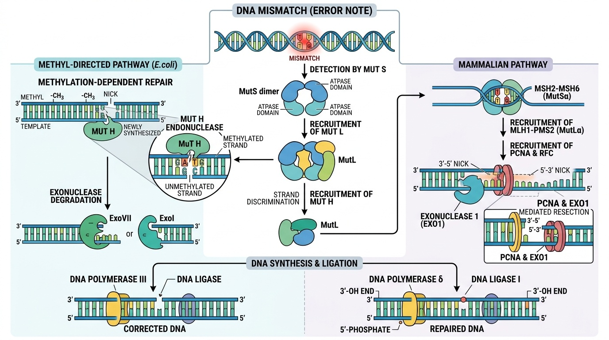
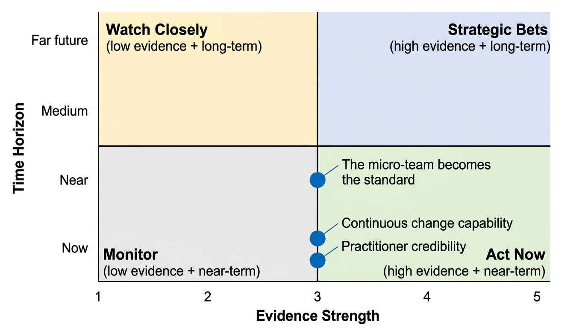
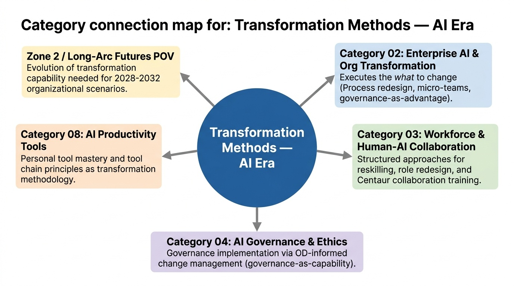

# Transformation Methods — AI Era
**Zone:** 3 — Practitioner Toolkit  
**Last updated:** April 2026  
**Baseline status:** COMPLETE

---

*Conceptual overview — generated via PaperBanana (color infographic)*

---

## What This Category Tracks
How the methodologies Sanjay has spent 30 years developing and applying — agile, OD, change management, digital transformation — are being rewritten for the AI-native context. This is the intersection of his legacy expertise with the new era.

---

## State of the Field (as of April 2026)

Transformation methodology is in a crisis of relevance. The frameworks that guided two decades of digital transformation — Kotter's 8-step model, Prosci ADKAR, SAFe, large-scale Scrum — were designed for a world where technology changed faster than organizations but slower than today. AI has broken the fundamental assumption: the rate of change now exceeds organizational absorption capacity.

Accenture's Pulse of Change Index shows a 183% increase in the rate of enterprise change since 2019. HBR describes the current environment as one of "ungovernable change" — transformations overlap, rarely conclude, and are driven by forces beyond leadership control. A 2025 Eagle Hill survey found only 25% of employees believe their organization manages change effectively. A March 2025 Gartner survey found just 32% of leaders implemented their last change initiative on time while sustaining employee engagement.

The core tension: classic transformation methods assume a **discrete change event** — define the future state, plan the transition, execute, stabilize. AI transformation is **continuous** — the technology capability shifts quarterly, requiring perpetual adaptation rather than episodic change management. Organizations applying Kotter's "create urgency → form coalition → implement → anchor" sequence find that by the time they reach "anchor," the technology landscape has shifted and a new urgency cycle begins.

Yet the baby must not be thrown out with the bathwater. The human dimensions of change — resistance, adoption, skill development, cultural shift — haven't changed just because the technology has. People still need a compelling vision, capability building, psychological safety, and leadership modeling. The methodology gap is not that old frameworks are wrong about people — it is that they are wrong about **pace, scope, and the nature of the change itself**.

---

## Key Framework Evolution

### Agile & Scrum in the AI Era

**What transfers:** The core agile principles — iterative delivery, feedback loops, cross-functional teams, responding to change — are more relevant than ever. Short cycles (2-week sprints) are well-matched to rapidly evolving AI capabilities. The micro-team pattern emerging from Category 02 (3-7 people with AI agent support) is essentially an agile team augmented with AI.

**What breaks:** The role structure. If AI handles code generation, testing, and documentation at significant scale, the traditional Scrum team composition (developers, testers, scrum master, product owner) needs redesign. The product owner role gains importance (defining *what* to build becomes more valuable when *how* to build is AI-augmented). The developer role shifts from code writer to code supervisor. The Scrum Master role risks elimination if AI handles process facilitation and impediment tracking.

**What's emerging:** "AI-native agile" — teams structured around AI capabilities rather than traditional skill roles. Sprint planning includes deciding which tasks are human-led vs. AI-delegated. Definition of Done includes AI output verification. Retrospectives assess human-AI collaboration effectiveness, not just team process.

### Organization Development (OD) Approaches

**What transfers:** OD's core lens — systems thinking, culture as a lever, participative design, human-centered change — is the correct lens for AI transformation. The organizations succeeding with AI (Category 02) are the ones treating it as a system redesign problem, which is precisely what OD has always done.

**What breaks:** OD's traditional pace. Classic OD interventions (culture assessments, large-group interventions, action research cycles) operate on 6-18 month timescales. AI transformation requires OD interventions that can operate at the speed of technology change — quarterly culture pulse checks, rapid role redesign workshops, continuous learning systems rather than annual training programs.

**What's emerging:** "Rapid OD" — compressed interventions that maintain OD's systemic lens but operate in accelerated cycles. AI-assisted organizational diagnostics (analyzing communication patterns, collaboration networks, decision flows). Real-time culture sensing through AI analysis of employee feedback, sentiment, and behavioral data.

### Change Management for AI Adoption

**What transfers:** Prosci's ADKAR model (Awareness, Desire, Knowledge, Ability, Reinforcement) remains valid as a description of individual change readiness. The insight that change fails when people lack awareness of *why*, desire to participate, knowledge of *how*, ability to perform, or reinforcement to sustain — this is timeless.

**What breaks:** The assumption of a defined future state. ADKAR works when you can describe "Knowledge of how to work in the new way." But when the "new way" evolves quarterly, knowledge becomes a moving target. Organizations applying ADKAR to AI adoption find they must restart the Knowledge and Ability stages every time the technology capability shifts. Prosci's own guidance now recommends pairing ADKAR with iterative methodologies.

**What's emerging:** "Continuous change management" — treating change as a persistent organizational capability rather than a project-based intervention. Building organizational muscle for constant adaptation rather than managing discrete transitions. 71% of organizations plan to increase AI technology spending in 2026, creating perpetual change pressure.

### Digital Transformation Methodology Updates

**What transfers:** The strategic alignment questions (why transform, what business value, how to measure success) remain essential. The governance and operating model design work remains necessary.

**What breaks:** The multi-year roadmap assumption. Traditional digital transformation plans 3-5 year journeys with defined milestones. AI capability shifts are making 18-month plans unreliable and 3-year plans fictional. The most honest assessment: organizations need transformation *direction* (north star) without transformation *destination* (specific end state).

**What's emerging:** "Adaptive transformation" — directional strategy with quarterly replanning. Minimum viable transformations that deliver value in 90-day cycles. Portfolio approaches that run multiple small experiments rather than one large program.

---

## What Still Works from Classic Methods

1. **Human change dynamics are timeless.** Resistance, adoption curves, skill development, cultural inertia — these haven't changed. Any AI transformation approach that ignores the human dimension will fail exactly as previous technology transformations failed.

2. **Systems thinking (OD heritage).** AI transformation is a system redesign problem. Optimizing one component (technology) without redesigning the system (roles, processes, governance, culture) produces the 80% failure rate from Category 02.

3. **Iterative delivery (agile heritage).** Short cycles, feedback loops, working software over documentation. More relevant than ever when the technology landscape shifts quarterly.

4. **Stakeholder alignment and coalition building (Kotter heritage).** AI transformation requires executive sponsorship, cross-functional alignment, and visible leadership modeling. The mechanism is different (demonstrating AI use rather than just endorsing it), but the principle holds.

5. **Measurement and accountability.** Defining success criteria before starting (a principle from this project's own methodology) prevents the most common transformation failure: declaring victory without evidence.

---

## What Needs Fundamental Revision

1. **The "future state" assumption.** Classic methods design toward a defined end state. AI transformation has no stable end state — it is continuous adaptation. Replace "future state design" with "adaptive direction setting."

2. **The discrete change event model.** Kotter's 8 steps, ADKAR's five stages, and most change management models assume a beginning, middle, and end. AI transformation is perpetual. Replace episodic change management with organizational change capability.

3. **The role-based team structure.** Traditional agile and transformation teams are organized by skill roles. AI-augmented teams need to be organized by outcome, with flexible human-AI task allocation. Replace static role assignments with dynamic task routing.

4. **The linear training model.** "Train everyone, then launch" doesn't work when the tool changes quarterly. Replace batch training with embedded, continuous learning — learn by doing, with AI as the teaching medium.

5. **The governance-before-innovation sequence.** Classic risk management says "build governance framework, then innovate within it." AI innovation is outpacing governance design. Replace sequential governance with co-evolved governance — innovate and build guardrails simultaneously.

---

## Sanjay's Current Position

After 30 years of transformation consulting, I believe we are at a **methodology inflection point** — the most significant since the shift from waterfall to agile in the early 2000s. The frameworks I've built my career on are not wrong, but they are insufficient. The human insights are timeless; the structural assumptions need rebuilding.

My emerging framework combines three heritage streams:

**From OD:** Systems thinking, human-centered design, culture as a lever. AI transformation is fundamentally an OD challenge — redesigning the socio-technical system of the organization. The technology is the catalyst; the transformation is organizational.

**From Agile:** Iterative delivery, feedback loops, cross-functional teams, responding to change. The micro-team model (3-7 people + AI agents) is the next evolution of the agile team — same principles, radically different capabilities.

**From Change Management:** Individual readiness (ADKAR), stakeholder alignment (Kotter), measurement discipline. But adapted from episodic intervention to continuous capability.

The synthesis I'm developing: **AI-Native Transformation** — an approach that treats AI not as the object of transformation but as a participant in the transformation process itself. AI agents assist in organizational diagnostics, skill assessment, process redesign, and change measurement. The transformation methodology becomes AI-augmented, not just applied to AI adoption.

The most important practitioner insight: **the transformation practitioners who don't use AI daily cannot credibly advise on AI transformation.** The gap between "I've read about AI" and "I build with AI" is the credibility gap that separates useful advice from consultant theater. Zone 4 (the Experimenter's Lab) feeds directly into Zone 3 (the Practitioner Toolkit) for this reason.

---

## Key Figures / Sources to Track

- **John Kotter** (Harvard) — 8-step model originator. Now evolving the framework for accelerating change. Track: HBR articles, Kotter International publications.
- **Prosci / Tim Creasey** — ADKAR model. Actively publishing on AI transformation change management. Track: prosci.com/blog, research publications.
- **Marty Cagan** (SVPG) — Product organization transformation. EMPOWERED framework now being adapted for AI-augmented product teams. Track: books, blog.
- **Accenture Transformation Practice** — Pulse of Change Index, enterprise transformation methodology. Internal access advantage. Track: reports, internal knowledge.
- **Gartner CHRO / Change Management research** — Change management trends, role redesign data. Track: press releases, reports.
- **Harvard Business Review** — "Ungovernable change" framing, case studies. Track: AI and organizational change articles.
- **Eagle Hill Consulting** — Change management effectiveness surveys. Track: annual surveys.
- **Lenny Rachitsky** — Product management and org transformation through AI. Track: Substack, podcast.

---

## Open Questions

1. **Can transformation methodology itself be AI-augmented?** If AI agents can analyze communication patterns, identify resistance signals, assess skill readiness, and recommend interventions — does this create a fundamentally more effective transformation approach, or does it lose the human judgment that makes transformation work?

2. **What replaces the multi-year transformation roadmap?** Quarterly replanning is more realistic but harder to fund, govern, and measure. What governance model supports continuous transformation without either runaway scope or analysis paralysis?

3. **How do you train transformation practitioners for the AI era?** The current certification models (SAFe, Prosci, ICF coaching) are built on frameworks that need updating. What does a "certified AI-native transformation practitioner" look like?

4. **Is there a "minimum viable transformation" pattern for AI adoption?** What's the smallest organizational change that produces measurable AI value? If the full transformation takes 18-36 months, what can be achieved in 90 days that demonstrates value and builds momentum?

5. **Does the centaur model apply to transformation consulting itself?** If AI handles diagnostic analysis, stakeholder mapping, and intervention design — what is the distinctly human contribution of the transformation practitioner? Judgment, relationship, trust, political navigation?

---

## Signal Assessment

*Signal landscape (Evidence vs. Time Horizon) — PaperBanana*

### Ranked Shortlist: Uncommon but Likely (Top 3)

### 1. Continuous change capability replaces episodic change management
**Profile:** E3 T-Accelerating U3 H-Post-hype Z-Now
**What's happening:** 183% increase in change rate since 2019. Only 25% believe organizations manage change well. Only 32% deliver change on time with engagement sustained. Classic episodic models are demonstrably failing.
**Why it matters:** The shift from "managing change" to "building change capability" is as fundamental as the shift from "project management" to "agile." It redefines what transformation practitioners do — from running change programs to building organizational adaptive capacity.
**What most people miss:** Most organizations are still hiring change management consultants for episodic interventions while the real need is building permanent organizational change muscle. The consulting engagement model itself needs to change.
**If true, optimize by:** Reframe transformation engagements from "manage this change" to "build your change capability." Design interventions that leave behind capability, not just completed transitions.
**Watch for:** Whether "change capability" or "adaptive capacity" appears as a strategic priority in 2026-2027 enterprise surveys.

### 2. The micro-team becomes the default transformation unit
**Profile:** E3 T-Accelerating U3 H-Post-hype Z-Near
**What's happening:** 3-7 person teams with AI agents shipping production AI in weeks rather than quarters. This pattern is spreading from engineering to other functions.
**Why it matters:** The traditional transformation approach — large cross-functional program teams with steering committees — is too slow for AI-era transformation. The micro-team model enables rapid, outcome-focused transformation at the team level that compounds across the organization.
**What most people miss:** Transformation practitioners are trained to run large programs. The shift to micro-team-based transformation requires a fundamentally different facilitation style: enabling small teams rather than orchestrating large programs.
**If true, optimize by:** Pilot transformation through micro-teams rather than enterprise programs. Define outcome-based missions for 3-7 person teams. Scale by replicating successful micro-team patterns, not by growing program scope.
**Watch for:** Whether micro-team-based AI deployment outperforms large-program AI transformation in next year's enterprise surveys.

### 3. Practitioner credibility requires hands-on AI experience
**Profile:** E3 T-Accelerating U2 H-Grounded Z-Now
**What's happening:** The gap between "advising on AI transformation" and "building with AI" is becoming visible. Executives increasingly ask transformation advisors: "Do you use AI in your own work?" The credibility standard is shifting from domain expertise to demonstrated practice.
**Why it matters:** This creates a competitive moat for transformation practitioners who are also AI practitioners. The rare executive who combines 30 years of transformation experience with hands-on AI building (GPU experiments, agent frameworks, daily AI tool use) has a credibility advantage that is extremely difficult to replicate.
**What most people miss:** Most transformation consultants have adopted AI tools superficially (ChatGPT for drafting) but have not fundamentally changed their own work processes. The clients are starting to notice.
**If true, optimize by:** Build and demonstrate AI-augmented transformation deliverables. Use AI tools visibly in client work. Document personal AI workflows as case studies. The practitioner toolkit (Zone 3) directly feeds transformation credibility.
**Watch for:** Whether "demonstrated AI proficiency" becomes an explicit requirement in transformation consulting RFPs within 12 months.

### Emerging Signals to Watch (Evidence 1-2, high Unlock potential)

**AI-augmented transformation diagnostics become standard practice**
**Profile:** E2 T-Emerging U3 H-Ahead Z-Near
**What's happening:** AI can analyze organizational communication patterns, collaboration networks, decision flows, employee sentiment, and skill readiness at scale. Early experiments show AI-assisted diagnostics providing richer, faster organizational insights than traditional survey-based assessments.
**Why it matters:** Traditional OD diagnostics (culture surveys, interviews, focus groups) take weeks-to-months and sample small populations. AI-augmented diagnostics can be continuous, comprehensive, and real-time. This enables "rapid OD" — compressed interventions at AI-era speed.
**What most people miss:** Most transformation practitioners see AI as the object of transformation, not as a tool for transformation. Using AI to diagnose organizational readiness, identify resistance patterns, and recommend interventions is the meta-level application that few are exploring.
**If true, optimize by:** Experiment with AI-assisted organizational diagnostics. Use LLMs to analyze employee survey data, communication patterns, and collaboration metrics for transformation insights. Build this as a practitioner capability.
**Watch for:** Whether consulting firms (including Accenture) launch AI-augmented diagnostic products in 2026-2027. Once a major consultancy commercializes this, upgrades to Uncommon but Likely.

**"Minimum viable transformation" pattern emerges for AI adoption**
**Profile:** E2 T-Emerging U2 H-Grounded Z-Near
**What's happening:** The 18-36 month enterprise transformation timeline is incompatible with quarterly technology shifts. Organizations are experimenting with 90-day transformation cycles that deliver measurable AI value.
**Why it matters:** If a repeatable "minimum viable transformation" pattern emerges — the AI-era equivalent of the MVP in product development — it dramatically lowers the barrier to organizational AI adoption and creates a compounding improvement pathway.
**What most people miss:** The transformation consulting industry is built on large, long engagements. A 90-day minimum viable transformation disrupts the business model as much as the methodology. This creates resistance from practitioners, not just from client organizations.
**If true, optimize by:** Design and test a 90-day AI transformation sprint template: diagnose → redesign one process → deploy AI + retrain team → measure → iterate. Document the pattern for replication.
**Watch for:** Whether 90-day AI transformation outcomes match or exceed first-year outcomes of multi-year programs.

### Filtered Out
- "Transformation frameworks are obsolete — just adopt AI" — Noise. Ignores 30 years of evidence that technology adoption without organizational change fails 70-80% of the time.
- "AI will automate transformation consulting" — Peak hype. AI augments diagnosis and analysis but the human elements (trust, relationship, political navigation, judgment) are irreducible.

---

## Connections to Other Categories

*Category connections map — generated via PaperBanana*

- **Category 02 (Enterprise AI & Org Transformation):** This category describes *how* to execute the transformation that Category 02 describes as *what* needs to change. Process redesign, micro-teams, governance-as-advantage — all require transformation methodology to implement.
- **Category 03 (Workforce & Human-AI Collaboration):** Reskilling, role redesign, and the missing rung problem all require structured transformation approaches. Centaur collaboration training is a transformation intervention.
- **Category 04 (AI Governance & Ethics):** Governance implementation is a transformation challenge. Building governance-as-capability (not governance-as-compliance) requires OD-informed change management.
- **Category 08 (AI Productivity Tools):** Personal tool mastery feeds practitioner credibility. The tool chain insight (combining specialized tools) is itself a transformation methodology principle.
- **Zone 2 / Long-Arc Futures POV:** The evolution of transformation methodology is an input to the futures scenario — what kind of transformation capability will organizations need in 2028-2032?
