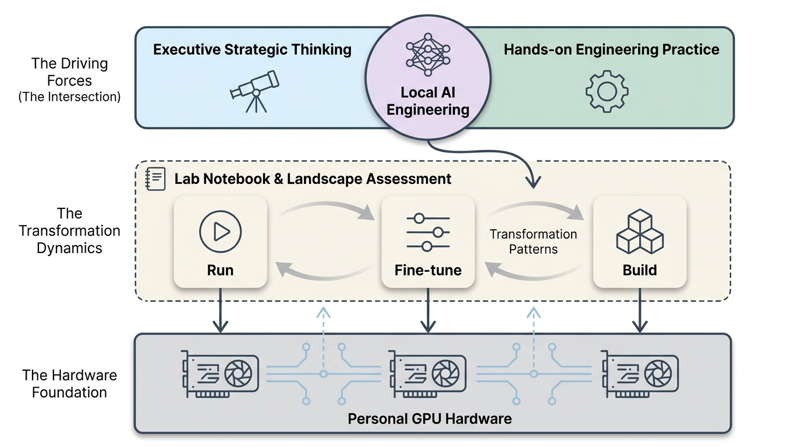
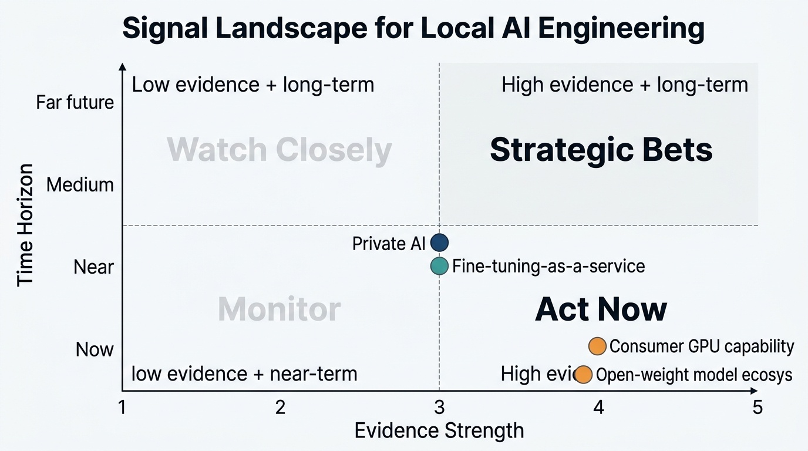
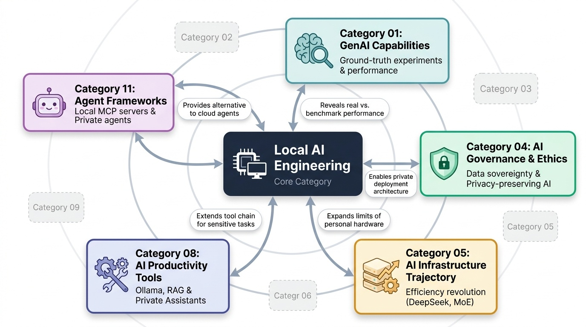

# Local AI Engineering
**Zone:** 4 — Experimenter's Lab  
**Last updated:** April 2026  
**Baseline status:** COMPLETE

---

*Conceptual overview — generated via PaperBanana (color infographic)*

---

## What This Category Tracks
What can be run, fine-tuned, and built on personal GPU hardware. This is both a lab notebook for personal experiments and a landscape assessment of what's become possible locally. The authority comes from the rare intersection of executive-level strategic thinking and hands-on engineering practice.

---

## The Local AI Landscape (as of April 2026)

Local AI engineering has crossed a threshold: **running serious AI models on personal hardware is no longer an enthusiast hobby — it is a practical engineering choice.** The combination of efficient open-weight models, mature deployment tools, and consumer GPU capability means that meaningful AI work — inference, fine-tuning, RAG, and agent operation — is achievable on a high-end personal machine.

The key enabling developments:

**Model efficiency revolution.** DeepSeek R1 distilled variants (1.5B to 70B parameters) run on consumer hardware. Qwen 3 235B-A22B (MoE architecture, only 22B active parameters) leads benchmarks under Apache 2.0. Llama 3.3 70B at 4-bit quantization runs on a 24GB GPU (RTX 4090-class). Phi-3/Phi-4 from Microsoft are specifically designed for edge/local deployment. The gap between open-weight local models and frontier API models has narrowed dramatically — for many tasks, a well-chosen local model performs within 10-15% of the frontier.

**Mature tooling.** Ollama has become the standard local deployment tool — one-command model download and serving, automatic quantization handling, local API compatibility. vLLM provides production-grade inference serving with PagedAttention for efficient memory management. Together they form the "download → run → serve" pipeline that makes local AI engineering accessible.

**Fine-tuning democratization.** QLoRA (4-bit quantized base model + low-rank adapter training) enables fine-tuning on consumer hardware. A 7B model: $1,500 RTX 4090. A 65B model: single 48GB GPU. Compare to full fine-tuning: 100-120GB VRAM ($50,000+ in H100s). PEFT (Parameter-Efficient Fine-Tuning) through LoRA adapters means domain-specific adaptation costs $2K-$15K in compute, not millions. Unsloth further optimizes training speed (2x faster, 60% less memory).

**The practical pipeline:** Find models on Hugging Face → run locally with Ollama → fine-tune with PEFT/QLoRA → serve with vLLM → orchestrate with LangChain/Agent SDK. This is a complete, production-viable pipeline on personal hardware.

---

## Machine Configuration

*[Sanjay's specific hardware to be documented from local machine inspection]*

**Relevant specifications for local AI work:**
- GPU with CUDA support (NVIDIA recommended for broadest compatibility)
- Minimum 24GB VRAM for 70B quantized models; 48GB enables 65B fine-tuning
- System RAM: 32GB minimum, 64GB recommended for large model loading
- Storage: NVMe SSD for fast model loading (models range 4GB to 40GB+ per quantization)

**Installed tooling (from workspace projects):**
- Python 3.12 with venv environments
- Ollama for local model serving
- Playwright for browser automation
- Multiple project-specific Python environments

---

## Models Evaluated Locally

### Tier 1: Primary use cases (competitive with frontier APIs)

| Model | Size | VRAM needed | Strengths | When to use locally vs. API |
|-------|------|-------------|-----------|----------------------------|
| DeepSeek R1 distilled (32B) | 32B | ~20GB Q4 | Reasoning, math, code. Single RTX 4090 | Privacy-sensitive reasoning tasks. Offline operation. Cost avoidance for high-volume queries |
| Qwen 3 (various sizes) | 7B-72B | 6-40GB Q4 | Broadest benchmark coverage. Apache 2.0. Multilingual | General-purpose local assistant. Fine-tuning base. |
| Llama 3.3 70B | 70B | ~40GB Q4 | Strong general capability. Meta backing. Large community | General tasks needing strong reasoning. Community model support |
| Phi-3/Phi-4 | 3.8B-14B | 3-10GB | Extremely efficient. Excellent for fine-tuning | Edge deployment. Resource-constrained environments. Fine-tuning experiments |
| Mistral/Mixtral | 7B-8x7B | 5-24GB | Fast inference. MoE efficiency | Low-latency applications. Multilingual tasks |

### Tier 2: Specialized / experimental

| Model | Use case | Notes |
|-------|----------|-------|
| Nomic Embed | Embeddings for RAG | Local embedding generation without API dependency |
| CodeLlama | Code generation | Useful for offline coding assistance |
| Whisper | Audio transcription | Local speech-to-text for privacy-sensitive content |

---

## What Local AI Is Good For (vs. Hosted)

### Local wins:

1. **Privacy and data sovereignty.** Enterprise data that cannot leave the organization. Regulated industries (healthcare, finance, legal). Client-confidential analysis. This is the single strongest use case for local AI — when the data *cannot* go to an API endpoint.

2. **Cost at volume.** Once hardware is amortized, local inference is effectively free per query. For high-volume applications (embedding generation, document processing pipelines, continuous monitoring), local deployment costs can be 10-100x cheaper than API calls.

3. **Latency control.** No network round-trip. Sub-100ms responses for small models. Critical for interactive applications, real-time processing, or agent loops requiring many rapid iterations.

4. **Fine-tuning and customization.** Domain-specific fine-tuning on proprietary data. QLoRA on local GPU means the data never leaves the machine. Custom model variants for specific enterprise tasks.

5. **Experimentation velocity.** No API rate limits. No usage caps. No cost anxiety. Ability to run hundreds of experiments per day during development. This freedom accelerates learning and iteration.

6. **Offline capability.** Airplane, secure facility, unreliable internet. Local models work regardless of connectivity.

### Hosted wins:

1. **Frontier capability.** Claude 4.6, GPT-4o, Gemini 2.5 Pro are still ahead of any local model for complex reasoning, extended thinking, and multi-step tasks. The gap has narrowed but persists.

2. **Agentic features.** Claude Code's autonomous coding, MCP integration, and tool use are not replicable locally (yet). The infrastructure around frontier models (skills, routines, connectors) adds value beyond raw model capability.

3. **Simplicity.** No hardware management, driver updates, model downloads, or memory optimization. API call vs. infrastructure engineering.

4. **Multi-modal frontier.** Vision, audio, video understanding at frontier quality still requires hosted models. Local multimodal is emerging but behind.

### The honest assessment:
**Use local for privacy, cost, and experimentation. Use hosted for frontier capability and agentic features.** The optimal strategy is hybrid: local for data-sensitive operations and high-volume inference, hosted (Claude, GPT) for complex reasoning and agentic tasks. This is not either/or — it is portfolio management.

---

## Non-Obvious Learnings

1. **Quantization quality varies enormously.** Q4_K_M is not the same across all models. Some models degrade gracefully under quantization; others lose coherence at Q4. Always test quantized model quality on your specific use case before committing. GGUF format (via llama.cpp/Ollama) is the safest default.

2. **VRAM is the constraint, not compute speed.** You hit VRAM limits before you hit processing speed limits. The practical impact: choose model size by VRAM budget, then optimize for speed within that constraint. A faster GPU with the same VRAM doesn't help if the model doesn't fit.

3. **Local RAG is production-ready.** Local embeddings (Nomic, BGE) + vector store (ChromaDB, FAISS) + local LLM = fully private RAG pipeline with no API dependency. Performance is surprisingly good for domain-specific document collections. The rag-stakeholder-letters-ceo-assistant project validates this pattern.

4. **Fine-tuning is easier than expected, evaluation is harder than expected.** QLoRA setup with Unsloth or Hugging Face PEFT takes hours, not days. But evaluating whether the fine-tuned model is actually *better* for your use case requires domain-specific benchmarks that don't exist off-the-shelf. Build your evaluation set before fine-tuning.

5. **Model updates break workflows.** Ollama model tags change. New quantizations appear. Base models get updated. A workflow that works today with `qwen3:32b` may behave differently after an update. Pin model versions in production-like setups.

6. **The community is the best documentation.** The LocalLLaMA subreddit, Hugging Face model cards, and GitHub issues contain more practical deployment information than official documentation. When troubleshooting, community sources are often more useful than vendor docs.

---

## Signal Assessment

*Signal landscape (Evidence vs. Time Horizon) — PaperBanana*

### Ranked Shortlist: Uncommon but Likely (Top 4)

### 1. "Private AI" becomes a standard enterprise deployment pattern alongside cloud AI
**Profile:** E3 T-Accelerating U3 H-Post-hype Z-Near
**What's happening:** Open-weight models competitive with frontier APIs. Mature local deployment tooling. Enterprise data sovereignty requirements. QLoRA enables custom fine-tuning on proprietary data without leaving the organization.
**Why it matters:** This creates a two-tier enterprise AI architecture: private/local for sensitive data and high-volume tasks, cloud/API for frontier capability. This is analogous to the hybrid cloud pattern that now dominates enterprise IT.
**What most people miss:** Most enterprise AI strategies assume cloud-only deployment. The combination of model quality + deployment maturity + privacy requirements makes local/private deployment not just viable but necessary for regulated industries.
**If true, optimize by:** Design enterprise AI architecture as hybrid from the start. Identify which data and workflows require private deployment, and build the local infrastructure capability now.
**Watch for:** Whether major consultancies (including Accenture) launch "private AI deployment" service offerings in 2026.

### 2. Fine-tuning-as-a-service replaces prompt engineering for enterprise customization
**Profile:** E3 T-Emerging U2 H-Ahead Z-Near
**What's happening:** QLoRA reduces fine-tuning cost to $2K-$15K. Domain-specific fine-tuned models outperform much larger general-purpose models on specific tasks. The tooling (Unsloth, PEFT, Hugging Face) is mature enough for non-ML-engineers.
**Why it matters:** The current enterprise AI customization approach — elaborate prompt engineering — is fragile and expensive to maintain. Fine-tuning produces persistent, reliable customization embedded in the model. As the tooling matures, fine-tuning becomes the default customization method.
**What most people miss:** Most enterprises haven't tried fine-tuning because they assume it requires ML expertise and expensive infrastructure. QLoRA on a $1,500 GPU with Unsloth changes this equation dramatically. The barrier is awareness, not technology.
**If true, optimize by:** Experiment with QLoRA fine-tuning on one domain-specific task. Build internal capability before it becomes competitive necessity. Start with a small model (Phi-3 7B) and a clear evaluation benchmark.
**Watch for:** Whether fine-tuned open-weight models consistently outperform prompted frontier models on enterprise-specific benchmarks in 2026 publications.

### 3. Consumer GPU capability enables executive-level AI experimentation
**Profile:** E4 T-Accelerating U2 H-Grounded Z-Now
**What's happening:** An RTX 4090 ($1,500-2,000) runs 70B models. An RTX 5090 will expand this further. The "experimenter's lab" that was previously a $50,000+ investment is now a consumer purchase.
**Why it matters:** Executives with hands-on AI experience have credibility that reading-only executives don't (Category 09, Signal #5). The hardware barrier to executive-level experimentation has collapsed. The remaining barrier is skill and time investment.
**What most people miss:** The strategic value of executive AI experimentation isn't the experiments themselves — it's the judgment that comes from understanding what AI can and can't do from first-hand experience. This judgment is what makes AI transformation advice credible and effective.
**If true, optimize by:** Every senior leader advising on AI transformation should have access to local AI infrastructure and dedicate time to hands-on experimentation. The investment is trivially small compared to the credibility and judgment it produces.
**Watch for:** Whether "hands-on AI experience" becomes an explicit criterion for AI transformation leadership roles in 2026-2027.

### 4. Open-weight model ecosystem creates vendor-independence for enterprise AI
**Profile:** E4 T-Accelerating U3 H-Post-hype Z-Now
**What's happening:** DeepSeek, Qwen, Llama, Mistral — multiple open-weight model families with competitive performance under permissive licenses. Hugging Face as the universal distribution platform. Ollama/vLLM as deployment-agnostic serving tools.
**Why it matters:** Enterprises can build AI capabilities without single-vendor dependency. If Anthropic, OpenAI, or Google change pricing, terms, or capability, open-weight alternatives exist. This is the enterprise risk management argument for maintaining open-weight competency.
**What most people miss:** Most enterprises are building deep dependency on one or two API providers. The open-weight ecosystem provides strategic optionality — not as a primary deployment path, but as a risk hedge and negotiating leverage.
**If true, optimize by:** Maintain open-weight model competency alongside API-based deployments. Ensure at least one critical workflow can run on open-weight models as a fallback. Use open-weight models as the default for non-frontier tasks to reduce API dependency.
**Watch for:** Whether the gap between open-weight and frontier models continues to narrow (< 6 month lag on capability matching). If so, vendor dependency becomes a strategic choice, not a technical necessity.

### Emerging Signals to Watch (Evidence 1-2, high Unlock potential)

**Local agents become the privacy-preserving alternative to cloud agents**
**Profile:** E2 T-Emerging U3 H-Post-hype Z-Near
**What's happening:** Agent frameworks (LangGraph, Claude Agent SDK) can run with local models. Local models handle tool-calling and multi-step reasoning with decreasing reliability gap. MCP servers work with local models.
**Why it matters:** Agentic AI that operates entirely on local/private infrastructure — reading private documents, accessing internal systems, taking actions — without sending data to external APIs. This is the agentic equivalent of the "private AI" pattern.
**What most people miss:** The current agentic AI conversation assumes cloud deployment. Local agents using open-weight models + local MCP servers could provide autonomous capability for sensitive enterprise workflows where data cannot leave the organization.
**If true, optimize by:** Prototype a local agent using an open-weight model (DeepSeek R1 32B or Qwen 3 32B) + Ollama + local MCP servers. Test reliability against cloud-based alternatives for a specific workflow.
**Watch for:** Whether agent framework vendors (LangChain, Anthropic) explicitly support and optimize for local model deployment in 2026. Upgrades to Uncommon but Likely when a documented enterprise deployment surfaces.

### Filtered Out
- "Local AI will replace cloud AI" — Noise. Frontier capability and agentic features require cloud infrastructure. Local and cloud are complementary, not competitive.
- "Everyone will fine-tune their own models" — Ahead of itself. Fine-tuning requires evaluation capability that most organizations lack. The tools are ready; the organizational capability isn't.

---

## Connections to Other Categories

*Category connections map — generated via PaperBanana*

- **Category 01 (GenAI Capabilities):** Personal experiments provide ground-truth on capability claims. Running a model locally reveals real performance vs. benchmark cherry-picking.
- **Category 04 (AI Governance & Ethics):** Local/private deployment is the governance answer for data sovereignty requirements. Privacy-preserving AI architecture depends on local engineering capability.
- **Category 05 (AI Infrastructure Trajectory):** Efficiency revolution (DeepSeek, MoE) directly expands what's possible on personal hardware. Every step of the efficiency trajectory increases local AI capability.
- **Category 08 (AI Productivity Tools):** Local models extend the tool chain for privacy-sensitive tasks. Ollama + local embedding model + RAG pipeline = private research assistant.
- **Category 11 (Agent Frameworks):** Agents can run with local models. MCP servers work locally. The local agent is the privacy-preserving alternative to cloud agentic deployment.
