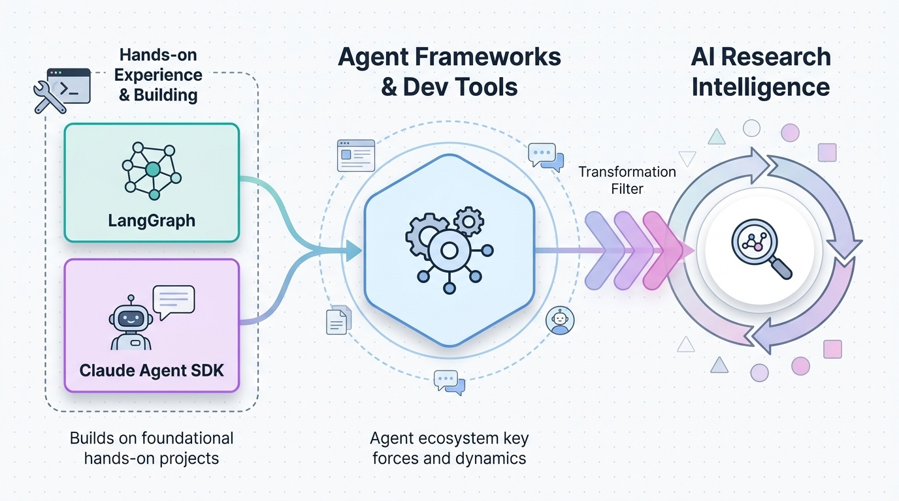
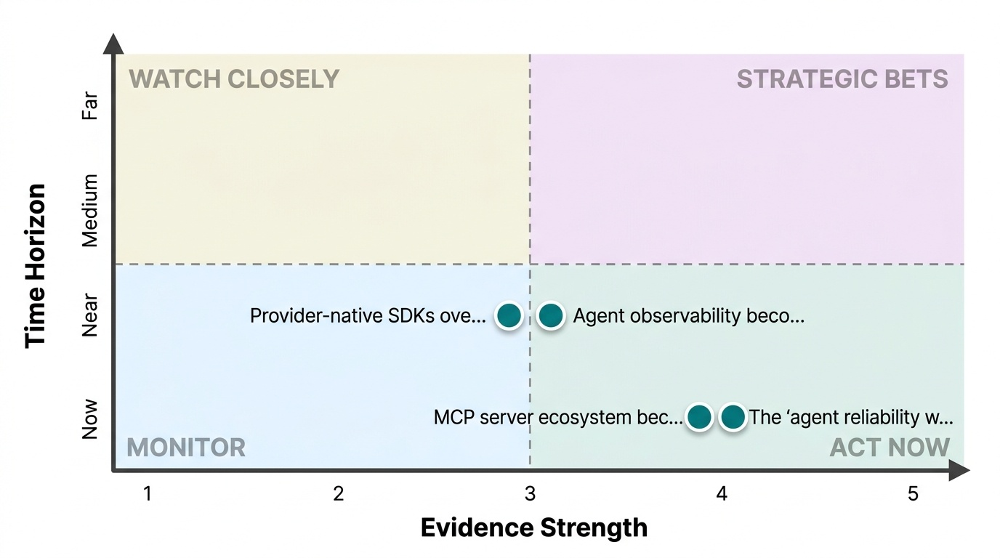
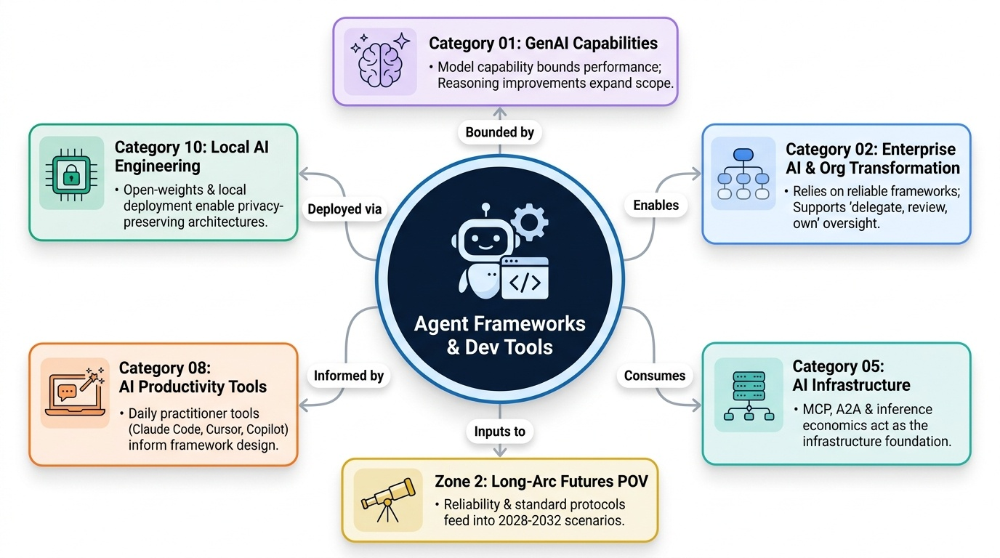

# Agent Frameworks & Dev Tools
**Zone:** 4 — Experimenter's Lab  
**Last updated:** April 2026  
**Baseline status:** COMPLETE

  
  <button type="button" class="audio-brief__play" aria-label="Play audio brief" data-audio-play>
    ▶
  </button>
  

    
    Sanjay's Summary
  

  

    

  

  <audio class="audio-brief__audio" src="/audio/categories/11.mp3" preload="metadata" data-audio-element></audio>

---

*Conceptual overview — generated via PaperBanana (color infographic)*

---

## What This Category Tracks
Hands-on experience with agent frameworks, development tools, and protocols. Sanjay has existing projects in LangGraph[^langgraph-github] and [Claude Agent SDK](https://platform.claude.com/docs/en/agent-sdk/overview) — this category builds on that foundation. The authority here comes from building with these tools, not just reading about them.

---

## Existing Work (Starting Point)

From active projects in the workspace:
- `langgraph-learning/` — LangGraph[^langgraph-github]/LangChain exploration (Python, venv-based)
- `agent-sdk-lab/` — Claude Agent SDK[^anthropic-claude-agent-sdk-2025] experiments (Node.js, exercises ex1–ex5)
- `elite-research-pipeline/` — This project uses notebooklm-py + async Python pipeline
- `gws-claude-plugin/` — 92 skills as a Claude Code plugin (demonstrates practical MCP[^mcp-site]/skill architecture)
- `raha-decor-agent/` — Production agent: Amazon.in scraping + IndiaMART matching using Claude API + Firecrawl

These projects provide first-hand experience with agent architecture patterns, from simple tool-calling to multi-step autonomous pipelines.

---

## Framework Landscape (as of April 2026)

The agent framework landscape has consolidated around a clear hierarchy: **framework-agnostic protocols** (MCP[^mcp-site], A2A[^google-a2a-launch]) at the bottom, **provider-native SDKs** (Claude Agent SDK[^anthropic-claude-agent-sdk-2025], [OpenAI Agents SDK](https://github.com/openai/openai-agents-python), Google ADK[^google-adk-docs]) in the middle, and **orchestration frameworks** (LangGraph[^langgraph-github], CrewAI[^crewai-github], Mastra[^mastra-site]) at the top. The right choice depends on the use case, but the trend is toward provider-native SDKs for single-model agents and orchestration frameworks for multi-agent systems.

### Provider-Native SDKs

**[Claude Agent SDK (Anthropic)](https://www.anthropic.com/engineering/building-agents-with-the-claude-agent-sdk):** Renamed from "Claude Code SDK" in late 2025 to signal broader ambitions. [Python (v0.1.48)](https://github.com/anthropics/claude-agent-sdk-python) and TypeScript (v0.2.71). Differentiators: extended thinking (visible chain-of-thought), computer use (desktop/browser interaction), and deep MCP[^mcp-site] integration. [Claude Managed Agents (public beta April 8, 2026)](https://platform.claude.com/docs/en/managed-agents/overview) adds [production-grade sandboxing, orchestration, and observability](https://www.infoworld.com/article/4156852/anthropic-rolls-out-claude-managed-agents.html). The SDK is optimized for Claude's specific capabilities — the agent loop, tool use accuracy, and instruction following are tuned for the SDK's patterns. **Verdict from practice:** Best for single-agent tasks where Claude's reasoning is the core value. Extended thinking is genuinely useful for complex multi-step planning. MCP[^mcp-site] integration is seamless.

**OpenAI Agents SDK:** [Released March 2025, evolved from the Swarm prototype](https://www.infoq.com/news/2025/03/openai-responses-api-agents-sdk/). Python-first. Clean API for defining agents with tools, handoffs between agents, and guardrails. Model-agnostic in theory, but optimized for OpenAI models. Less mature than LangGraph[^langgraph-github] for complex orchestration, but simpler for straightforward agent tasks. **Verdict from practice:** Good starting point for simple agents. Less capable than Claude Agent SDK[^anthropic-claude-agent-sdk-2025] for complex reasoning tasks due to model differences.

**[Google ADK (Agent Development Kit)](https://google.github.io/adk-docs):** [Released April 2025. Python and TypeScript.](https://github.com/google/adk-python) Integrates with A2A[^google-a2a-launch] protocol for agent-to-agent communication. Deep integration with Google Cloud services. **Verdict from practice:** Early stage. Primary value is A2A[^google-a2a-launch] interoperability if your ecosystem is Google-centric.

### Orchestration Frameworks

**[LangGraph (LangChain)](https://github.com/langchain-ai/langgraph):** The [leading production-grade orchestration framework](https://www.langchain.com/langgraph). Python and TypeScript. Graph-based agent definition with nodes, edges, and conditional routing. Key capabilities: stateful execution with checkpointing, human-in-the-loop patterns, parallel execution, streaming, and time travel (replay past states). [LangSmith observability platform](https://www.langchain.com/langsmith) ([69% of US-based LLM teams consider essential](https://www.langchain.com/state-of-agent-engineering)). Production deployments at [Klarna (80% resolution time reduction)](https://blog.langchain.com/customers-klarna/), [Uber, Replit, Elastic](https://blog.langchain.com/is-langgraph-used-in-production/). LangGraph[^langgraph-github] leads monthly searches (27,100). **Verdict from practice:** Most capable framework for complex, multi-step, multi-agent workflows. The graph abstraction is powerful but has a learning curve. LangSmith[^langchain-langsmith] observability is genuinely essential for debugging non-deterministic agent behavior. The "paved road" model — making agent delivery repeatable across teams — is the right enterprise adoption pattern.

[**CrewAI:**](https://github.com/crewAIInc/crewAI) Role-based multi-agent framework. Agents defined by role, goal, and backstory. Fast prototyping for collaborative agent patterns. Monthly searches: 14,800. **Verdict from practice:** Excellent for rapid prototyping of multi-agent systems. The role metaphor is intuitive. Less production-hardened than LangGraph[^langgraph-github] for complex workflows. Best for: "I want three agents collaborating on a task in 30 minutes."

[**Mastra:**](https://mastra.ai/) Leading TypeScript agent framework. Best choice for TypeScript-native teams. Growing ecosystem but smaller community than LangGraph[^langgraph-github].

[**AutoGen (Microsoft):**](https://github.com/microsoft/autogen) Multi-agent conversation framework. Group chat patterns. Less adopted in production than LangGraph[^langgraph-github]/CrewAI[^crewai-github]. Microsoft backing provides enterprise credibility.

### Protocol Layer

**[MCP (Model Context Protocol)](https://modelcontextprotocol.io):** [The universal AI-to-tool interface](https://www.anthropic.com/news/model-context-protocol). See Category 05 for full infrastructure analysis. From a framework perspective: MCP[^mcp-site] means you write tool integrations once (as MCP[^mcp-site] servers) and every framework/SDK can use them. [10,000+ public servers, 97M monthly SDK downloads](https://github.com/modelcontextprotocol). [Linux Foundation governance](https://www.anthropic.com/news/donating-the-model-context-protocol-and-establishing-of-the-agentic-ai-foundation). **Verdict from practice:** MCP[^mcp-site] is the single most consequential infrastructure development for agent builders. The gws-claude-plugin project (92 skills) is practical proof that MCP[^mcp-site]-based tool architecture scales.

**[A2A (Agent-to-Agent, Google)](https://developers.googleblog.com/en/a2a-a-new-era-of-agent-interoperability/):** Agent discovery and communication protocol. [150+ supporting organizations](https://cloud.google.com/blog/products/ai-machine-learning/agent2agent-protocol-is-getting-an-upgrade). Complementary to MCP[^mcp-site] (which handles agent-to-tool). Enables multi-vendor agent collaboration. Still early-stage for practical deployment.

---

## What Actually Works in Practice

### Reliable patterns (from hands-on experience)

1. **Single-agent with tools (Claude Agent SDK[^anthropic-claude-agent-sdk-2025] + MCP[^mcp-site]):** The most reliable pattern. One agent, clear instructions, well-defined tools. Success rate on scoped tasks: 80%+. Works for: research pipelines, document processing, data extraction, code generation with review. The raha-decor-agent project follows this pattern.

2. **Graph-based orchestration (LangGraph[^langgraph-github]):** Best for multi-step workflows where the execution path is somewhat predictable. Define the graph, handle state transitions, add human-in-the-loop at critical points. Works for: complex pipelines with branching logic, error handling, and checkpointing.

3. **Sequential chain with verification:** Agent performs step → output is verified (by another agent or human) → next step. Simple, debuggable, reliable. Works for: any workflow where quality matters more than speed.

### Unreliable patterns (from hands-on experience)

1. **Multi-agent "debate" or "collaboration":** Agents discussing with each other to reach better answers. Impressive in demos, unreliable in production. Error accumulation across agent exchanges. Works in controlled conditions; fails on novel inputs.

2. **Long-horizon autonomous operation (>30 steps):** Error accumulation and context degradation are real. ~55% success on [SWE-bench Verified (best agent performance)](https://www.swebench.com/). Acceptable with human oversight; unacceptable for autonomous production use.

3. **Agents choosing other agents:** Dynamic routing where one agent selects which specialist agent to invoke. Selection accuracy degrades with the number of options. Works with 3-5 specialists; becomes unreliable at 10+.

### The reliability formula
Agent reliability ≈ (task complexity × number of steps × number of agents)^(-1). The most reliable agents are simple (one agent, few steps, well-scoped task). Every additional degree of complexity reduces reliability multiplicatively, not additively.

---

## Practitioner Insights

1. **Start with the simplest architecture that could work.** Single agent + tools. Only add complexity (multi-agent, graph orchestration) when simple architecture demonstrably fails. The LangGraph[^langgraph-github] learning curve is worth it for complex workflows, but most tasks don't need it.

2. **Observability is not optional.** Non-deterministic agent behavior means you cannot reason about failures without trace logs. LangSmith[^langchain-langsmith], Claude's built-in tracing, or even simple structured logging — pick one and instrument from day one. "I'll add observability later" means "I'll debug blind when it breaks in production."

3. **MCP[^mcp-site] is the right abstraction layer.** Building tool integrations as MCP[^mcp-site] servers (not framework-specific plugins) is the correct architectural decision. Write once, use from any agent framework. The gws-claude-plugin (92 skills) validates this at scale.

4. **The framework choice matters less than the prompt engineering.** Switching from OpenAI Agents SDK to Claude Agent SDK[^anthropic-claude-agent-sdk-2025] to LangGraph[^langgraph-github] changes 20% of the code. Rewriting the agent's system prompt and tool descriptions changes 80% of the behavior. Invest accordingly.

5. **Human-in-the-loop is a feature, not a limitation.** The most valuable agent architectures include explicit human review points. This isn't because AI can't be trusted — it's because the combination of AI generation + human judgment consistently outperforms either alone (the centaur model from Category 03).

---

## Signal Assessment

*Signal landscape (Evidence vs. Time Horizon) — PaperBanana*

### Ranked Shortlist: Uncommon but Likely (Top 4)

### 1. Provider-native SDKs overtake orchestration frameworks for most use cases
**Profile:** E3 T-Accelerating U2 H-Post-hype Z-Near
**What's happening:** Claude Agent SDK[^anthropic-claude-agent-sdk-2025], OpenAI Agents SDK, and Google ADK[^google-adk-docs] are maturing rapidly. Claude Managed Agents[^anthropic-managed-agents-2026] (April 2026) adds production-grade orchestration. Each SDK is optimized for its model's specific capabilities.
**Why it matters:** For single-model agents (the majority of production use cases), provider-native SDKs offer better performance, simpler architecture, and tighter integration than framework-agnostic orchestrators. LangGraph[^langgraph-github] retains value for multi-model and complex multi-agent systems, but the "average" agent project may not need it.
**What most people miss:** The LangChain/LangGraph[^langgraph-github] ecosystem became the default because it was first. But provider SDKs are catching up on orchestration features while offering better model-specific optimization. The framework consolidation will favor SDKs for simple-to-moderate complexity.
**If true, optimize by:** Default to provider-native SDK for new agent projects. Use LangGraph[^langgraph-github] only when the architecture genuinely requires multi-model orchestration, complex graph logic, or advanced state management.
**Watch for:** Whether Claude Managed Agents[^anthropic-managed-agents-2026] achieves production adoption for workflows that previously required LangGraph[^langgraph-github].

### 2. MCP[^mcp-site] server ecosystem becomes the "app store" for AI agents
**Profile:** E4 T-Accelerating U3 H-Grounded Z-Now
**What's happening:** 10,000+ MCP[^mcp-site] servers. [Forrester predicts 30% of enterprise SaaS vendors will ship MCP servers in 2026](https://www.forrester.com/blogs/predictions-2026-ai-agents-changing-business-models-and-workplace-culture-impact-enterprise-software/). Every major SDK integrates MCP[^mcp-site] natively.
**Why it matters:** MCP[^mcp-site] servers are becoming the unit of AI tool integration — analogous to REST APIs for web services or npm packages for JavaScript. Building an MCP[^mcp-site] server for your service is becoming as essential as building an API.
**What most people miss:** Most enterprise architects are still thinking about AI integration as a custom development problem. The MCP[^mcp-site] ecosystem means most common integrations are already available. The value shifts from "building integrations" to "composing existing MCP[^mcp-site] servers into workflows."
**If true, optimize by:** Audit your tool and service ecosystem for existing MCP[^mcp-site] servers. Build MCP[^mcp-site] servers for internal tools that agents need to access. Treat MCP[^mcp-site] server availability as a criterion for vendor selection.
**Watch for:** Whether enterprise SaaS vendors (Salesforce, ServiceNow, Workday) ship official MCP[^mcp-site] servers by end of 2026.

### 3. Agent observability becomes a required enterprise capability (like APM for web apps)
**Profile:** E3 T-Accelerating U2 H-Grounded Z-Near
**What's happening:** LangSmith[^langchain-langsmith], [Langfuse](https://github.com/langfuse/langfuse), and OpenTelemetry-based agent tracing are maturing. 69% of US LLM teams say observability is essential for production[^langchain-state-of-agents-2025]. Non-deterministic agent behavior demands trace-based debugging.
**Why it matters:** Agents are fundamentally different from deterministic software. The same input can produce different outputs, different tool call sequences, and different failure modes. Without observability, agent systems are black boxes that break unpredictably.
**What most people miss:** Most agent projects add observability as an afterthought. The teams that instrument from day one debug 5x faster and reach production 3x sooner. Observability is a development tool, not just a production monitoring tool.
**If true, optimize by:** Choose an observability platform before choosing a framework. Instrument all agent interactions from the first prototype. Build alert thresholds for agent reliability metrics (success rate, step count, cost per run).
**Watch for:** Whether agent observability becomes a line item in enterprise AI budgets the way APM (Datadog, New Relic) became a line item in web application budgets.

### 4. The "agent reliability wall" forces architectural innovation
**Profile:** E4 T-Shifting U3 H-Grounded Z-Now
**What's happening:** [Best agent coding performance: ~55% on SWE-bench Verified](https://openai.com/index/introducing-swe-bench-verified/). Multi-step autonomous operation degrades multiplicatively with complexity. The reliability formula (inversely proportional to complexity × steps × agents) is a hard constraint.
**Why it matters:** Current agent architectures hit a reliability ceiling that cannot be solved by better models alone. The next breakthrough requires architectural innovation: better error recovery, verification loops, graceful degradation, and human-in-the-loop patterns. The companies that solve agent reliability at scale win the enterprise market.
**What most people miss:** The AI labs are focused on model capability (making agents smarter). But the production bottleneck is reliability engineering (making agents consistent). These are different problems requiring different solutions. The reliability breakthrough may come from systems engineering, not AI research.
**If true, optimize by:** Invest in reliability patterns: verification loops, checkpointing, graceful degradation, confidence-based human escalation. Treat agent reliability as a systems engineering problem, not an AI capability problem.
**Watch for:** Whether SWE-bench Verified[^swebench-site] scores cross 70% in the next 12 months. If not, architectural innovation (not model improvement) becomes the critical path.

### Emerging Signals to Watch (Evidence 1-2, high Unlock potential)

**A2A[^google-a2a-launch] protocol enables multi-vendor agent collaboration in enterprise**
**Profile:** E2 T-Emerging U3 H-Ahead Z-Medium
**What's happening:** Google's A2A[^google-a2a-launch] protocol has 150+ supporting organizations. Designed for agent-to-agent discovery and communication across vendors. Complementary to MCP[^mcp-site].
**Why it matters:** Enterprises use multiple AI vendors. If agents from different providers can discover and collaborate with each other, it enables best-of-breed agent architectures. One vendor's coding agent collaborates with another's data analysis agent, orchestrated by a third's workflow engine.
**What most people miss:** Most enterprise AI strategies assume single-vendor agent ecosystems. A2A[^google-a2a-launch] could enable multi-vendor agent composition, disrupting the lock-in strategies of major providers.
**If true, optimize by:** Track A2A[^google-a2a-launch] adoption. If major enterprise SaaS vendors adopt A2A[^google-a2a-launch] alongside MCP[^mcp-site], architect for multi-vendor agent composition rather than single-vendor lock-in.
**Watch for:** Whether A2A[^google-a2a-launch] moves from protocol specification to production deployment with real multi-vendor interoperability in 2026-2027. Upgrades to Uncommon but Likely on documented production deployment.

### Filtered Out
- "Autonomous AI agents will replace software engineers" — Peak hype. 55% SWE-bench means 45% failure on complex tasks. Agents augment developers; they don't replace them.
- "No-code agent builders will democratize agent development" — Ahead of itself. Current no-code tools produce fragile agents unsuitable for production. The complexity of agent reliability requires engineering skill.

---

## Sources

### Papers & Reports

[^forrester-predictions-2026]: Forrester. *Predictions 2026 — AI Agents, Changing Business Models, And Workplace Culture Impact Enterprise Software*. Forrester. 2025. <https://www.forrester.com/blogs/predictions-2026-ai-agents-changing-business-models-and-workplace-culture-impact-enterprise-software/>
[^langchain-state-of-agents-2025]: LangChain. *State of Agent Engineering 2025*. LangChain. 2025. <https://www.langchain.com/state-of-agent-engineering>

### Benchmarks

[^swebench-site]: Jimenez, Yang, et al. *SWE-bench — Can Language Models Resolve Real-world GitHub Issues?*. swebench.com. 2024. <https://www.swebench.com/>

### Articles & Newsletters

[^anthropic-claude-agent-sdk-2025]: Anthropic. *Building agents with the Claude Agent SDK*. Anthropic Engineering Blog. 2025. <https://www.anthropic.com/engineering/building-agents-with-the-claude-agent-sdk>
[^anthropic-managed-agents-2026]: Anthropic. *Claude Managed Agents overview*. Claude API Docs. 2026. <https://platform.claude.com/docs/en/managed-agents/overview>
[^anthropic-mcp-aaif]: Anthropic. *Donating the Model Context Protocol and establishing the Agentic AI Foundation*. Anthropic News. 2025. <https://www.anthropic.com/news/donating-the-model-context-protocol-and-establishing-of-the-agentic-ai-foundation>
[^anthropic-mcp-launch]: Anthropic. *Introducing the Model Context Protocol*. Anthropic News. 2024. <https://www.anthropic.com/news/model-context-protocol>
[^google-a2a-launch]: Google. *Announcing the Agent2Agent Protocol (A2A) — A New Era of Agent Interoperability*. Google Developers Blog. 2025. <https://developers.googleblog.com/en/a2a-a-new-era-of-agent-interoperability/>
[^google-a2a-upgrade]: Google Cloud. *Agent2Agent protocol (A2A) is getting an upgrade — 150+ organizations*. Google Cloud Blog. 2026. <https://cloud.google.com/blog/products/ai-machine-learning/agent2agent-protocol-is-getting-an-upgrade>
[^infoq-openai-agents-sdk-2025]: InfoQ. *OpenAI Launches New API, SDK, and Tools to Develop Custom Agents*. InfoQ. 2025. <https://www.infoq.com/news/2025/03/openai-responses-api-agents-sdk/>
[^infoworld-managed-agents-2026]: InfoWorld. *Anthropic rolls out Claude Managed Agents*. InfoWorld. 2026. <https://www.infoworld.com/article/4156852/anthropic-rolls-out-claude-managed-agents.html>
[^langchain-klarna-case-study]: LangChain. *How Klarna's AI assistant redefined customer support at scale*. LangChain Blog. 2025. <https://blog.langchain.com/customers-klarna/>
[^langchain-langgraph-production]: LangChain. *Is LangGraph Used In Production?*. LangChain Blog. 2024. <https://blog.langchain.com/is-langgraph-used-in-production/>
[^openai-swebench-verified]: OpenAI. *Introducing SWE-bench Verified*. OpenAI. 2024. <https://openai.com/index/introducing-swe-bench-verified/>

### Organizations & Publications

[^anthropic-agent-sdk-docs]: Anthropic. *Agent SDK overview*. Claude API Docs. 2025. <https://platform.claude.com/docs/en/agent-sdk/overview>
[^anthropic-claude-agent-sdk-python]: Anthropic. *claude-agent-sdk-python*. GitHub. 2025. <https://github.com/anthropics/claude-agent-sdk-python>
[^crewai-github]: CrewAI Inc. *crewAI — Framework for orchestrating role-playing, autonomous AI agents*. GitHub. 2024. <https://github.com/crewAIInc/crewAI>
[^google-adk-docs]: Google. *Agent Development Kit (ADK)*. google.github.io/adk-docs. 2025. <https://google.github.io/adk-docs>
[^google-adk-python]: Google. *adk-python — open-source, code-first Python toolkit for building AI agents*. GitHub. 2025. <https://github.com/google/adk-python>
[^langchain-langgraph-page]: LangChain. *LangGraph — Agent Orchestration Framework for Reliable AI Agents*. langchain.com. 2025. <https://www.langchain.com/langgraph>
[^langchain-langsmith]: LangChain. *LangSmith — AI Agent & LLM Observability Platform*. langchain.com. 2025. <https://www.langchain.com/langsmith>
[^langfuse-github]: Langfuse. *langfuse — Open source LLM engineering platform*. GitHub. 2024. <https://github.com/langfuse/langfuse>
[^langgraph-github]: LangChain. *langgraph — Build resilient language agents as graphs*. GitHub. 2024. <https://github.com/langchain-ai/langgraph>
[^mastra-site]: Mastra. *Mastra — TypeScript AI Agent Framework & Platform*. mastra.ai. 2025. <https://mastra.ai/>
[^mcp-github-org]: Model Context Protocol. *Model Context Protocol — GitHub organization*. GitHub. 2024. <https://github.com/modelcontextprotocol>
[^mcp-site]: Model Context Protocol. *Model Context Protocol — Specification and Documentation*. modelcontextprotocol.io. 2024. <https://modelcontextprotocol.io>
[^microsoft-autogen]: Microsoft. *autogen — A programming framework for agentic AI*. GitHub. 2024. <https://github.com/microsoft/autogen>
[^openai-agents-sdk]: OpenAI. *openai-agents-python*. GitHub. 2025. <https://github.com/openai/openai-agents-python>

---
## Connections to Other Categories

*Category connections map — generated via PaperBanana*

- **Category 01 (GenAI Capabilities):** Agent performance is bounded by model capability. Reasoning model improvements (extended thinking, o-series) directly expand what agents can do.
- **Category 02 (Enterprise AI & Org Transformation):** Agentic AI operating models depend on reliable agent frameworks. The "delegate, review, own" model requires agent architectures that support human oversight.
- **Category 05 (AI Infrastructure Trajectory):** MCP, A2A, and inference cost economics are the infrastructure foundation. Agent frameworks are consumers of this infrastructure.
- **Category 08 (AI Productivity Tools):** Claude Code, Copilot, and Cursor are the practitioner-facing edge of agent framework development. What works in daily tool use informs framework design.
- **Category 10 (Local AI Engineering):** Agents often run locally or in hybrid configurations. Open-weight models + local deployment enables privacy-preserving agent architectures.
- **Zone 2 / Long-Arc Futures POV:** Agent reliability trajectories and protocol standardization are primary inputs to 2028-2032 scenarios.
