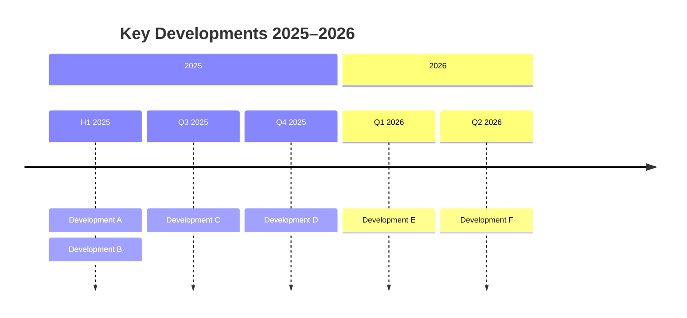
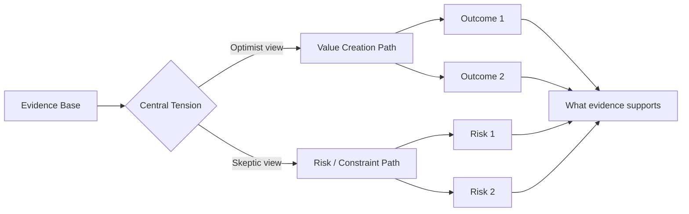
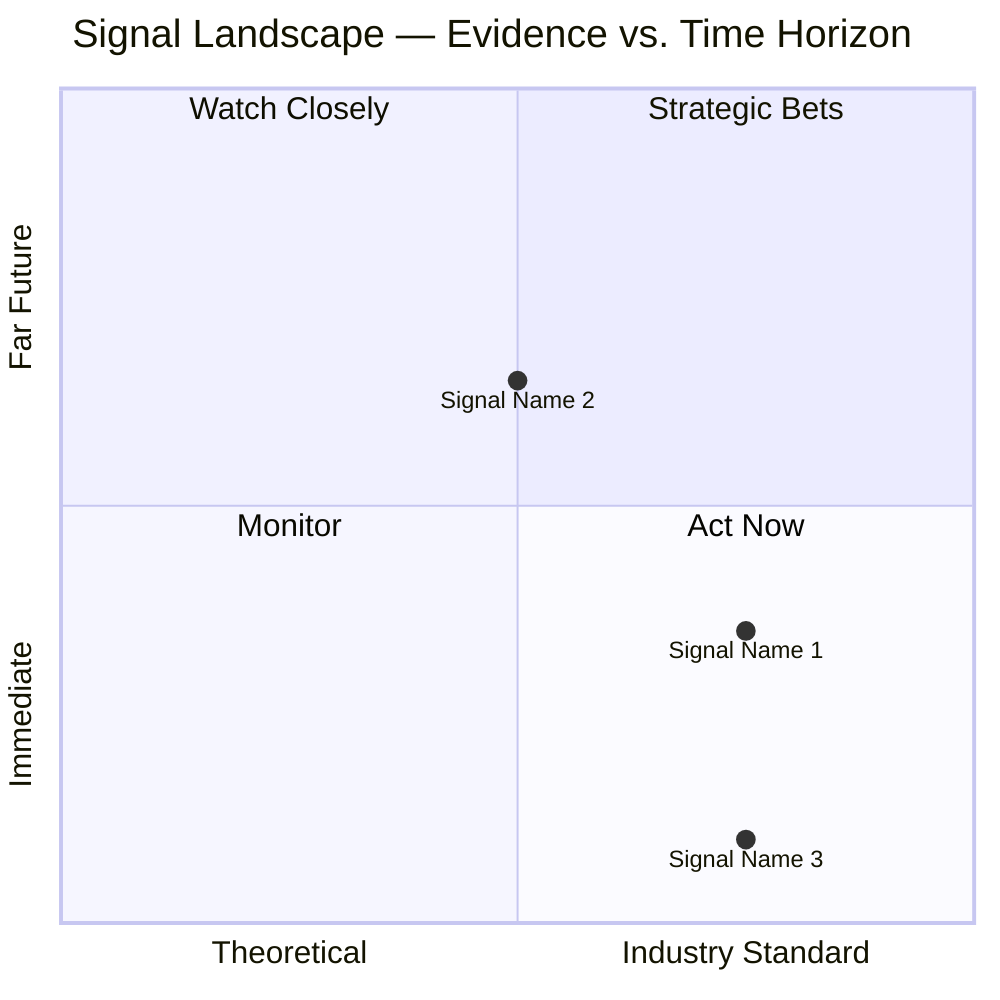
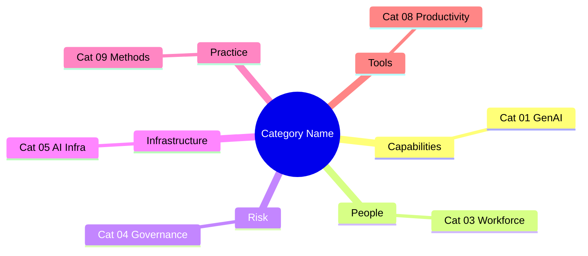

# Visualization Guide
**Zone:** System Design  
**Last updated:** April 2026

## Purpose

Every research category in this knowledge system uses a **fixed vocabulary of 5 diagram types** — no more, no less. This ensures visual consistency across all 10 baseline categories and all future weekly scan additions. When in doubt: use the template exactly as written here.

---

## The 5 Diagram Types

| # | Type | Tool | Section | Updated when |
|---|------|------|---------|--------------|
| 1 | **Category Concept Diagram** | PaperBanana (PNG) | Top of file | One-time per baseline |
| 2 | **Key Developments Timeline** | Mermaid `timeline` | Key Developments | One-time per baseline |
| 3 | **Debate Tension Map** | Mermaid `graph LR` | The Debate | One-time per baseline |
| 4 | **Signal Landscape Quadrant** | Mermaid `quadrantChart` | Signal Assessment | Auto-updated by weekly scan |
| 5 | **Category Connections Map** | PaperBanana (PNG) | Connections section | One-time per baseline |

**Tool selection principle:** PaperBanana for anything requiring visual aesthetics or complex relationships (concept diagrams, connection maps). Mermaid for data-driven diagrams that must auto-update (signal quadrant) or simple process flows (timelines, debate maps).

---

## Type 1: Category Concept Diagram (PaperBanana)

**What it shows:** A conceptual overview of the entire category — the key forces, relationships, and dynamics — as a publication-quality infographic.

**Style:** Option B (color-coded bands, executive-facing, Nature review article aesthetic).

**File naming convention:**
```
knowledge-system/assets/images/[category-slug]/concept-diagram-b.png
```

**Reference in markdown:**
```markdown

*Figure: Conceptual overview of [Category Name] — generated via PaperBanana*
```

**Generation:** Run `scripts/viz-pass.py <file> --with-paperbanana`

---

## Type 2: Key Developments Timeline

**What it shows:** The 6-8 key developments from the past 12 months, organized chronologically by quarter.

**Mermaid template:**


**Consistency rules:**
- Always use `section 2025` and `section 2026` (never specific months as section headers)
- Period labels: H1 2025, Q3 2025, Q4 2025, Q1 2026, Q2 2026 — not free-form dates
- Max 8 entries total
- Keep each entry label under 60 characters

---

## Type 3: Debate Tension Map

**What it shows:** The optimist/skeptic poles of the central debate in the category, with the shared evidence base and the "what the evidence supports" synthesis.

**Mermaid template:**


**Consistency rules:**
- Always use `graph LR` (left-to-right) — never `TD`, `BT`, or `RL`
- Node labels: max 4-5 words each
- Exactly 2 outcomes per side (O1, O2, S1, S2)
- Always end with a synthesis node C

---

## Type 4: Signal Landscape Quadrant

**What it shows:** All ranked shortlist signals plotted by Evidence Strength (X) vs. Time Horizon (Y). Reveals the evidence/horizon distribution at a glance.

**Axis mapping:**
- X-axis (Evidence): E1=0.1, E2=0.3, E3=0.5, E4=0.75, E5=0.9
- Y-axis (Time Horizon): Now=0.1, Near=0.35, Med=0.65, Far=0.9

**Quadrant meanings:**
- Q1 (high evidence, long-term): Strategic Bets
- Q2 (low evidence, long-term): Watch Closely
- Q3 (low evidence, near-term): Monitor
- Q4 (high evidence, near-term): Act Now

**Mermaid template:**


**Consistency rules:**
- Always use exactly these quadrant labels and axis labels
- Signal names: truncate to 25 characters if needed (avoid label collision)
- Include ALL ranked shortlist signals (not just top 3)
- This is the only diagram auto-regenerated by the weekly scan

---

## Type 5: Category Connections Map

**What it shows:** How this category connects to the other 9 categories in the knowledge system, with a 1-word description of the connection type.

**Mermaid template:**


**Consistency rules:**
- Root node: 2-3 word category name, not the full title
- Depth: exactly 2 levels (grouping → category) — never 3 levels
- Grouping labels (depth 1): single-word concepts like Capabilities, People, Risk, Infrastructure, Practice, Tools, Lab
- Max 7 leaf nodes (don't list every category — only the genuinely connected ones)

---

## Running `viz-pass.py`

```bash
# Mermaid diagrams only (zero API cost)
python scripts/viz-pass.py knowledge-system/baseline/zone1-present-intelligence/02-enterprise-ai-org-transformation.md

# With PaperBanana concept diagram (Gemini API cost)
python scripts/viz-pass.py knowledge-system/baseline/zone1-present-intelligence/02-enterprise-ai-org-transformation.md --with-paperbanana

# Dry-run (preview without writing)
python scripts/viz-pass.py <file> --dry-run
```

The script is idempotent: running it twice will not duplicate diagrams. It checks for existing `mermaid` blocks before injecting.

---

## Weekly Scan Integration

The weekly scan agent automatically regenerates the Signal Landscape Quadrant (Type 4) for any category that received new signals. It:
1. Re-reads the updated signal profiles from the Signal Assessment section
2. Recomputes the x,y coordinates for all signals
3. Replaces the existing `quadrantChart` mermaid block

All other diagram types remain unchanged by the weekly scan.
